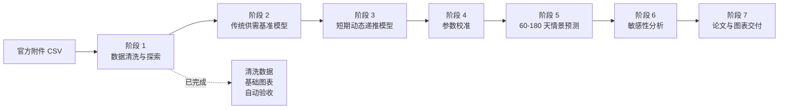
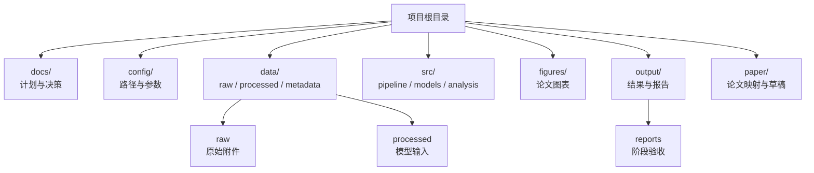

# 数学建模 A 题：霍尔木兹海峡封锁对原油价格的影响

本目录用于完成浙江工商大学 2026 年大学生数学建模竞赛 A 题。当前执行主线是：

```text
原始 CSV -> 数据清洗 -> 传统供需基准模型 -> 动态递推模型 -> 参数校准 -> 情景预测 -> 敏感性分析 -> 论文图表
```

`A题初步实施方案_V1.*` 保留为早期思路稿；当前开发和协作以 `docs/`、`config/`、`src/` 中的约定为准。

## 项目主线



## 当前关键结论

| 项目 | 当前状态 |
|---|---|
| 当前阶段 | 阶段 1 已完成，下一步进入阶段 2 |
| 真实拟合口径 | 使用附件 CSV 的 `close_price` |
| 冲突窗口实际交易日 | 2026-03-02 至 2026-05-05 |
| 冲突窗口最高收盘价 | 114.06 USD/barrel |
| 冲突窗口最高盘中价 | 119.50 USD/barrel |
| 阶段 1 自动验收 | 33 项通过，0 项失败 |

## 当前阶段

当前 **阶段 1：数据清洗和探索** 已完成。

阶段 1 已生成：

- `data/processed/brent_daily_clean.csv`
- `data/processed/brent_event_window.csv`
- `figures/price_trend.png`
- `figures/event_window_price.png`
- `figures/return_volatility.png`

下一阶段是 **阶段 2：传统供需基准模型**。

## 目录说明



| 目录 | 作用 |
|---|---|
| `docs/` | 项目理解、计划、验收、技术路线和架构决策 |
| `config/` | 基础路径、模型参数、情景参数、校准搜索范围 |
| `data/raw/` | 官方原始数据，不直接修改 |
| `data/external/` | 外部资料或人工整理的 SPR、库存、事件表等 |
| `data/interim/` | 清洗中间数据 |
| `data/processed/` | 可直接进入模型的数据 |
| `data/metadata/` | 数据字典、字段说明、来源说明 |
| `src/` | 数据处理、模型、校准、分析、可视化和流水线代码 |
| `figures/` | 论文图表 |
| `output/` | 模型结果、参数结果、报告和多轮运行产物 |
| `paper/` | 论文大纲、章节草稿和最终稿 |
| `dashboard/` | 可选交互式展示系统 |

## 最小运行顺序

先创建环境：

```bash
mamba env create -f environment.yml
mamba activate mathmodel-oil
```

如果本机绘图时提示 Matplotlib 或 fontconfig 缓存不可写，可以在运行脚本前加载项目环境约定：

```bash
source scripts/project_env.sh
```

阶段 1 可复跑命令：

```bash
source scripts/project_env.sh
python3 -m src.pipeline.clean_data
python3 -m src.pipeline.validate_stage1 --rerun
```

阶段 2 开始前推荐先看：

- [output/reports/stage1_validation_report.md](output/reports/stage1_validation_report.md)
- [data/metadata/stage1_data_dictionary.md](data/metadata/stage1_data_dictionary.md)
- [paper/figures_mapping.md](paper/figures_mapping.md)

PostgreSQL 当前只完成设计，不立即建库写入。数据库方案见 [docs/09_环境与数据库方案.md](docs/09_环境与数据库方案.md)。

## 数据真相源

标准原始数据路径为：

```text
data/raw/brent_daily.csv
```

`data/raw/布伦特原油期货主力合约价格数据_原始.csv` 作为人工可读备份保留。

## 文档入口

从 [docs/00_文档导航.md](docs/00_文档导航.md) 开始阅读。
