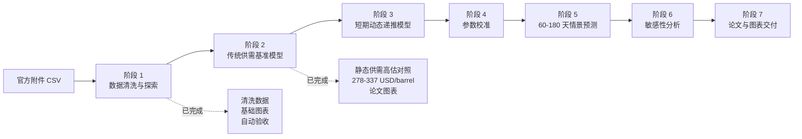
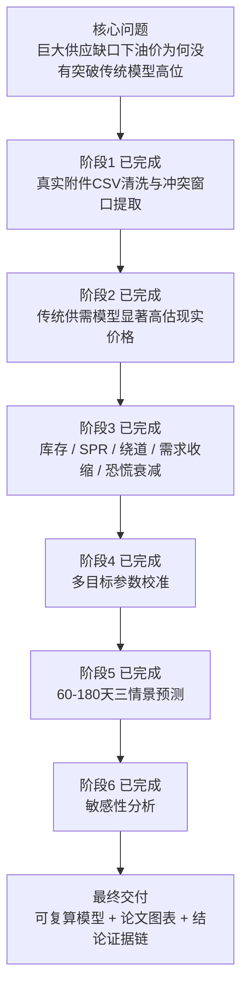
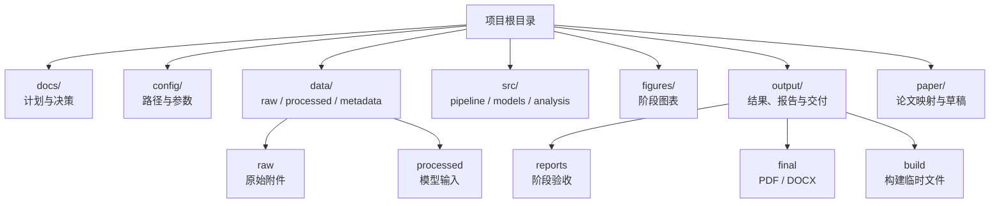

# 数学建模 A 题：霍尔木兹海峡封锁对原油价格的影响

本目录用于完成浙江工商大学 2026 年大学生数学建模竞赛 A 题。项目已经从“想法规划”进入“可复算交付”阶段：阶段 1 数据清洗、阶段 2 传统供需基准模型、阶段 3 短期动态递推模型、阶段 4 参数校准、短期模型防御性检验、阶段 5 三情景预测、阶段 6 敏感性分析和阶段 7 总论文初稿已经完成；阶段 8 已开始围绕综合最优主模型做因素筛选和优化边界治理。

当前执行主线是：

```text
原始 CSV -> 数据清洗 -> 传统供需基准模型 -> 综合机制递推模型 -> 参数校准 -> 情景预测 -> 敏感性分析 -> 总论文 PDF/DOCX
```

`A题初步实施方案_V1.*` 保留为早期思路稿；当前开发和协作以 `docs/`、`config/`、`src/` 中的约定为准。

## 项目主线



## 一页速览



## 当前关键结论

| 项目 | 当前状态 |
|---|---|
| 当前阶段 | 阶段 8 已开始：先固定综合机制递推模型为最终主模型，再用因素覆盖矩阵约束后续优化 |
| 真实拟合口径 | 使用附件 CSV 的 `close_price` |
| 冲突窗口实际交易日 | 2026-03-02 至 2026-05-05 |
| 冲突窗口最高收盘价 | 114.06 USD/barrel |
| 冲突窗口最高盘中价 | 119.50 USD/barrel |
| 阶段 1 自动验收 | 33 项通过，0 项失败 |
| 阶段 2 基准模型结论 | 静态供需模型给出 278-337 USD/barrel，明显高估现实价格 |
| 阶段 3 动态模型结论 | 模拟峰值 110.90、末日价格 110.46，能解释 110 美元附近平台 |
| 阶段 4 校准结论 | 综合最优 RMSE 3.44，MAE 2.85，分段 RMSE 均控制在 5 以内或附近，短期模型达到优秀水平 |
| 短期模型防御检验 | RMSE 3.44 优于朴素上一日基准 4.47 和滚动 ARIMA 4.53；MAPE 2.86%；平移检验原始位置最优，主要拐点 8/10 同步捕捉 |
| 致命质疑补充防御 | 承认 46 个样本对应 21 个连续校准参数有过拟合风险；\(\pm 15\%\) 压力测试下 96.6% 峰值仍在 105-125 区间；代码审计确认没有 120 美元硬编码上限 |
| 阶段 5 情景结论 | 中性情景第 180 天约 104.49 USD/barrel，悲观情景第 180 天约 119.53 USD/barrel 且存在高二次跳涨风险 |
| 阶段 6 敏感性结论 | 综合敏感度前三为不确定性平台、地缘风险权重、供应中断量；SPR 主要影响外推期峰值和削峰能力 |
| 阶段 8 因素筛选 | 已生成综合主模型因素覆盖矩阵：赛题因素和经检验证明有效的价格形成因素进主模型，OPEC+ 等慢变量进长期情景，缺少真实外生数据的因素进入改进方向 |
| 短期论文素材 | `paper/短期动态模型论文.tex` 仅作为素材稿保留，最终交付不再使用短期论文 PDF/DOCX |
| 最终主论文 | 已生成 `output/final/总论文.pdf` 与 `output/final/总论文.docx`；当前正文预览 PDF 为 26 页，后续加入代码附录后页数会继续增加 |

## 队友快速理解

我们已经做完两件关键的基础活：

| 已完成内容 | 对后续的作用 |
|---|---|
| 清洗附件原油价格 CSV | 后面所有模型都用这份真实数据做拟合和对照 |
| 截取 2026 冲突窗口 | 明确实际油价峰值、平台区间和拟合目标 |
| 建立传统供需基准模型 | 证明只看供应缺口会明显高估油价 |
| 建立短期动态递推模型 | 用缓冲机制解释现实价格平台 |
| 完成多目标参数校准 | 比较 RMSE、峰值、末日和分段误差 |
| 完成短期模型防御性检验 | 回答是否打败 Random Walk、是否滞后复制、预测步长是什么、相对误差是否足够小 |
| 生成阶段图表和报告 | 可以直接进入论文的数据说明和模型一结果 |
| 完成三情景预测 | 回答 60-180 天油价路径和二次跳涨风险 |
| 完成敏感性分析 | 判断哪些参数最影响第 180 天价格、外推期峰值和政策缓冲优先级 |

接下来不是无边界地重做模型，而是在综合机制递推模型基础上继续优化：先确认因素是否值得进入主模型，再做必要的消融、敏感性和论文表达更新。

## 当前阶段

当前 **阶段 7：总论文初稿** 已完成。

阶段 1 已生成：

- `data/processed/布伦特原油期货主力合约价格数据_清洗后.csv`
- `data/processed/布伦特原油期货主力合约价格数据_冲突窗口.csv`
- `figures/price_trend.png`
- `figures/event_window_price.png`
- `figures/return_volatility.png`

阶段 2 已生成：

- `output/baseline/传统供需基准模型结果.csv`
- `figures/baseline_vs_actual.png`
- `output/reports/stage2_baseline_model_report.md`

阶段 3 已生成：

- `output/calibration/短期动态递推模型结果.csv`
- `output/calibration/短期动态递推模型误差指标.csv`
- `figures/fitted_vs_actual.png`
- `output/reports/stage3_dynamic_model_report.md`

阶段 4 已生成：

- `output/calibration/动态模型校准后路径.csv`
- `output/calibration/动态模型最优参数.csv`
- `output/calibration/动态模型候选参数前10.csv`
- `output/calibration/动态模型分段误差.csv`
- `output/reports/stage4_calibration_report.md`

阶段 5 已生成：

- `output/scenarios/三情景预测结果.csv`
- `output/scenarios/三情景关键指标.csv`
- `output/scenarios/三情景参数表.csv`
- `figures/scenario_price_paths.png`
- `figures/inventory_depletion_risk.png`
- `output/reports/stage5_scenario_forecast_report.md`

阶段 6 已生成：

- `src/analysis/sensitivity_stage6.py`
- `output/sensitivity/阶段6_敏感性分析结果.csv`
- `output/sensitivity/阶段6_参数重要性排序.csv`
- `figures/sensitivity_tornado_180day.png`

阶段 8 已生成：

- `docs/00_项目总览.md`
- `docs/01_建模方案.md`
- `docs/02_执行计划与分工.md`
- `docs/03_工程架构与复现.md`
- `docs/04_交付物与论文材料.md`
- `docs/05_决策记录.md`
- `docs/archive/`
- `src/common/paths.py`
- `src/common/metrics.py`
- `src/common/plotting.py`
- `src/calibration/settings.py`
- `src/calibration/evaluation.py`
- `src/calibration/parameter_space.py`
- `src/calibration/search.py`
- `src/calibration/reporting.py`
- `src/scenarios/settings.py`
- `src/scenarios/parameters.py`
- `src/scenarios/simulation.py`
- `src/scenarios/reporting.py`
- `src/analysis/factor_selection_stage8.py`
- `output/reports/综合主模型因素覆盖矩阵.csv`
- `output/reports/综合主模型因素覆盖矩阵.md`
- `figures/sensitivity_parameter_response.png`
- `output/reports/stage6_sensitivity_analysis_report.md`

短期模型防御性检验已生成：

- `output/calibration/短期模型基准对比.csv`
- `output/calibration/短期模型滞后平移检验.csv`
- `output/calibration/短期模型拐点检验.csv`
- `output/calibration/短期模型历史窗口边界检验.csv`
- `output/reports/短期模型评委质疑防御报告.md`
- `output/reports/短期模型预测步长说明.md`
- `output/reports/短期模型致命质疑补充防御报告.md`
- `output/reports/短期模型机制消融实验报告.md`
- `output/calibration/短期模型机制消融实验.csv`
- `output/calibration/短期模型过拟合压力测试.csv`
- `output/calibration/传统供需基准弹性敏感性.csv`
- `output/calibration/短期模型硬编码审计.csv`
- `paper/figures/短期模型基准对比.png`
- `paper/figures/短期模型滞后平移检验.png`
- `paper/figures/短期模型拐点局部检验.png`
- `paper/figures/短期模型机制消融实验.png`
- `paper/figures/短期模型过拟合压力测试.png`

短期模型素材稿已生成：

- `paper/短期动态模型论文.tex`
- `paper/figures/短期模型拟合效果.png`
- `paper/figures/短期模型误差诊断.png`
- `paper/figures/短期模型机制贡献.png`
- `paper/figures/候选模型误差对比.png`

最终主论文已生成：

- `paper/总论文.tex`
- `scripts/build_final_paper.sh`
- `output/final/总论文.pdf`
- `output/final/总论文.docx`

当前阶段 7 已形成总论文初稿。下一步是基于 `paper/总论文.tex` 和 `output/final/总论文.docx` 做人工精修、队友批注合并和提交版排版。

## 目录说明



| 目录 | 作用 |
|---|---|
| `docs/` | 项目理解、计划、验收、技术路线和架构决策 |
| `config/` | 基础路径、模型参数、情景参数、校准搜索范围 |
| `data/raw/` | 官方原始数据，不直接修改 |
| `data/external/` | 外部资料或人工整理的 SPR、库存、事件表等 |
| `data/interim/` | 清洗中间数据 |
| `data/processed/` | 可直接进入模型的数据 |
| `data/metadata/` | 数据字典、字段说明、来源说明 |
| `src/` | 数据处理、模型、校准、分析、可视化和流水线代码 |
| `figures/` | 阶段图表，用于过程分析和阶段报告 |
| `paper/figures/` | 论文专用图表，用于 LaTeX 排版和最终论文叙事 |
| `output/` | 模型结果、参数结果、报告和多轮运行产物 |
| `output/final/` | 当前可交付的 PDF、DOCX 等最终文件 |
| `output/build/` | LaTeX/Pandoc 构建临时文件，不纳入 Git |
| `paper/` | 论文大纲、章节草稿和最终稿 |
| `dashboard/` | 短期模型交互式展示系统 |

## 最小运行顺序

先创建环境：

```bash
mamba env create -f environment.yml
mamba activate mathmodel-oil
```

如果本机绘图时提示 Matplotlib 或 fontconfig 缓存不可写，可以在运行脚本前加载项目环境约定：

```bash
source scripts/project_env.sh
```

阶段 1 可复跑命令：

```bash
source scripts/project_env.sh
python3 -m src.pipeline.clean_data
python3 -m src.pipeline.validate_stage1 --rerun
```

阶段 2 可复跑命令：

```bash
source scripts/project_env.sh
python3 -m src.models.baseline_supply_demand
```

阶段 3 可复跑命令：

```bash
source scripts/project_env.sh
python3 -m src.models.dynamic_short_term
```

阶段 4 可复跑命令：

```bash
source scripts/project_env.sh
python3 -m src.calibration.calibrate_dynamic_model
```

阶段 5 可复跑命令：

```bash
source scripts/project_env.sh
/opt/homebrew/Caskroom/miniconda/base/envs/mathmodel-oil/bin/python3 -m src.scenarios.forecast_stage5
```

短期模型论文图、PDF 与 DOCX 可复跑命令：

```bash
source scripts/project_env.sh
python3 -m src.visualization.short_term_paper_figures
python3 -m src.analysis.short_term_model_quality
python3 -m src.analysis.short_term_model_defense
python3 -m src.analysis.short_term_model_fatal_challenges
python3 -m src.analysis.short_term_model_ablation
./scripts/build_short_term_paper.sh
```

`./scripts/build_short_term_paper.sh` 会先用 `xelatex` 编译论文 PDF，再用 `pandoc` 导出可编辑 DOCX。PDF 是正式排版版本，DOCX 主要用于后续人工修改、给队友批注和提交 Word 版。

总论文 PDF 与 DOCX 可复跑命令：

```bash
source scripts/project_env.sh
./scripts/build_final_paper.sh
```

`./scripts/build_final_paper.sh` 会先生成“短期拟合 + 长期预测总览图”，再生成 `output/final/总论文.pdf` 和 `output/final/总论文.docx`。最终提交只使用这一个主论文版本。

短期模型展示台：

```bash
source scripts/project_env.sh
streamlit run dashboard/streamlit_app.py
```

总论文继续精修前推荐先看：

- [output/reports/stage1_validation_report.md](output/reports/stage1_validation_report.md)
- [output/reports/stage2_baseline_model_report.md](output/reports/stage2_baseline_model_report.md)
- [output/reports/stage3_dynamic_model_report.md](output/reports/stage3_dynamic_model_report.md)
- [output/reports/stage4_calibration_report.md](output/reports/stage4_calibration_report.md)
- [output/reports/stage5_scenario_forecast_report.md](output/reports/stage5_scenario_forecast_report.md)
- [output/reports/stage6_sensitivity_analysis_report.md](output/reports/stage6_sensitivity_analysis_report.md)
- [output/reports/短期模型质量复盘与提升方向.md](output/reports/短期模型质量复盘与提升方向.md)
- [data/metadata/stage1_data_dictionary.md](data/metadata/stage1_data_dictionary.md)
- [data/metadata/参数来源与可信度说明.md](data/metadata/参数来源与可信度说明.md)
- [docs/01_建模方案.md](docs/01_建模方案.md)
- [paper/figures_mapping.md](paper/figures_mapping.md)
- [paper/参考文献与证据库.md](paper/参考文献与证据库.md)
- [paper/短期动态模型论文.tex](paper/短期动态模型论文.tex)
- [paper/总论文.tex](paper/总论文.tex)
- [output/final/总论文.pdf](output/final/总论文.pdf)
- [output/final/总论文.docx](output/final/总论文.docx)
- [output/reports/短期模型质量增强报告.md](output/reports/短期模型质量增强报告.md)
- [output/reports/短期模型评委质疑防御报告.md](output/reports/短期模型评委质疑防御报告.md)
- [output/reports/短期模型致命质疑补充防御报告.md](output/reports/短期模型致命质疑补充防御报告.md)
- [output/reports/短期模型预测步长说明.md](output/reports/短期模型预测步长说明.md)
- [dashboard/README.md](dashboard/README.md)

PostgreSQL 当前只完成设计，不立即建库写入。数据库边界见 [docs/03_工程架构与复现.md](docs/03_工程架构与复现.md) 和 [docs/05_决策记录.md](docs/05_决策记录.md)。

## 数据真相源

标准原始数据路径为：

```text
data/raw/布伦特原油期货主力合约价格数据.csv
```

`data/raw/布伦特原油期货主力合约价格数据_原始.csv` 作为人工可读备份保留。

## 文档入口

从 [docs/00_项目总览.md](docs/00_项目总览.md) 开始阅读。
