<div align="center">

# 霍尔木兹海峡封锁对国际原油价格的影响

### 用机制模型解释短期价格平台，用概率路径刻画长期尾部风险

[](environment.yml)
[](src)
[](docs/01_建模方案.md)
[](paper/总论文.tex)
[](docs/03_交付物与数据索引.md)
[](scripts/build/build_final_paper.sh)

浙江工商大学 2026 年大学生数学建模竞赛 · A 题

<br>

<table>
  <tr>
    <td align="center"><strong>0—60 天</strong><br><sub>短期冲击模型</sub></td>
    <td align="center"><strong>60—180 天</strong><br><sub>中长期调节模型</sub></td>
    <td align="center"><strong>RMSE 3.47</strong><br><sub>短期机制主模型</sub></td>
    <td align="center"><strong>2,000</strong><br><sub>蒙特卡洛联合扰动</sub></td>
    <td align="center"><strong>3,000</strong><br><sub>状态转移路径</sub></td>
  </tr>
</table>

</div>

<p align="center">
  <a href="paper/figures/短期拟合与长期预测总览.png">
    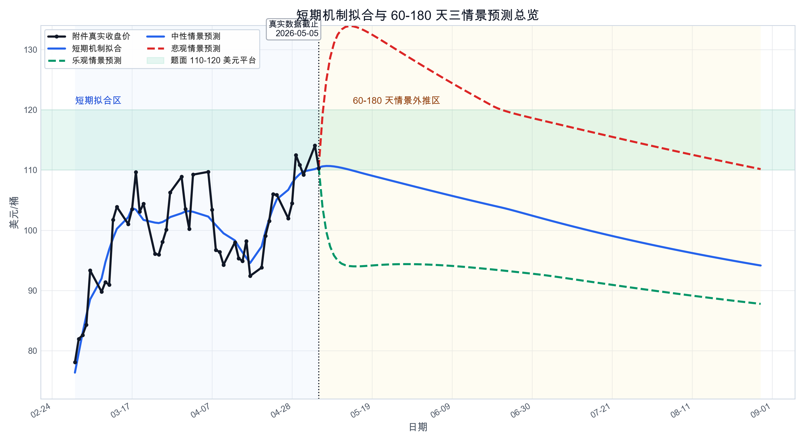
  </a>
</p>

## 核心矛盾

霍尔木兹海峡封锁可能造成约 1,400—1,800 万桶/日的供应中断。若直接把巨大缺口代入低弹性需求曲线，线性需求反事实会给出 278—337 美元/桶的极端价格；附件中的真实市场却在 110—120 美元/桶附近形成阶段性平台。

因此，本项目不把问题简化成一条时间序列外推，而是回答两个更具体的问题：

1. **短期为什么没有冲向 200 美元以上？**
2. **库存、SPR、替代供给和制度风险共同作用后，未来 60—180 天的中心路径与尾部风险是什么？**

模型把物理供需与市场定价拆开：SPR、商业库存、绕道运输和需求收缩负责填补物理缺口；恐慌溢价、持续封锁风险和缓冲确认折价负责解释市场如何把缺口映射为价格。

<p align="center">
  <a href="paper/figures/论文总体技术路线图.png">
    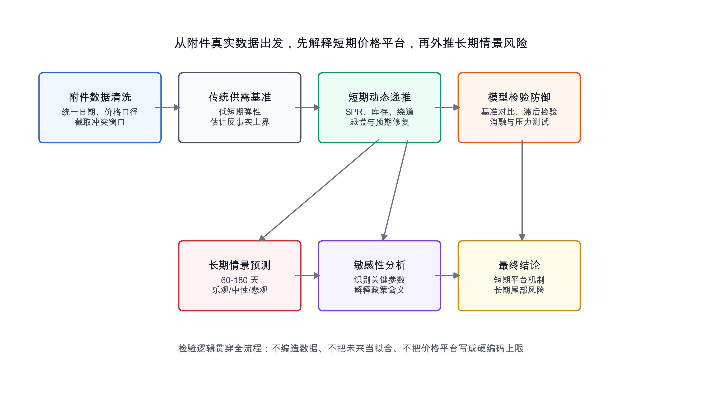
  </a><br>
  <sub>从附件价格、机制递推、历史校准到长期概率路径和外部证据审计的完整研究链。</sub>
</p>

## 最新结果

| 模块 | 当前结果 | 解释边界 |
|---|---|---|
| 短期机制主模型 | RMSE **3.47**、MAE **2.87**、MAPE **2.88%** | 不使用当日真实价格，解释 0—60 天平台形成 |
| 同口径统计审计 | RMSE **3.49**，相对朴素上一日基准的 4.52 下降 **22.63%** | DM 平方损失单侧检验 `p=0.000116`；方向命中率 **65.91%** |
| 三情景中心路径 | 第 180 天：乐观 **86.26**、中性 **97.82**、悲观 **121.64** 美元/桶 | 悲观情景外推期最高价约 **137.75** 美元/桶 |
| 蒙特卡洛联合扰动 | 第 180 天 P50 **104.91**，P05—P95 为 **87.77—116.59** 美元/桶 | 外推期最高价突破 120/130 美元的概率分别为 **19.95% / 5.00%** |
| 马尔可夫状态转移 | 第 180 天 P50 **97.59**，P05—P95 为 **90.98—116.21** 美元/桶 | 在状态转移条件模型下，最高价突破 120 美元的条件概率为 **85.4%** |

蒙特卡洛与状态转移模型回答的不是同一个概率问题：前者扰动连续参数和路径噪声，后者显式允许“缓和—维持—升级”状态跳变。因此 README 保留两套结果，不把条件概率和无条件概率混写成一个数字。

---

## 结果图谱

以下图表均来自当前模型、审计数据或正式论文。点击图片可查看高清原图。

### 1. 从机械高价到现实价格平台

<table>
  <tr>
    <td width="50%" align="center">
      <a href="paper/figures/传统供需基准与真实价格对比.png">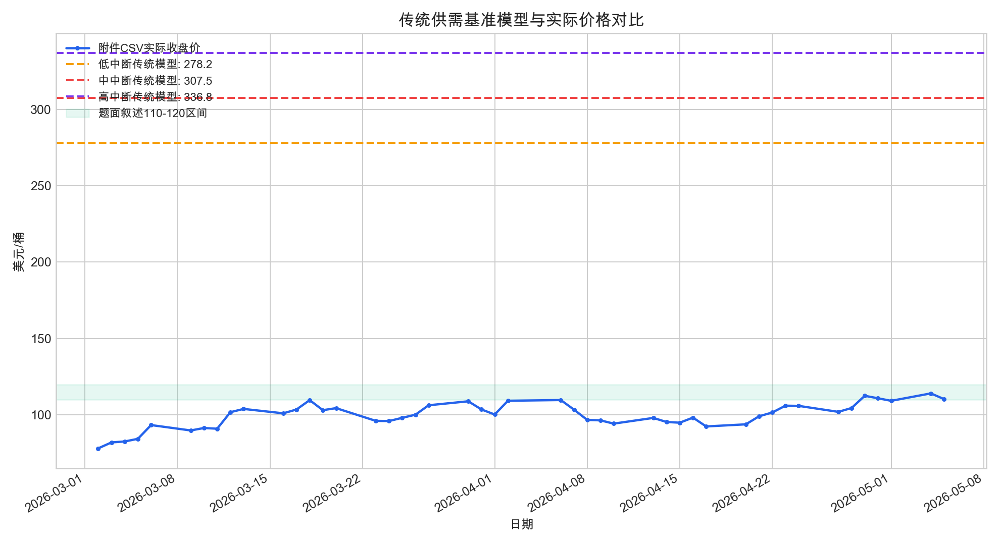</a><br>
      <sub><strong>机械反事实上界</strong><br>传统供需缺口模型显著高估真实价格，暴露出必须解释的机制缺口。</sub>
    </td>
    <td width="50%" align="center">
      <a href="paper/figures/短期模型拟合效果.png">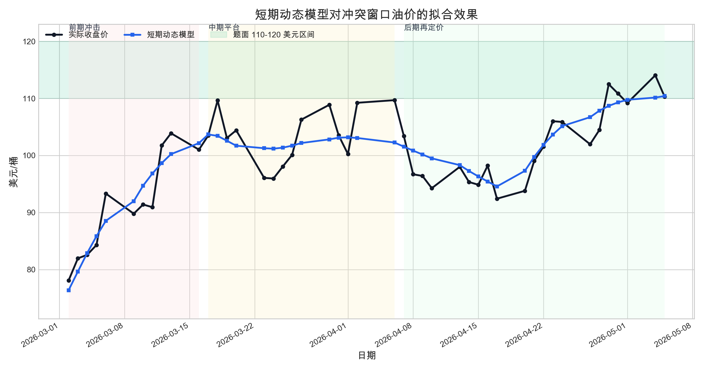</a><br>
      <sub><strong>短期机制拟合</strong><br>缓冲覆盖、恐慌衰减与预期修复共同解释 110—120 美元平台。</sub>
    </td>
  </tr>
</table>

### 2. 短期模型不是黑箱拟合

<table>
  <tr>
    <td width="50%" align="center">
      <a href="paper/figures/短期模型机制贡献.png">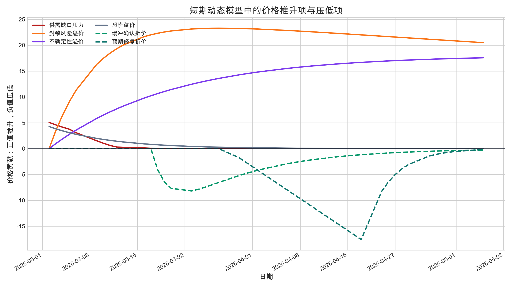</a><br>
      <sub><strong>机制贡献分解</strong><br>风险溢价推高价格，SPR、库存、绕道和预期修复向下缓冲。</sub>
    </td>
    <td width="50%" align="center">
      <a href="paper/figures/短期模型机制消融实验.png">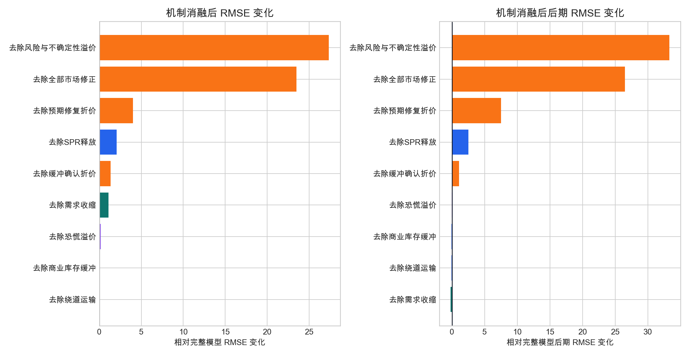</a><br>
      <sub><strong>机制消融</strong><br>逐项关闭物理或市场机制，检验扩展项是否只是任意拟合补丁。</sub>
    </td>
  </tr>
  <tr>
    <td width="50%" align="center">
      <a href="paper/figures/短期模型基准对比.png">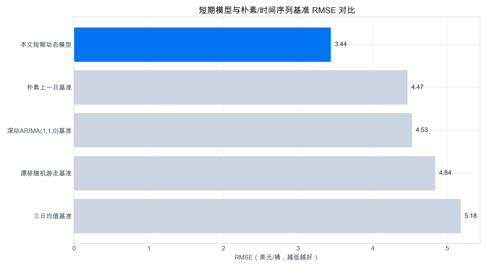</a><br>
      <sub><strong>预测基准比较</strong><br>与随机游走、滞后复制、三日均值和滚动 ARIMA 同口径比较。</sub>
    </td>
    <td width="50%" align="center">
      <a href="paper/figures/短期模型统计审计.png">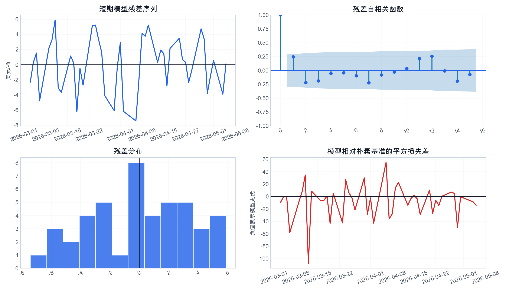</a><br>
      <sub><strong>统计显著性审计</strong><br>同时报告误差、DM 检验、方向命中和残差相关性。</sub>
    </td>
  </tr>
  <tr>
    <td width="50%" align="center">
      <a href="paper/figures/短期模型参数剖面图.png">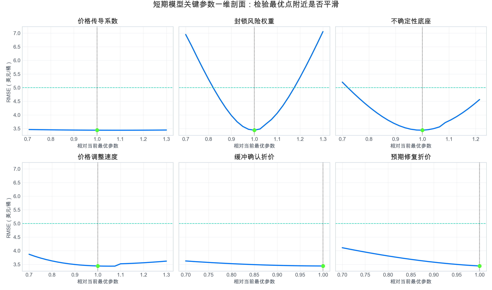</a><br>
      <sub><strong>参数剖面</strong><br>展示关键机制参数附近的目标函数形状和可识别程度。</sub>
    </td>
    <td width="50%" align="center">
      <a href="paper/figures/短期模型时间轴与删块稳健性.png">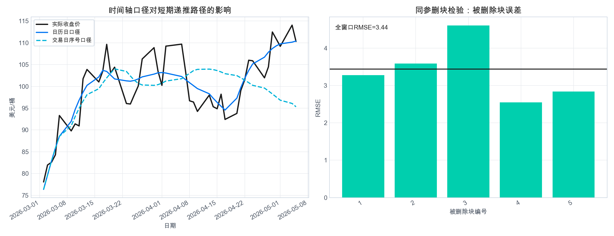</a><br>
      <sub><strong>时间轴与删块检验</strong><br>验证日历日递推的合理性，并定位最难解释的再定价窗口。</sub>
    </td>
  </tr>
</table>

### 3. 中长期不是三条光滑曲线

<p align="center">
  <a href="paper/figures/蒙特卡洛情景树高级组合图.png">
    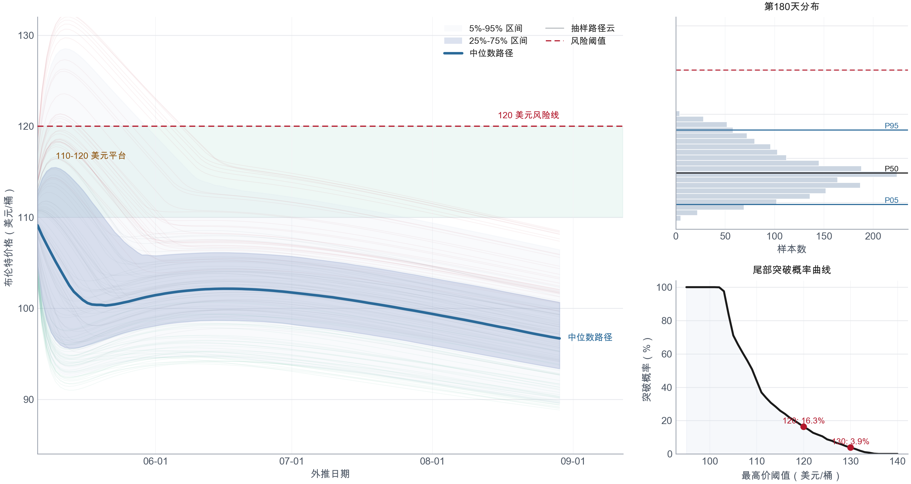
  </a><br>
  <sub>路径云、P05—P95 扇形区间、第 180 天价格分布和阈值突破概率在同一张图中闭环呈现。</sub>
</p>

<table>
  <tr>
    <td width="50%" align="center">
      <a href="paper/figures/长期状态转移情景树.png">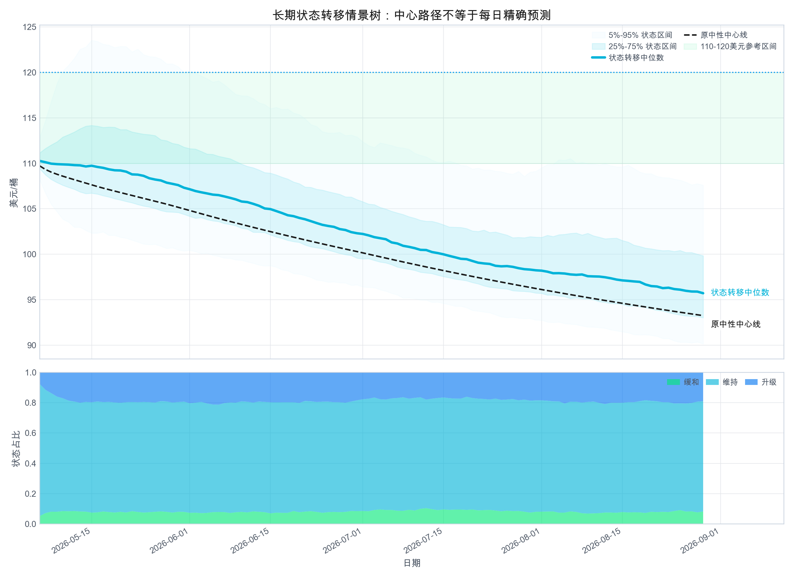</a><br>
      <sub><strong>状态转移情景树</strong><br>缓和、维持和升级状态随物理压力与 GPR/OVX 风险共同切换。</sub>
    </td>
    <td width="50%" align="center">
      <a href="paper/figures/库存与供需缺口风险.png">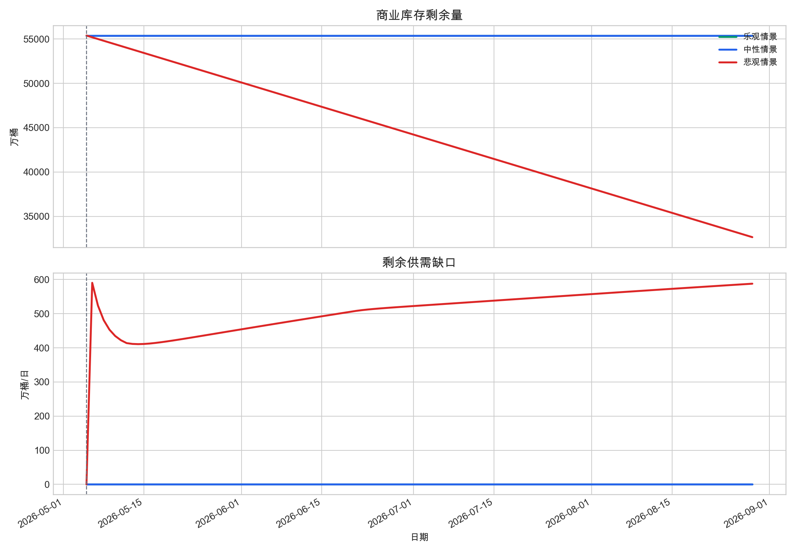</a><br>
      <sub><strong>库存耗尽与二次跳涨</strong><br>把剩余缺口、商业库存和 SPR 压力与价格尾部联系起来。</sub>
    </td>
  </tr>
  <tr>
    <td width="50%" align="center">
      <a href="paper/figures/参数敏感性龙卷风图.png">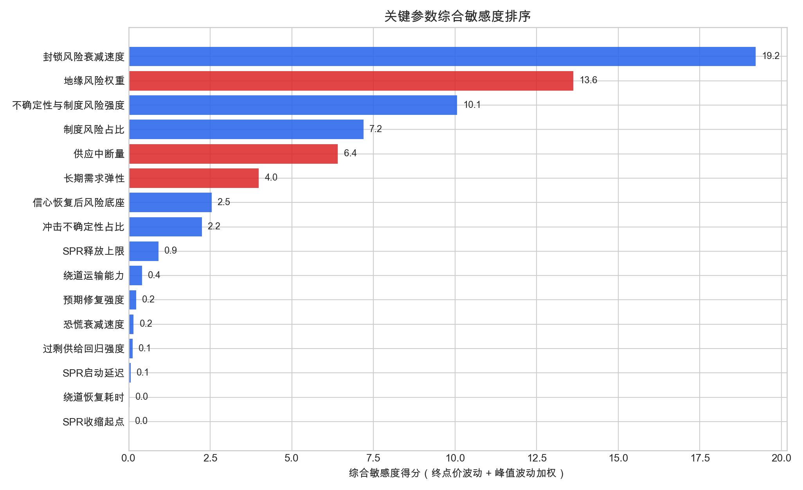</a><br>
      <sub><strong>参数敏感性排序</strong><br>封锁风险衰减速度成为综合敏感度最高的机制参数。</sub>
    </td>
    <td width="50%" align="center">
      <a href="paper/figures/长期敏感性扰动热力图.png">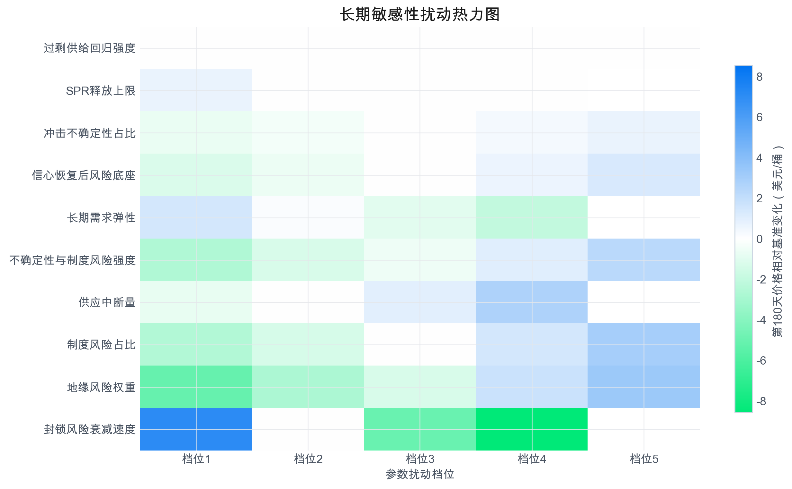</a><br>
      <sub><strong>多档扰动热力图</strong><br>展示关键参数对第 180 天价格的影响方向、非对称性和幅度。</sub>
    </td>
  </tr>
</table>

<table>
  <tr>
    <td width="50%" align="center">
      <a href="paper/figures/传统蒙特卡洛路径云图.png">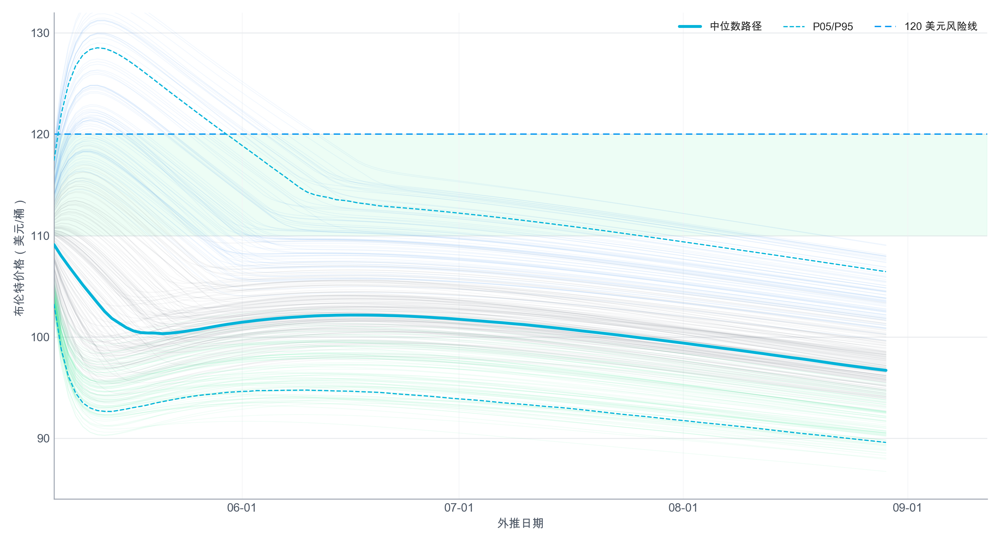</a><br>
      <sub><strong>传统路径云</strong><br>保留单条样本轨迹、中心路径、P05/P95 边界与 120 美元风险线。</sub>
    </td>
    <td width="50%" align="center">
      <a href="paper/figures/R长期状态转移扇形图.png">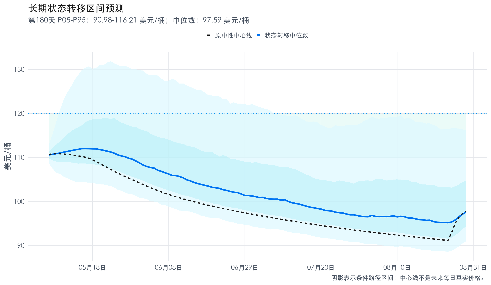</a><br>
      <sub><strong>R 学术扇形图</strong><br>用双层置信带弱化对单一长期中心线的误读。</sub>
    </td>
  </tr>
</table>

### 4. 外部证据与历史极端性

<table>
  <tr>
    <td width="50%" align="center">
      <a href="paper/figures/地缘风险指数滞后审计.png">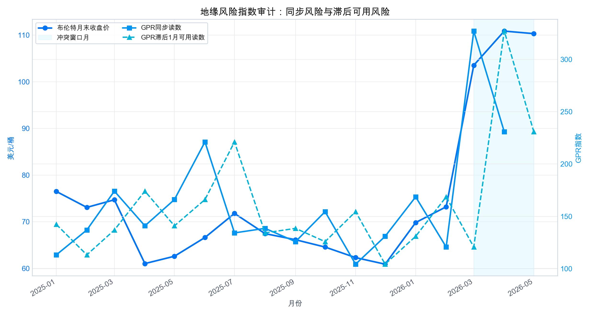</a><br>
      <sub><strong>GPR 滞后审计</strong><br>事件月风险处于历史极高分位，但滞后 GPR 对收益方向解释较弱。</sub>
    </td>
    <td width="50%" align="center">
      <a href="paper/figures/OVX隐含波动率滞后检验.png">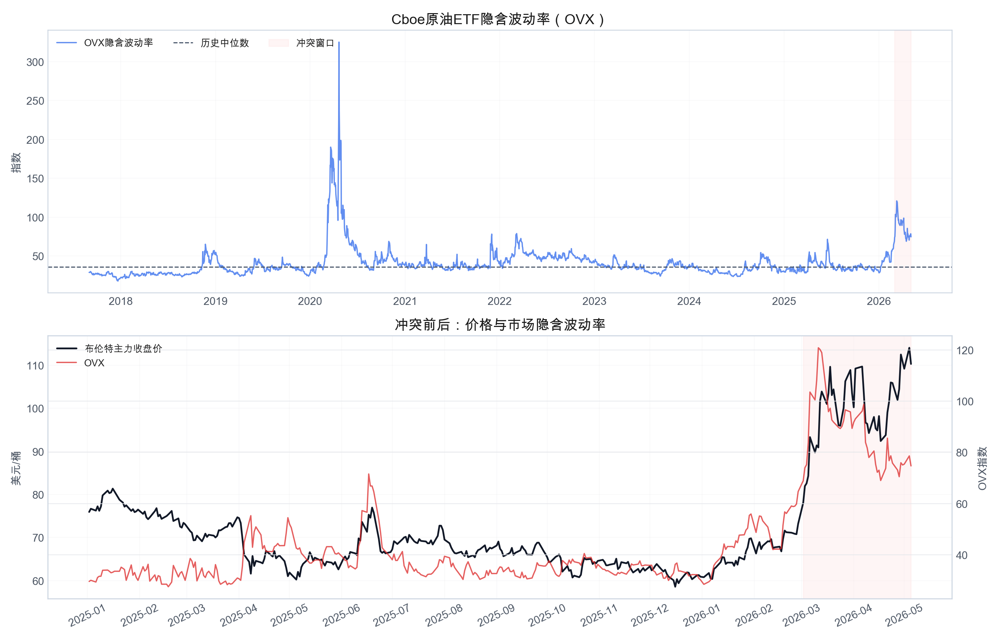</a><br>
      <sub><strong>OVX 市场风险审计</strong><br>冲突窗口均值位于历史约 97.3% 分位，滞后 OVX 能解释实现波动而非收益方向。</sub>
    </td>
  </tr>
  <tr>
    <td width="50%" align="center">
      <a href="paper/figures/历史窗口极端性检验.png">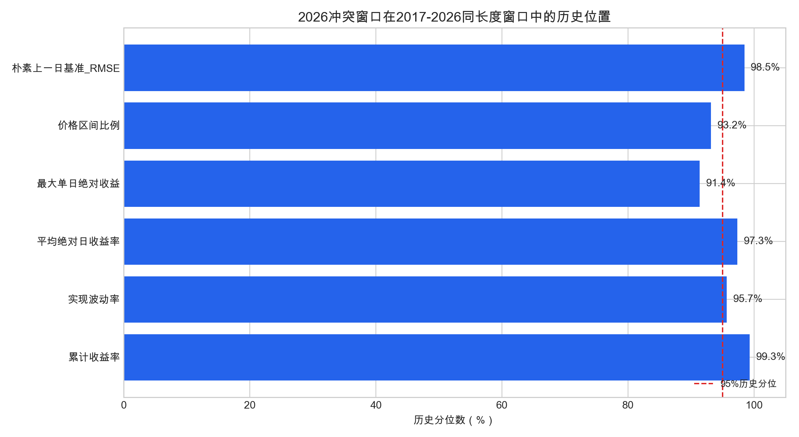</a><br>
      <sub><strong>历史窗口极端性</strong><br>冲突窗口累计收益、波动率和朴素基准误差均处于历史高分位。</sub>
    </td>
    <td width="50%" align="center">
      <a href="paper/figures/R短期误差学术诊断.png">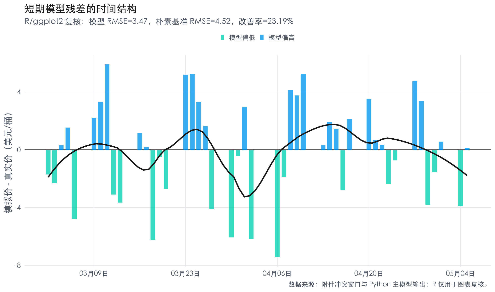</a><br>
      <sub><strong>R 残差诊断</strong><br>从残差时间结构、分布和系统偏差三个角度检查短期模型。</sub>
    </td>
  </tr>
</table>

---

## 模型结构

### 任务一｜0—60 天短期冲击模型

- 物理供需层：供应中断、SPR、商业库存、绕道运输和已观测需求收缩；
- 市场定价层：恐慌溢价、冲击不确定性、持续封锁制度风险和缓冲确认折价；
- 使用真实经过时间驱动释放、绕道和风险衰减，不以交易日序号替代日历时间；
- Ridge 和在线残差校正只作为低自由度辅助层，不替代机制主模型。

### 任务二｜60—180 天中长期调节模型

- 自适应三情景中心路径描述缓和、中性和持续封锁条件；
- 蒙特卡洛模型对参数、压力指数和路径噪声做 2,000 次联合扰动；
- 马尔可夫状态转移模型生成 3,000 条“缓和—维持—升级”条件路径；
- EIA、JODI 和 OPEC 约束长期供需数量级，GPR 与 OVX 只约束风险层。

## 证据边界

| 证据 | 在项目中的用途 | 没有做什么 |
|---|---|---|
| 赛题附件价格 | 短期拟合、真实峰值和预测起点 | 不用于未来真实价格泄漏 |
| EIA / JODI / OPEC | 库存、产量、供需平衡和替代供给的数量级约束 | 不直接替代赛题冲击参数 |
| GPR | 证明地缘风险处于历史极端位置并审计滞后关系 | 不把同月新闻相关性写成因果 |
| OVX | 约束长期风险权重和不确定性强度 | 不作为短期价格方向预测变量 |
| 2017—2025 历史窗口 | 校准波动、状态跳变和极端性分位 | 不把历史片段当作本次冲突的重复样本 |

这套边界刻意区分“进入模型的约束”“用于稳健性审计的证据”和“暂不具备复现条件的数据”。期货多期限结构与油轮保险费没有被强行数值化。

## 为什么结果可信

| 审计层 | 已完成检查 |
|---|---|
| 预测基准 | 朴素上一日、漂移随机游走、三日均值与滚动 ARIMA |
| 统计检验 | DM 平方/绝对损失检验、方向命中检验、Ljung—Box 残差检验 |
| 机制检验 | 单机制消融、机制贡献分解和参数剖面 |
| 稳健性 | 参数扰动、稳健性带、滞后平移、局部拐点、时间轴和删块检验 |
| 长期风险 | 三情景、蒙特卡洛、状态转移、风险约束消融和敏感性分析 |
| 外部审计 | EIA、JODI、OPEC、GPR、OVX 与历史同长度窗口 |
| 双语言复核 | Python 主计算链与 R 计量/图表辅助层 |

## 一键复现

```bash
source scripts/project_env.sh
./scripts/build/build_final_paper.sh
```

正式构建需要 `xelatex -shell-escape` 与 Pygments，用于渲染附录中的代码。环境定义见 [environment.yml](environment.yml) 和 [requirements.txt](requirements.txt)。

## 最终交付

| 文件 | 内容 |
|---|---|
| `A题_霍尔木兹海峡封锁对国际原油价格影响_论文.pdf` | 当前 57 页正式论文 |
| `A题_霍尔木兹海峡封锁对国际原油价格影响_论文.docx` | 供团队批注和人工修改的 Word 版本 |
| [`paper/总论文.tex`](paper/总论文.tex) | 模块化 XeLaTeX 主控文件 |
| [`paper/sections/`](paper/sections) | 正文章节源码 |

## 阅读入口

| 入口 | 内容 |
|---|---|
| [项目总览](docs/00_项目总览.md) | 当前状态、最新结果与证据边界 |
| [建模方案](docs/01_建模方案.md) | 短期和长期模型结构、参数与公式口径 |
| [工程复现](docs/02_工程复现.md) | 环境、运行命令和计算流程 |
| [交付物与数据索引](docs/03_交付物与数据索引.md) | 关键 CSV、图表、报告和论文位置 |
| [决策与质疑防御](docs/04_决策与质疑防御.md) | 关键假设、模型选择和评委质疑回应 |
| [论文图表映射](paper/figures_mapping.md) | 每张正式图的数据来源与论文位置 |

## 仓库导航

| 路径 | 内容 |
|---|---|
| [`data/`](data) | 附件、清洗数据和外部证据 |
| [`src/`](src) | 数据清洗、校准、建模、检验和可视化代码 |
| [`paper/`](paper) | 模块化论文源码、参考文献与正式图表 |
| [`output/reports/`](output/reports) | 模型运行报告和证据材料 |
| [`审计报告/`](审计报告) | 评委视角质疑、防御矩阵和外部审计记录 |
| [`dashboard/`](dashboard) | 可选 Streamlit 交互展示 |

> 最终主线只有一份总论文。历史素材稿不属于当前交付；所有关键数字都应能回溯到 CSV、脚本或审计报告。
