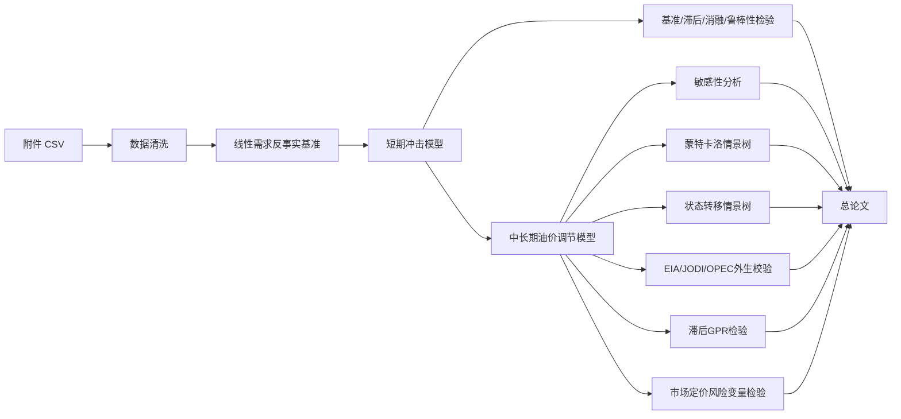

# 建模方案

## 1. 总体技术路线

核心逻辑是：先用线性需求反事实基准证明“只靠低弹性供需缺口会严重高估价格”，并用常弹性需求口径给出机械上界参照；再用短期冲击模型解释真实价格为什么被压在 110-120 美元/桶附近；最后用中长期油价调节模型、敏感性分析、蒙特卡洛情景树、状态转移情景树、EIA/JODI/OPEC 外生校验、滞后 GPR 检验和市场定价风险变量检验回答持续封锁下的长期风险与风险溢价可信度。

## 2. 模型层级

| 层级 | 作用 | 论文角色 |
|---|---|---|
| 传统供需基准模型 | 给出线性需求反事实压力，并保留常弹性机械上界参照 | 反事实基准 |
| 短期冲击模型 | 解释附件冲突窗口内的真实价格路径 | 任务 1 对应模型 |
| 中长期油价调节模型 | 在短期冲击模型基础上预测 60-180 天路径 | 任务 2 对应模型 |
| 消融与敏感性分析 | 检验因素贡献和参数重要性 | 主模型可信度证明 |
| 蒙特卡洛情景树 | 联合扰动关键参数，刻画价格区间和尾部概率 | 长期风险区间材料 |
| 状态转移情景树 | 让缓和、维持、升级三类事件状态动态切换，并用 GPR/OVX 风险读数温和约束转移概率 | 回应长期中心线过平的问题 |
| EIA/JODI/OPEC 外生校验 | 用官方能源数据约束供给、库存、贸易、需求和全球供需平衡数量级 | 防止长期外推脱离现实数量级 |
| 滞后 GPR 检验 | 用官方地缘风险指数验证风险溢价外部一致性 | 内生性边界和外部证据 |
| 市场定价风险变量检验 | 接入 OVX 隐含波动率，并评估期货期限结构、油轮保险费等变量的数据可得性 | 用交易层面的风险定价补充新闻风险指数 |
| R/ggplot2 图表增强 | 对关键统计图做学术化重绘 | 提升论文美观度和统计表达 |

最终论文不应写成多个模型互相竞争，而应按赛题给定名称写成两个连续模型：短期冲击模型负责解释 0-60 天，中长期油价调节模型负责 60-180 天条件外推。

## 3. 短期冲击模型

短期冲击模型的状态变量来自附件价格路径和题面机制。模型不把 120 美元写成硬上限，而是通过供应缺口、政策缓冲、库存、绕道、需求回落、恐慌衰减、风险溢价和预期修复共同形成价格平台。

当前短期模型关键指标：

| 指标 | 数值 |
|---|---:|
| RMSE | 3.38 美元/桶 |
| MAE | 2.76 美元/桶 |
| MAPE | 2.76% |
| 相对上一日朴素基准 RMSE 改善 | 约 23.0% |
| Theil U vs naive | 0.770 |

最新补充了在线残差校正层：它只使用上一交易日以前已经观测到的模型误差，不读取当日真实价格。校正后 RMSE 降至 3.38 美元/桶，MAE 降至 2.79 美元/桶，但方向命中率低于机制主模型。因此它作为机器学习/自适应过滤思想的辅助增强，不替代综合机制递推主模型。

针对 Cursor 对时间轴语义提出的评审意见，项目已新增短期质量加固检验。同一组最优参数下，日历日口径 RMSE 为 3.38，交易日序号口径 RMSE 为 7.41，说明封锁政策、绕道运输和恐慌衰减更适合按真实经过时间推进。删块检验进一步定位出中期平台段是后续优化重点。

这些指标说明短期模型可以作为数学建模论文主模型，但不能包装成通用金融交易预测器。

## 4. 中长期油价调节模型

中长期油价调节模型给出 60-180 天三条路径：

| 情景 | 定位 |
|---|---|
| 乐观情景 | SPR 可用上限更高、绕道恢复更快、需求收缩更充分 |
| 中性情景 | 沿用综合最优参数作为主基准 |
| 悲观情景 | SPR 释放弱、绕道恢复慢、恐慌和制度风险溢价持续 |

长期部分不是拟合，因为未来真实价格不存在；它只能写成条件情景预测。质量评判重点是参数边界、机制合理性、敏感性和尾部风险解释。最新主线已经把长期机制强度参数显式拆出，包括冲击不确定性占比、制度风险占比、信心恢复后风险底座、过剩供给回归强度和封锁风险衰减速度，并纳入单因素敏感性分析，避免长期外推依赖隐藏常数。

最新长期外推不再把 SPR 直接等同于计划上限：实际释放量会根据预释放缺口、价格压力和持续时间收缩。风险项也不再使用单一长期平台，而是拆成前期冲击不确定性和持续封锁制度风险；如果供给超过需求，模型会加入较弱的过剩供给折价。

蒙特卡洛情景树用于补足单因素敏感性的不足。当前固定随机种子运行 2000 条路径，联合扰动供应中断、SPR、绕道、长期弹性、风险权重和制度风险强度等变量，输出价格扇形区间和尾部风险概率。压力指数噪声已由 2017-2025 历史同长度窗口波动分位数校准。单因素敏感性已扩展为 16 个参数，其中封锁风险衰减速度、地缘风险权重和不确定性与制度风险强度排名前三，说明长期预测最需要解释清楚“封锁风险被市场吸收的速度”。

状态转移情景树用于回应“长期中性线太平直”的质疑。它不改变三情景物理中心路径，而是在中心路径外加入缓和、维持、升级三类状态切换，并用附件历史价格波动估计扰动强度。最新版本进一步用滞后 GPR 与 OVX 隐含波动率生成综合状态转移压力，温和提高早中期升级概率。当前 3000 条样本显示，第 180 天价格 5%-95% 条件区间为 86.36-96.06 美元/桶，外推期最高价 P95 为 130.51 美元/桶，突破 120 美元/桶条件概率为 38.3%。论文中应把它解释成条件路径区间和尾部风险，而不是未来真实价格。

中长期油价调节模型中的三情景曲线是条件中心路径，不是未来每日油价的精确点预测。当前已接入 EIA 美国周度 SPR、商业库存和原油产量数据，JODI 多国月度产量、库存、进出口、需求和炼厂产出，OPEC 全球供需平衡表，以及 OVX 原油 ETF 隐含波动率作为外部校验。最新实现已经把 EIA/JODI/OPEC/OVX 推进到中长期油价调节模型参数层：前三者生成温和乘数，约束绕道能力、库存缓冲、需求收缩、长期弹性和 SPR 释放上限可信度；OVX 只温和约束风险权重和不确定性强度，不进入短期同日拟合。但 EIA 是美国口径，JODI 是多国上报口径，OPEC 是正常基线预测，OVX 是期权市场波动预期，仍不能直接替代赛题封锁冲击参数。

地缘风险侧已接入 Caldara-Iacoviello GPR 月度指数。这个指数是新闻文本构造的风险指数，所以不作为同月拟合输入；项目只使用滞后 1 月 GPR 做检验，说明 2026 年 3-4 月风险读数确实处于历史高位，同时避免“油价上涨导致新闻恐慌、新闻恐慌再解释油价”的循环论证。

在 GPR 之外，项目已新增市场定价风险变量探索。当前最稳妥、可复现的数据是 Cboe/FRED 的 OVX 原油 ETF 隐含波动率日度序列。冲突窗口 OVX 均值为 87.07，最大值为 120.91，同长度历史均值分位约 97.3%；滞后 1 日 OVX 与 7 日实现波动率相关系数为 0.790，但与收益方向关系很弱。因此 OVX 已接入中长期油价调节模型中的风险权重和不确定性强度，用于约束尾部概率和波动扰动，不包装成短期方向预测因子。

期货期限结构和油轮运输风险是更贴近市场的候选变量，但当前不能强行入模。附件只有布伦特主力连续合约，缺少 M1、M3、M6 等多到期合约，无法计算期限结构斜率；油轮保险费、BDTI、TD3C 等日度历史数据通常来自 Baltic Exchange、Lloyd's 或行业数据库授权，若仅从新闻摘取零散费率，只适合作为叙述证据，不适合变成连续数值输入。

2017-2026 完整历史数据的作用不是替代冲突窗口拟合，而是提供历史参照。历史稳健性审计使用与冲突窗口相同的 46 交易日滚动窗口，比较累计收益率、实现波动率、价格区间、最大单日跳变和朴素基准误差，证明 2026 冲突窗口属于历史高压样本；同时用 ADF 检验说明价格水平非平稳、收益率更适合做统计基准。

R 语言当前作为增强层使用：一方面提供 DM、ADF、ARCH/GARCH、Newey-West 等计量检验；另一方面用 ggplot2 重绘短期误差、长期状态转移区间和历史基准误差分布。它不替代 Python 主模型，也不声称能直接提高预测精度，但能明显增强论文的专业感和证据可读性。

## 5. 因素纳入原则

| 层级 | 因素 | 处理方式 |
|---|---|---|
| 短期冲击模型物理层 | 供应中断、短期弹性、SPR、商业库存、绕道运输、需求收缩、恐慌衰减 | 进入短期冲击模型 |
| 短期冲击模型价格形成层 | 地缘风险溢价、冲击不确定性、持续封锁制度风险、缓冲确认折价、预期修复折价 | 进入短期冲击模型，但必须通过基准、消融和稳健性检验 |
| 中长期调节层 | OPEC+ 剩余产能、非 OPEC 供给响应、冲突升级概率 | 进入中长期油价调节模型和尾部风险解释 |
| 外部校验层 | EIA 官方周度数据、JODI 官方多国月度石油数据、Caldara-Iacoviello GPR 月度指数 | 只做数量级和风险溢价校验，不直接替代主模型参数 |
| 市场定价校验层 | OVX 隐含波动率、候选 Brent 期限结构、候选油轮保险费/BDTI/TD3C | OVX 已做滞后检验；期限结构和运输风险暂不强行数值化 |
| 历史稳健层 | 2017-2026 全历史价格、同长度滚动窗口、ADF 检验 | 证明冲突窗口极端性，辅助评价普通时间序列基准 |
| 改进方向 | 美元指数、投机资金、套保需求、官方多期限 Brent 结算价 | 只有拿到可复现连续数据后才进入参数层 |

任何新增因素都要同时满足解释重要性、数据可得性、边际贡献和低过拟合风险，不能为了降低 RMSE 任意加参数。

## 6. 鲁棒性与边界检验

论文需要主动说明以下检验边界：

- 相对朴素上一日价格基准和滚动 ARIMA 是否有效。
- 是否只是滞后复制真实曲线。
- 预测步长和评价口径是否清楚。
- MAPE、相对误差和极端窗口表现是否合理。
- 46 个交易日内参数是否过多，是否存在过拟合。
- 120 美元平台是否来自外生价格上限。
- 2017 年以来的完整历史数据是否被充分利用，而不是只拟合 46 个交易日。

相关运行报告保存在 `output/reports/`，不是 `docs/` 主文档。
