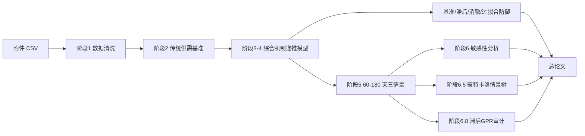

# 建模方案

## 1. 总体技术路线

核心逻辑是：先用传统供需模型证明“只靠低弹性供需缺口会严重高估价格”，再用综合机制递推模型解释真实价格为什么被压在 110-120 美元/桶附近，最后用三情景、敏感性分析、蒙特卡洛情景树和滞后 GPR 审计回答持续封锁下的长期风险与风险溢价可信度。

## 2. 模型层级

| 层级 | 作用 | 论文角色 |
|---|---|---|
| 传统供需基准模型 | 给出低弹性供需冲击下的理论上界 | 反事实基准 |
| 综合机制递推模型 | 解释附件冲突窗口内的真实价格路径 | 最终主模型 |
| 三情景外推模型 | 在主模型基础上预测 60-180 天路径 | 长期情景预测 |
| 消融与敏感性分析 | 检验因素贡献和参数重要性 | 主模型可信度证明 |
| 蒙特卡洛情景树 | 联合扰动关键参数，刻画价格区间和尾部概率 | 长期风险防御材料 |
| 滞后 GPR 审计 | 用官方地缘风险指数验证风险溢价外部一致性 | 内生性防御和外部证据 |

最终论文不应写成多个模型互相竞争，而应写成一个主模型，其他模型是基准、外推或检验工具。

## 3. 短期主模型

综合机制递推模型的状态变量来自附件价格路径和题面机制。模型不把 120 美元写成硬上限，而是通过供应缺口、政策缓冲、库存、绕道、需求回落、恐慌衰减、风险溢价和预期修复共同形成价格平台。

当前短期模型关键指标：

| 指标 | 数值 |
|---|---:|
| RMSE | 3.44 美元/桶 |
| MAE | 2.85 美元/桶 |
| MAPE | 2.86% |
| 相对上一日朴素基准 RMSE 改善 | 约 23.0% |
| Theil U vs naive | 0.770 |

这些指标说明短期模型可以作为数学建模论文主模型，但不能包装成通用金融交易预测器。

## 4. 长期情景模型

阶段 5 给出 60-180 天三条路径：

| 情景 | 定位 |
|---|---|
| 乐观情景 | SPR 可用上限更高、绕道恢复更快、需求收缩更充分 |
| 中性情景 | 沿用阶段 4 综合最优参数作为主基准 |
| 悲观情景 | SPR 释放弱、绕道恢复慢、恐慌和制度风险溢价持续 |

长期部分不是拟合，因为未来真实价格不存在；它只能写成条件情景预测。质量评判重点是参数边界、机制合理性、敏感性和尾部风险解释。

最新长期外推不再把 SPR 直接等同于计划上限：实际释放量会根据预释放缺口、价格压力和持续时间收缩。风险项也不再使用单一长期平台，而是拆成前期冲击不确定性和持续封锁制度风险；如果供给超过需求，模型会加入较弱的过剩供给折价。

蒙特卡洛情景树用于补足单因素敏感性的不足。当前固定随机种子运行 2000 条路径，联合扰动供应中断、SPR、绕道、长期弹性、风险权重和制度风险强度等变量，输出价格扇形区间和尾部风险概率。

长期预测中的三情景曲线是条件中心路径，不是未来每日油价的精确点预测。当前已接入 EIA 美国周度 SPR、商业库存和原油产量数据作为外部审计：它能约束数量级和论文叙述边界，但因为是美国口径，不能直接替代全球情景参数。

地缘风险侧已接入 Caldara-Iacoviello GPR 月度指数。这个指数是新闻文本构造的风险指数，所以不作为同月拟合输入；项目只使用滞后 1 月 GPR 做审计，说明 2026 年 3-4 月风险读数确实处于历史高位，同时避免“油价上涨导致新闻恐慌、新闻恐慌再解释油价”的循环论证。

## 5. 因素纳入原则

| 层级 | 因素 | 处理方式 |
|---|---|---|
| 主模型物理层 | 供应中断、短期弹性、SPR、商业库存、绕道运输、需求收缩、恐慌衰减 | 进入综合机制递推模型 |
| 主模型价格形成层 | 地缘风险溢价、冲击不确定性、持续封锁制度风险、缓冲确认折价、预期修复折价 | 进入主模型，但必须通过基准、消融和稳健性检验 |
| 长期情景层 | OPEC+ 剩余产能、非 OPEC 供给响应、冲突升级概率 | 进入 60-180 天情景和尾部风险解释 |
| 外部审计层 | EIA 官方周度数据、Caldara-Iacoviello GPR 月度指数 | 只做数量级和风险溢价审计，不直接替代主模型参数 |
| 改进方向 | 油轮保险费、美元指数、期货期限结构、投机资金和套保需求 | 当前缺少附件内真实外生数据，不单独参数化 |

任何新增因素都要同时满足解释重要性、数据可得性、边际贡献和低过拟合风险，不能为了降低 RMSE 任意加参数。

## 6. 防御性检验

论文需要主动回答评委可能提出的质疑：

- 是否打败朴素上一日价格基准和滚动 ARIMA。
- 是否只是滞后复制真实曲线。
- 预测步长和评价口径是否清楚。
- MAPE、相对误差和极端窗口表现是否合理。
- 46 个交易日内参数是否过多，是否存在过拟合。
- 是否把 120 美元平台硬编码进代码。

相关运行报告保存在 `output/reports/`，不是 `docs/` 主文档。
