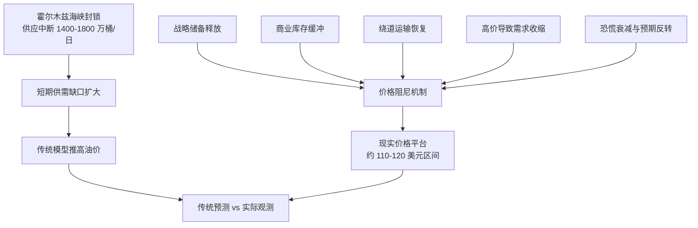

# 01 项目理解

## 一句话理解

本题不是普通的“油价预测题”，而是一个“冲击发生后，为什么市场价格没有按传统供需逻辑无限上冲”的机制解释题。

我们要用数学模型说明：霍尔木兹海峡封锁带来巨大供应缺口，但市场同时存在多个缓冲和调节机制，使布伦特油价没有稳定突破 200 美元/桶，而是在 110-120 美元/桶附近形成阶段性均衡。

## 赛题给出的核心事实

| 事实 | 数值或描述 | 建模意义 |
|---|---:|---|
| 全球原油供给 | 约 10000 万桶/日 | 基准供给规模 |
| 全球原油需求 | 约 10000 万桶/日 | 基准需求规模 |
| 霍尔木兹海峡正常运输 | 约 2000 万桶/日 | 关键运输通道 |
| 船舶通行下降 | 95.3% | 封锁冲击强度 |
| 实际供应中断 | 1400-1800 万桶/日 | 供给缺口范围 |
| 布伦特峰值 | 约 126 美元/桶 | 短期冲击上沿 |
| 观测价格区间 | 110-120 美元/桶 | 需要解释的价格平台 |
| 战略石油储备 | 约 30 亿桶 | 政策缓冲池 |
| 商业库存 | 约 5.8 亿桶 | 市场缓冲池 |
| 实际需求下降 | 约 430 万桶/日 | 需求毁灭或需求压缩 |
| 绕道运输能力 | 上限约 300 万桶/日 | 中期供给修复 |

## 核心矛盾

传统供需模型会认为，短期原油需求价格弹性很低，供应突然减少 1400-1800 万桶/日时，价格应该剧烈上涨，甚至突破 200 美元/桶。

但赛题给出的观测事实是，油价峰值约 126 美元/桶，随后主要在 110-120 美元/桶附近运行。这说明市场中存在明显的价格阻尼机制。

## 需要解释的机制

我们应重点解释以下五类机制：

| 机制 | 对价格的影响 | 建模方式 |
|---|---|---|
| 战略储备释放 | 增加临时供给，压制价格上冲 | 设置启动延迟、释放上限和释放曲线 |
| 商业库存缓冲 | 用库存吸收短期供需缺口 | 设置库存初值、消耗速度和耗尽风险 |
| 绕道运输 | 中期恢复部分供应 | 设置启动时间、爬坡速度和运力上限 |
| 需求收缩 | 高价导致消费减少 | 使用短期和长期需求价格弹性 |
| 市场预期反转 | 恐慌先推高价格，随后边际减弱 | 构造恐慌因子并设置衰减 |

## 模型总目标

本项目要完成三层模型：

1. **传统供需基准模型**：先证明如果只看供应缺口，价格可能被推到很高。
2. **0-60 天短期动态冲击模型**：模拟封锁初期价格如何从恐慌上涨转向受缓冲机制压制。
3. **60-180 天中长期情景模型**：预测继续封锁下的平衡价格区间和库存耗尽后的跳变风险。

## 计算机侧的关键价值

计算机侧不只是“帮忙画图”，而是承担整个建模系统的工程化实现：

- 把赛题 PDF 中的文字参数整理成可复用参数表。
- 把官方 CSV 清洗成可建模的时间序列数据。
- 把经济学公式写成可运行、可复算的仿真程序。
- 用参数搜索校准模型，使模拟结果贴近真实价格。
- 批量运行乐观、中性、悲观情景，形成可比较结果。
- 自动生成论文所需图表，减少人工误差。
- 如时间允许，构建交互式看板展示不同政策参数下的油价变化。
