# 03 执行计划

## 总体节奏

建议按“先跑通、再增强、最后写作”的顺序推进。不要先追求复杂模型，也不要一开始就做完整 Dashboard。最重要的是尽快形成一条能从 CSV 生成论文图表的完整链路。

```mermaid
gantt
    title A 题执行阶段图
    dateFormat  X
    axisFormat  阶段%L
    section 已完成
    阶段0 项目结构搭建           :done, 0, 1
    阶段0.5 工程骨架补强         :done, 1, 1
    阶段0.6 环境与数据库准备     :done, 2, 1
    阶段1 数据清洗和探索         :done, 3, 1
    阶段2 传统供需基准模型       :done, 4, 1
    阶段3 短期动态模型           :done, 5, 1
    阶段4 参数校准               :done, 6, 1
    阶段5 情景预测               :done, 7, 1
    阶段6 敏感性分析             :done, 8, 1
    阶段7 论文整合               :done, 9, 1
    section 后续精修
    提交版润色与答辩材料          :10, 1
```



## 阶段 0：项目结构搭建

目标：

- 建立清晰的目录结构。
- 明确所有文件产物放在哪里。

建议结构：

```text
数模/
├── docs/                  # 项目说明和执行计划
├── data/
│   ├── raw/               # 原始数据备份
│   ├── external/          # 外部资料和人工整理数据
│   ├── interim/           # 清洗中间数据
│   ├── metadata/          # 数据字典和来源说明
│   └── processed/         # 清洗后的建模数据
├── config/                # 路径、参数、情景和校准搜索范围
├── src/                   # 模型和数据处理脚本
├── figures/               # 论文图表
├── output/                # 参数、结果、报告
├── paper/                 # 论文草稿
└── dashboard/             # 可选展示系统
```

阶段产物：

- 目录创建完成
- 原始 CSV 复制到 `data/raw/`
- 标准化原始数据路径为 `data/raw/布伦特原油期货主力合约价格数据.csv`
- 建立 `config/` 参数配置层
- 建立 `STATUS.md` 当前状态入口
- `docs/` 中完成任务规划

## 阶段 0.6：环境与数据库准备

目标：

- 固定 Python 科学计算环境。
- 明确 PostgreSQL 是否使用、如何使用、何时启用。
- 先完成设计，不急于建库写入。

阶段产物：

- `environment.yml`
- `requirements.txt`
- `config/database.yml`
- `sql/001_init_schema.sql`
- `docs/09_环境与数据库方案.md`
- `output/reports/stage0_6_environment_database_report.md`

当前决策：

- 使用 `mamba` 创建 `mathmodel-oil` 环境。
- PostgreSQL 作为结构化实验底座保留，但阶段 1 完成前不写库。

## 阶段 1：数据清洗和探索

目标：

- 理解附件数据的时间范围、价格走势和冲突窗口。
- 为后续模型提供干净输入。

任务：

1. 读取 CSV。
2. 处理 `NA`。
3. 计算收益率和滚动波动率。
4. 截取 2026 年冲突窗口。
5. 标记关键时间点。
6. 生成基础探索图。

阶段产物：

- `data/processed/布伦特原油期货主力合约价格数据_清洗后.csv`
- `data/processed/布伦特原油期货主力合约价格数据_冲突窗口.csv`
- `figures/price_trend.png`
- `figures/event_window_price.png`
- `figures/return_volatility.png`
- `output/reports/stage1_validation_report.md`
- `output/reports/stage1_manifest.json`

## 阶段 2：传统供需基准模型

目标：

- 建立一个“只考虑供应缺口”的高估模型。
- 为后文引入缓冲机制提供对照组。

任务：

1. 设定基准价格 `P_0`。
2. 设定供应中断范围：1400、1600、1800 万桶/日。
3. 使用需求价格弹性推导价格变化。
4. 输出传统模型预测价格。
5. 与真实观测价格对比。

阶段产物：

- `src/models/baseline_supply_demand.py`
- `output/baseline/传统供需基准模型结果.csv`
- `figures/baseline_vs_actual.png`
- `output/reports/stage2_baseline_model_report.md`

当前完成情况：

- 已用附件 CSV 的冲突窗口真实价格作为对照。
- 已输出 1400、1600、1800 万桶/日三种供应中断情景。
- 已证明传统静态供需模型会显著高估现实价格，因此阶段 3 必须引入缓冲机制。

## 阶段 3：0-60 天短期动态模型

目标：

- 构建日度递推模型，解释封锁初期油价先冲高、后被压制的过程。

任务：

1. 实现封锁供应损失函数。
2. 实现战略储备释放函数。
3. 实现商业库存缓冲函数。
4. 实现绕道运输恢复函数。
5. 实现恐慌因子和衰减函数。
6. 实现需求价格弹性调整。
7. 汇总为日度价格递推。

阶段产物：

- `src/models/dynamic_short_term.py`
- `output/calibration/短期动态递推模型结果.csv`
- `output/calibration/短期动态递推模型误差指标.csv`
- `figures/fitted_vs_actual.png`
- `output/reports/stage3_dynamic_model_report.md`

当前完成情况：

- 已纳入 SPR、商业库存、绕道运输、需求收缩和恐慌衰减五类机制。
- 已输出动态模拟路径和误差指标。
- 已生成真实价格与动态模型对比图。

## 阶段 4：参数校准

目标：

- 让模型结果尽量贴近附件中的真实油价路径。

任务：

1. 选择需要校准的参数。
2. 设置参数搜索范围。
3. 使用多目标得分衡量模拟价格与真实价格的误差。
4. 输出最优参数组合。
5. 绘制真实价格与拟合价格对比图。

阶段产物：

- `src/calibration/calibrate_dynamic_model.py`
- `output/calibration/动态模型校准后路径.csv`
- `output/calibration/动态模型最优参数.csv`
- `output/calibration/动态模型候选参数前10.csv`
- `output/calibration/动态模型分段误差.csv`
- `output/reports/stage4_calibration_report.md`
- `figures/fitted_vs_actual.png`

当前完成情况：

- 已使用多目标校准函数，避免单纯追求 RMSE。
- 已保留综合最优、RMSE 最优、平台解释最优三类候选。
- 已输出分段误差，用于论文解释模型优劣。

## 阶段 5：60-180 天情景预测

目标：

- 回答如果封锁继续，油价会如何变化，平衡点在哪里，是否存在跳变风险。

任务：

1. 设置乐观、中性、悲观三组参数。
2. 扩展模型到 180 天。
3. 引入长期需求弹性。
4. 引入库存耗尽后的价格跳变机制。
5. 输出三情景价格路径和库存路径。

阶段产物：

- `src/scenarios/run_scenarios.py`
- `output/scenarios/三情景预测结果.csv`
- `figures/scenario_price_paths.png`
- `figures/inventory_depletion_risk.png`

## 阶段 6：敏感性分析

目标：

- 判断哪些因素最影响油价峰值和平衡价格。

任务：

1. 单独改变一个参数，其余参数固定。
2. 记录峰值价格、180 天价格、库存耗尽时间。
3. 生成敏感性图表。
4. 给出因素重要性排序。

阶段产物：

- `src/analysis/sensitivity_stage6.py`
- `output/sensitivity/阶段6_敏感性分析结果.csv`
- `output/sensitivity/阶段6_参数重要性排序.csv`
- `figures/sensitivity_tornado_180day.png`
- `figures/sensitivity_parameter_response.png`
- `output/reports/stage6_sensitivity_analysis_report.md`

## 阶段 7：论文整合

目标：

- 将模型、结果和图表整合成正式论文。

任务：

1. 写摘要。
2. 写问题重述。
3. 写模型假设。
4. 写符号说明。
5. 写三个模型。
6. 插入图表和结果分析。
7. 写模型评价、优缺点和改进方向。

阶段产物：

- `paper/outline.md`
- `paper/final.md`
- `paper/总论文.tex`
- `output/final/总论文.pdf`
- `output/final/总论文.docx`

当前状态：

- 总论文初稿已经生成。
- PDF 当前正文预览为 26 页，已做基础渲染抽查；后续加入代码附录和复现说明后页数会继续增加。
- DOCX 已导出，并通过 LibreOffice 转 PDF 做基础预览检查。
- 后续重点从“搭建论文”转为“精修论文”。

## 阶段 8：综合主模型优化

目标：

- 明确最终论文只推荐一个综合最优主模型，即“综合机制递推模型”。
- 建立因素覆盖矩阵，说明哪些因素进入主模型、哪些进入长期情景、哪些只进入改进方向。
- 避免为了降低 RMSE 无边界增加参数。
- 将主模型质量评价从“拟合好不好”升级为“拟合、解释、稳健、可复现、边界清楚”。

已完成：

- 新增 `docs/12_综合主模型与因素覆盖矩阵.md`。
- 新增 `docs/13_代码结构治理说明.md`。
- 新增 `src/common/` 公共模块，统一路径、指标和图表风格。
- 拆分 `src/calibration/calibrate_dynamic_model.py`，保留原入口，将校准设置、评估、参数空间、搜索和报告输出拆成独立模块。
- 新增 `src/analysis/factor_selection_stage8.py`。
- 生成 `output/reports/综合主模型因素覆盖矩阵.csv`。
- 生成 `output/reports/综合主模型因素覆盖矩阵.md`。

下一步：

1. 将因素覆盖矩阵压缩为论文中的一张“因素纳入说明”表。
2. 检查长期情景是否需要显式强化 OPEC+ 剩余产能、非 OPEC 供给响应和冲突升级概率。
3. 对任何新增长期因素做敏感性或情景对照，避免只靠文字解释。
4. 更新总论文中的模型命名，让“综合机制递推模型”成为明确主模型。
5. 若继续做代码治理，优先拆分长期情景脚本，保持现有入口命令不变。

验收标准：

- 论文中能清楚回答“最终主模型是什么”。
- 论文中能清楚回答“赛题要求因素和额外因素分别怎么处理”。
- 不新增无法解释来源的数字参数。
- 新增因素若进入主模型或长期情景，必须有对应表格、图或敏感性说明。
- 公共工具模块必须通过编译检查，且不改变核心模型结论。

## 阶段 9：可选展示系统

目标：

- 如果时间允许，做一个可交互的参数展示页面。

建议优先级：

1. 先保证论文图表完整。
2. 再考虑 Streamlit 快速看板。
3. 最后才考虑 React/ECharts 精致前端。

阶段产物：

- `dashboard/`
- 展示截图
- 可选演示视频或 GIF
