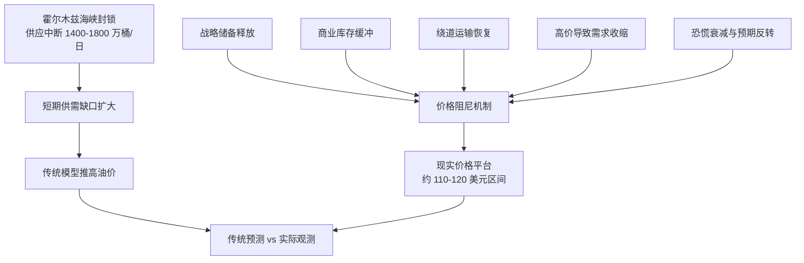
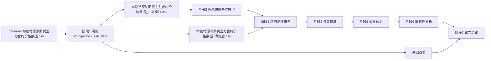
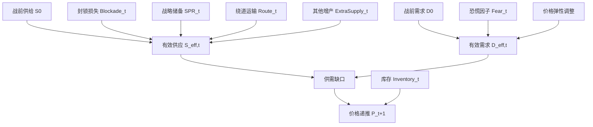
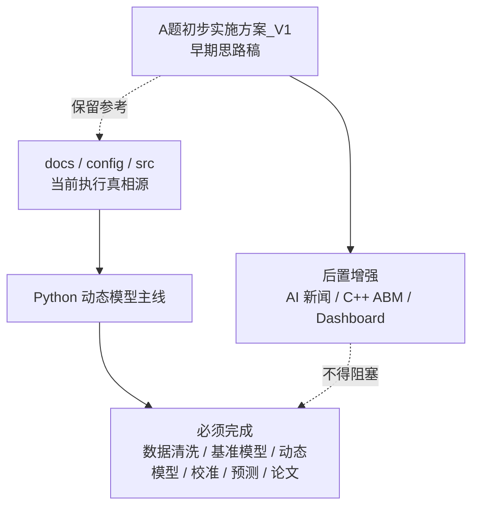
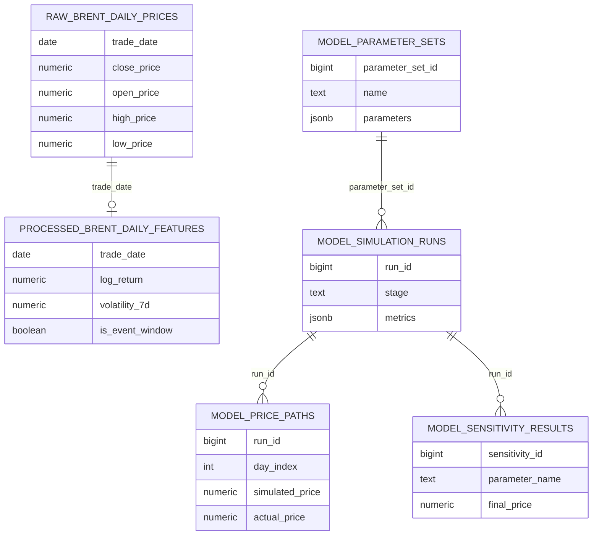
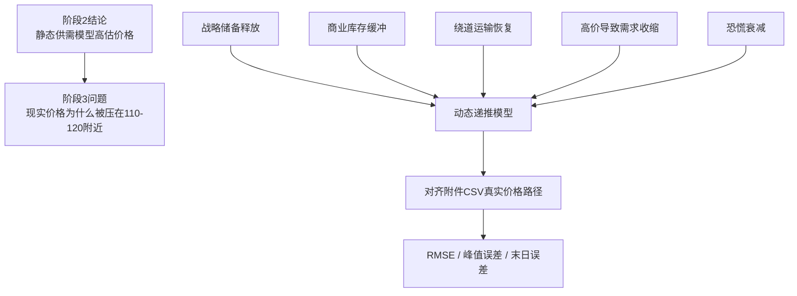

# 历史决策与早期材料

> 本文件是文档治理后的单文件历史保留版，合并了原根目录 `A题初步实施方案_V1.md`、原 `STATUS.md` 和原 `docs/archive/` 下的旧过程文档。下面内容保留原始语境，可能包含旧路径、旧页数、旧阶段判断或已被后续模型修正的方案；当前执行真相源以 `docs/00_项目总览.md`、`docs/01_建模方案.md`、`docs/02_工程复现.md`、`docs/03_交付物与数据索引.md`、`docs/04_决策与质疑防御.md`、`paper/总论文.tex` 为准。

## 原 A 题初步实施方案 V1

## **数学建模A题：霍尔木兹海峡封锁对国际原油价格影响——深度建模实施方案**

本方案旨在针对2026年美以伊战争背景下的霍尔木兹海峡封锁事件，通过“计算机+统计学”的跨学科优势，构建一套能够解释“价格异常（200美元
vs
120美元）”现象的深度建模体系。方案涵盖了数据挖掘、多智能体仿真及高级可视化等核心模块。

## **一、 赛题核心矛盾与建模目标**

题目指出的核心矛盾在于：**极端供应缺口（1400-1800万桶/日）与实际油价低位（110-120美元）之间的背离。**

| 状态 | 预测价格 | 核心逻辑 |
|:---|:---|:---|
| 传统模型预测 | \> 200 USD/桶 | 低价格需求弹性（PED）下的线性/指数推导。 |
| 实际市场观测 | 110 - 120 USD/桶 | 受战略储备、需求毁灭及市场预期等多重“阻尼器”压制。 |

## **二、 团队技术分工（计算机 + 统计学）**

充分发挥全栈开发与算法仿真能力，实现对统计学理论的工程化落地。

| 领域 | 具体分工项目 | 核心技术栈 |
|:---|:---|:---|
| **计算机（你）** | 基于AI Agent的非结构化数据抓取与NLP情感量化 基于C++的多智能体系统（MAS）底层仿真引擎开发 基于Node.js/ECharts的高级交互式可视化图表 | C++, Python, Claude Code, Node.js, ECharts |
| **统计学（队友）** | 原油价格波动特征提取（GARCH模型） 结构性突变检验（Chow Test）与因果推断 博弈效用矩阵设计与模型鲁棒性检验（OAT） | R, Stata, Python (Pandas/Statsmodels) |

## **三、 阶段性实施细则**

### **第一阶段：数据扩维——填补“解释变量”空白**

由于官方CSV仅含价格，需利用技术手段提取外部干预信号：

1.  **新闻情绪提取：** 使用AI
    Agent抓取2026年3-5月的全球主要能源新闻标题。\
2.  **恐慌指数构建：** 利用LLM对文本进行情感打分（-1到1），构建
    $`Fear\\\_Index\_t`$ 序列。\
3.  **库存信号提取：** 从EIA/IEA报告中提取战略储备（SPR）的周度释放量。

### **第二阶段：核心仿真——多智能体系统（ABM）构建**

放弃静态方程，使用C++模拟真实市场的涌现行为：

`// 伪代码逻辑：定义市场参与者Agent`\
`class MarketAgent {`\
`virtual void trade(double currentPrice, double fearIndex) = 0;`\
`};`

`class GovernmentAgent : public MarketAgent {`\
`void trade(...) {`\
`if (price > 115.0) release_SPR(target_volume); // 触发压制机制`\
`}`\
`};`

`class SpeculatorAgent : public MarketAgent {`\
`void trade(...) {`\
`double sentiment = update_sentiment(fearIndex);`\
`if (sentiment < threshold) close_long_positions(); // 获利了结`\
`}`\
`};`

运行10,000次蒙特卡洛模拟，得到包含多重非线性约束下的价格收敛轨迹。

### **第三阶段：可视化与结论提炼**

论文结论应清晰展示三大发现：

- **SPR释放的边际效应：** 证明每日释放量如何改变了供给曲线的斜率。\
- **需求毁灭阈值：**
  确定当价格达到126美元时，工业需求下降的定量百分比。\
- **预期反转时间点：** 解释为什么恐慌情绪在开战30天后不再推高油价。

## **四、 给评委的视觉冲击点**

在论文中应包含以下由你负责生成的高质量插图：

1.  **三线演进对比图：**
    真实价格轨迹线、传统模型预测线（冲向200）、以及你们的仿真拟合线。\
2.  **Agent状态热力图：**
    展示不同阶段（如开战初期vs僵持期）市场参与者的多空分布变化。\
3.  **敏感性漏斗图：** 展示SPR释放量变化对最终稳态价格的影响范围。

## 当前状态

更新时间：2026-05-11

## 当前阶段

阶段
10：历史样本稳健性已经补齐。短期模型、三情景预测、敏感性分析、蒙特卡洛、EIA
外生审计、GPR 滞后审计和 2017-2026
历史窗口检验已经整合进一份可编译的总论文，并导出 PDF 与 DOCX。


## 当前主线

采用
`Python 动态递推模型 + 参数校准 + 三情景预测 + 敏感性分析 + 论文图表`
作为主路径。

`AI 新闻情绪抓取`、`C++ 多智能体仿真`、`React/ECharts Dashboard`
暂时作为后置增强项，不进入主路径验收。

## 已完成

- 阶段 0 文档目录已建立。
- 顶层目录已建立：`data/`、`src/`、`figures/`、`output/`、`paper/`、`dashboard/`。
- 原始 CSV 已备份到 `data/raw/`。
- 项目规划 PDF 已生成。
- 阶段 0.5 已补强配置层、数据层、源码层和输出层边界。
- 阶段 0.6 已新增 `environment.yml`、`config/database.yml` 和 PostgreSQL
  初始化 SQL 设计。
- `mathmodel-oil` 环境已存在，并验证 Python 版本为
  3.11.15，核心科学计算和 PostgreSQL 依赖可导入。
- 阶段 1 已实现并运行 `src/pipeline/clean_data.py`。
- 阶段 1 已生成清洗数据、冲突窗口数据、三张基础图和阶段报告。
- 阶段 1 已新增并运行
  `src/pipeline/validate_data_cleaning.py --rerun`，自动验收 33 项，全部通过。
- 阶段 1 已新增数据字典、自动验收报告、机器可读校验结果和 manifest。
- 阶段 2 已实现并运行 `src/models/baseline_supply_demand.py`。
- 阶段 2 已生成传统供需基准结果、对照图和阶段报告。
- 阶段 2 结论：在线性化短期弹性口径下，传统供需模型预测约 278-337
  USD/barrel，明显高于附件 CSV 的冲突窗口最高收盘价 114.06 USD/barrel。
- 阶段 3 已实现并运行 `src/models/dynamic_short_term.py`。
- 阶段 3 已生成短期动态递推结果、误差指标、拟合对照图和阶段报告。
- 阶段 3 结论：在
  SPR、库存、绕道运输、需求收缩和恐慌衰减共同作用下，模型能把价格解释到
  110 美元附近平台。
- 阶段 4 已实现并运行 `src/calibration/calibrate_dynamic_model.py`。
- 阶段 4 已生成校准后路径、最优参数、候选参数前 10、分段误差和阶段报告。
- 阶段 4 结论：综合最优参数 RMSE 为 3.44，MAE 为
  2.85，并通过固定种子随机搜索、连续局部精修、局部稳健性复核和拟合质量精修，将前期、中期、后期、高价平台和低价回落误差同步压低，短期模型达到优秀水平。
- 阶段 4.7 已新增质量增强诊断，证明短期模型相对上一日价格朴素基准 RMSE
  改善 23.0%，Theil U 为 0.770，并在 800 组局部参数扰动下保持稳定。
- 阶段 4.9 已新增评委质疑防御性检验：短期模型 RMSE
  3.44，优于朴素上一日基准 4.47、滚动 ARIMA(1,1,0) 基准 4.53；MAPE 为
  2.86%；模型曲线原始位置 RMSE 最低，向左平移 1 天后 RMSE 升至
  3.87，排除了明显滞后复制风险；主要突变日中 8/10 同步捕捉、2/10 提前 1
  日。
- 阶段 4.10 已新增致命质疑补充防御：承认 46 个交易日对应 21
  个连续校准参数存在过拟合风险，并通过题面约束、多目标校准、(%)
  压力测试、传统基准弹性敏感性和代码硬编码审计进行防御。压力测试中 96.6%
  的样本峰值仍落在 105-125 美元/桶，代码审计确认模型未把 120
  美元硬编码为上限。
- 阶段 4.11
  已新增统一模型机制消融实验：不另建赛题严格版，而是在同一短期模型中逐项关闭
  SPR、库存、绕道、需求收缩、恐慌溢价、风险与不确定性溢价、缓冲确认折价和预期修复折价，证明题面物理层是主干，市场价格形成层解释期货价格如何消化物理缺口和预期修复。
- 已对原始 CSV
  的其他历史高波动窗口做固定参数边界检验：霍尔木兹机制参数在非霍尔木兹窗口通常弱于朴素基准，说明模型是事件机制模型，不应包装成通用油价短线交易器。
- 阶段 4.8
  已新增参数来源与可信度说明，明确当前短期模型没有使用爬虫数值数据，校准参数必须写成模型待估参数而非真实观测数据。
- 阶段 4.6
  已建立论文参考文献与证据库，记录油价冲击、库存预期、地缘风险、需求弹性、SPR
  和霍尔木兹背景资料。
- 短期动态模型论文初稿已生成，作为 `paper/总论文.tex`
  的素材稿保留；最终交付不再单独使用短期模型 PDF/DOCX。
- 本机已安装 BasicTeX，并补齐 `ctex`、中文字体和常用排版包；论文 PDF 与
  DOCX 可用 `./scripts/build_short_term_paper.sh` 一键复现。
- 短期模型中的防御检验、消融实验、拐点检验、过拟合压力测试和稳健性带已经迁移进总论文。
- 阶段 5 已实现并运行 `src/scenarios/scenario_forecast.py`，基于阶段 4
  综合最优参数构造乐观、中性、悲观三条 60-180 天路径。
- 长期模型当前结论：采用新版长期自适应反馈主模型，并接入 OPEC 全球供需平衡表后，中性情景第 180 天约 93.38 USD/barrel；悲观情景第 180 天约
  108.82 USD/barrel，且存在二次跳涨风险。早期 98.61/114.49 口径已降级为历史审计材料。
- 阶段 6 已实现并运行 `src/analysis/sensitivity_analysis.py`，围绕 14
  个关键参数做单因素敏感性分析；最新版本已把冲击不确定性占比、制度风险占比、信心恢复后风险底座和过剩供给回归强度纳入长期机制透明层。
- 阶段 6
  结论：综合敏感度前三为地缘风险权重、不确定性与制度风险强度、制度风险占比；SPR
  释放上限主要影响外推期峰值和削峰能力，对中性路径第 180
  天终点价影响较小。
- 阶段 7 已新增 `paper/总论文.tex` 和
  `scripts/build_final_paper.sh`，将阶段 1-6
  的数据、模型、校准、防御检验、三情景预测和敏感性分析整合成总论文。
- 总论文 PDF 当前正文预览为 39 页，输出到
  `output/final/总论文.pdf`；总论文 DOCX 已输出到
  `output/final/总论文.docx`。33
  页不是硬性目标，后续加入代码附录和复现说明后页数会继续增加。
- 阶段 8 已完成 `docs/` 文档治理：主目录收拢为
  `00_项目总览.md`、`01_建模方案.md`、`02_执行计划与分工.md`、`03_工程架构与复现.md`、`04_交付物与论文材料.md`、`05_决策记录.md`，旧版过程文档归档到
  `docs/archive/`；阶段运行报告继续保留在 `output/reports/`。
- 阶段 8 已新增 `src/common/`
  公共模块，把项目根目录、输出目录创建、误差指标和 Matplotlib
  中文图表风格统一管理。
- 阶段 8 已完成阶段 4
  校准脚本拆分：`src/calibration/calibrate_dynamic_model.py`
  保留原命令入口和兼容导出，具体职责拆到
  `settings.py`、`evaluation.py`、`parameter_space.py`、`search.py`、`reporting.py`。
- 阶段 8 已完成阶段 5
  长期情景脚本拆分：`src/scenarios/scenario_forecast.py`
  保留原命令入口和兼容导出，具体职责拆到
  `settings.py`、`parameters.py`、`simulation.py`、`reporting.py`。
- 阶段 8 后续已补充 EIA 官方外生约束、GPR 滞后风险审计和阶段 10
  历史样本稳健性检验；R
  当前未安装，不作为主线，后续只作为可选计量补强工具。

## 当前可直接引用的成果

| 类型 | 文件 | 用途 |
|----|----|----|
| 清洗数据 | `data/processed/布伦特原油期货主力合约价格数据_清洗后.csv` | 论文数据来源和后续模型输入 |
| 冲突窗口 | `data/processed/布伦特原油期货主力合约价格数据_冲突窗口.csv` | 阶段 3 和阶段 4 的真实价格对照 |
| 数据验收 | `output/reports/数据清洗验收报告.md` | 证明阶段 1 数据可靠 |
| 基准结果 | `output/baseline/传统供需基准模型结果.csv` | 论文模型一结果表 |
| 基准图 | `figures/baseline_vs_actual.png` | 证明传统模型高估现实价格 |
| 动态结果 | `output/calibration/短期动态递推模型结果.csv` | 论文模型二结果表 |
| 动态图 | `figures/fitted_vs_actual.png` | 证明动态模型能解释价格平台 |
| 阶段报告 | `output/reports/短期动态递推模型报告.md` | 可直接改写进论文模型二小节 |
| 校准参数 | `output/calibration/动态模型最优参数.csv` | 阶段 5 中性预测基准 |
| 校准报告 | `output/reports/短期模型参数校准报告.md` | 可直接改写进论文参数校准小节 |
| 质量检查 | `output/reports/早期任务质量审计报告.md` | 阶段 0 至阶段 3 完整质量审计 |
| 文献证据库 | `paper/参考文献与证据库.md` | 后续论文文献综述、模型依据和参考文献来源 |
| 短期论文素材源码 | `paper/短期动态模型论文.tex` | 短期模型章节素材稿，不作为最终交付 |
| 论文专用图 | `paper/figures/*.png` | 短期模型拟合、误差诊断、机制贡献和候选模型对比 |
| 质量增强报告 | `output/reports/短期模型质量增强报告.md` | 相对基准、残差诊断和局部扰动稳健性 |
| 防御检验报告 | `output/reports/短期模型评委质疑防御报告.md` | 回应 Random Walk、滞后曲线、预测步长、MAPE 和历史窗口边界质疑 |
| 致命质疑报告 | `output/reports/短期模型致命质疑补充防御报告.md` | 回应参数过拟合、恐慌内生性、200 美元稻草人和硬编码天花板质疑 |
| 消融实验报告 | `output/reports/短期模型机制消融实验报告.md` | 证明题面物理机制和市场价格形成机制各自的边际贡献 |
| 预测步长说明 | `output/reports/短期模型预测步长说明.md` | 明确短期模型是条件机制递推，不是 T+1 日度交易预测器 |
| 参数来源说明 | `data/metadata/参数来源与可信度说明.md` | 区分附件数据、题面参数、文献依据和模型校准参数 |
| 三情景路径 | `output/scenarios/三情景预测结果.csv` | 阶段 5 乐观、中性、悲观价格路径 |
| 三情景指标 | `output/scenarios/三情景关键指标.csv` | 第 60/90/120/180 天价格、均价、二次跳涨风险 |
| 情景预测图 | `figures/scenario_price_paths.png` | 三情景 60-180 天路径图 |
| 库存风险图 | `figures/inventory_depletion_risk.png` | 商业库存和剩余供需缺口变化 |
| 阶段 5 报告 | `output/reports/长期三情景预测报告.md` | 可直接改写进论文情景预测小节 |
| 敏感性结果 | `output/sensitivity/敏感性分析结果.csv` | 阶段 6 单因素扰动全量结果 |
| 敏感性排序 | `output/sensitivity/参数重要性排序.csv` | 关键参数综合敏感度排序 |
| 敏感性报告 | `output/reports/敏感性分析报告.md` | 可直接改写进论文敏感性分析小节 |
| 敏感性图 | `figures/sensitivity_tornado_180day.png` | 关键参数综合敏感度排序图 |
| 因素覆盖矩阵 | `output/reports/综合主模型因素覆盖矩阵.md` | 说明哪些因素进主模型、长期情景、悲观情景或改进方向 |
| 项目总览 | `docs/00_项目总览.md` | 新的文档入口，说明项目状态和文档边界 |
| 建模方案 | `docs/01_建模方案.md` | 说明最终主模型、长期情景和因素纳入原则 |
| 工程复现 | `docs/03_工程架构与复现.md` | 记录目录边界、命令入口和代码治理状态 |
| 总论文源码 | `paper/总论文.tex` | 整合阶段 1-6 的 LaTeX 总论文初稿 |
| 总论文 PDF | `output/final/总论文.pdf` | 已编译并抽查的 39 页总论文 PDF |
| 总论文 DOCX | `output/final/总论文.docx` | 可编辑 Word 版本，已做基础预览检查 |

## 下一步

进入总论文精修、答辩材料和可复现附录整理阶段。

下一轮建议重点：

- 精修摘要、结论和图表顺序，让论文从“报告堆叠”进一步变成完整论文。
- 把代码附录、运行命令和数据来源说明整理成可直接交付的附录。
- 下一轮若继续治理代码，优先减负 `src/models/dynamic_short_term.py`
  或拆分
  `src/analysis/short_term_model_defense.py`，不要先动论文入口命令。
- 评估是否需要增加答辩版 PPT 或一页核心结论图。
- 统一“美元/桶”“USD/barrel”等单位表述。
- 检查图表是否还需要降噪或替换为更适合论文版式的高分辨率图。
- 准备答辩或展示用的一页核心结论图。

短期模型论文 PDF/DOCX 复现命令：

```bash
source scripts/project_env.sh
python3 -m src.visualization.short_term_paper_figures
python3 -m src.analysis.short_term_model_quality
python3 -m src.analysis.short_term_model_defense
python3 -m src.analysis.short_term_model_fatal_challenges
python3 -m src.analysis.short_term_model_ablation
./scripts/build_short_term_paper.sh
```

阶段 5 复现命令：

```bash
source scripts/project_env.sh
/opt/homebrew/Caskroom/miniconda/base/envs/mathmodel-oil/bin/python3 -m src.scenarios.scenario_forecast
```

阶段 6 复现命令：

```bash
source scripts/project_env.sh
/opt/homebrew/Caskroom/miniconda/base/envs/mathmodel-oil/bin/python3 -m src.analysis.sensitivity_analysis
```

总论文 PDF/DOCX 复现命令：

```bash
source scripts/project_env.sh
./scripts/build_final_paper.sh
```

## 阻塞点

PostgreSQL 当前只设计，不建库、不写入。阶段 2 已经证明当前 CSV
文件足够支撑前两阶段，数据库可以等进入多情景、多轮参数实验后再启用。

备注：本机绘图依赖首次导入时出现 Matplotlib/fontconfig
缓存目录不可写提示，已添加 `.env.example`、`scripts/project_env.sh`
和项目本地 `.cache/` 目录约定。

## 阶段 1 验收目标

- `data/processed/布伦特原油期货主力合约价格数据_清洗后.csv`：已完成
- `data/processed/布伦特原油期货主力合约价格数据_冲突窗口.csv`：已完成
- `figures/price_trend.png`：已完成
- `figures/event_window_price.png`：已完成
- `figures/return_volatility.png`：已完成
- `output/reports/数据清洗报告.md`：已完成
- `output/reports/数据清洗验收报告.md`：已完成
- `output/reports/数据清洗清单.json`：已完成
- `data/metadata/数据字典.md`：已完成

## 阶段 2 验收目标

- `src/models/baseline_supply_demand.py`：已完成
- `output/baseline/传统供需基准模型结果.csv`：已完成
- `figures/baseline_vs_actual.png`：已完成
- `output/reports/传统供需基准模型报告.md`：已完成
- 传统模型高估现实价格的论文论证：已完成

## 阶段 3 验收目标

- `src/models/dynamic_short_term.py`：已完成
- `output/calibration/短期动态递推模型结果.csv`：已完成
- `output/calibration/短期动态递推模型误差指标.csv`：已完成
- `figures/fitted_vs_actual.png`：已完成
- `output/reports/短期动态递推模型报告.md`：已完成

## 阶段 4 验收目标

- `src/calibration/calibrate_dynamic_model.py`：已完成
- `output/calibration/动态模型校准后路径.csv`：已完成
- `output/calibration/动态模型最优参数.csv`：已完成
- `output/calibration/动态模型候选参数前10.csv`：已完成
- `output/calibration/动态模型分段误差.csv`：已完成
- `output/reports/短期模型参数校准报告.md`：已完成

## 数学建模 A 题项目文档目录

本目录是本次数学建模 A
题的执行中枢，用来把赛题理解、任务分工、阶段计划、技术路线和验收标准固定下来。当前目标不是替代
`A题初步实施方案_V1.md`，而是为后续建模、代码实现、图表生成和论文写作提供一套可执行的项目说明。

## 当前题目定位

题目围绕“霍尔木兹海峡封锁对国际原油价格的影响”展开。它真正要解释的不是简单的油价上涨，而是一个反常现象：

> 供给中断规模巨大，经典供需模型可能推导出 200
> 美元/桶以上的油价，但实际观测区间却主要维持在 110-120 美元/桶附近。

因此本项目的核心目标是建立一个能够解释“高供应缺口与相对低油价并存”的动态模型体系，并用数据、仿真和图表证明库存缓冲、战略储备、绕道运输、需求收缩和市场预期等机制如何共同压制油价。

## 文档索引

| 文档 | 作用 |
|----|----|
| [01_项目理解.md](01_项目理解.md) | 记录对赛题、数据、矛盾和建模目标的理解 |
| [02_任务分解与团队分工.md](02_任务分解与团队分工.md) | 拆解团队任务，突出计算机方向的可执行职责 |
| [03_执行计划.md](03_执行计划.md) | 按阶段安排工作、产物和时间顺序 |
| [04_阶段验收标准.md](04_阶段验收标准.md) | 定义每个阶段怎么算完成，避免只停留在想法 |
| [05_技术栈选型.md](05_技术栈选型.md) | 技术栈选型、取舍理由和优先级 |
| [06_建模流程设计.md](06_建模流程设计.md) | 数据处理、基准模型、动态模型、情景预测的建模流程 |
| [07_交付物清单.md](07_交付物清单.md) | 最终论文、图表、代码和可选展示系统的交付清单 |
| [08_架构决策记录.md](08_架构决策记录.md) | 记录当前主线、后置增强项、参数治理和结果归档规则 |
| [09_环境与数据库方案.md](09_环境与数据库方案.md) | 记录 mamba 环境、PostgreSQL 边界和启用时机 |
| [10_阶段2到阶段3交接说明.md](10_阶段2到阶段3交接说明.md) | 记录阶段 2 结论、阶段 3 输入输出和交接检查项 |
| [11_目录结构说明.md](11_目录结构说明.md) | 固定目录边界，说明 output/final、paper/figures 和阶段产物的归档规则 |
| [12_综合主模型与因素覆盖矩阵.md](12_综合主模型与因素覆盖矩阵.md) | 明确最终主模型、因素分层和后续优化准则 |
| [13_代码结构治理说明.md](13_代码结构治理说明.md) | 记录大文件体检、公共模块抽取和后续轻量重构原则 |

## 论文材料入口

| 文档 | 作用 |
|----|----|
| [../paper/figures_mapping.md](../paper/figures_mapping.md) | 记录论文图表编号、数据来源和生成阶段 |
| [../paper/参考文献与证据库.md](../paper/参考文献与证据库.md) | 记录已检索论文、官方资料和模型机制映射 |
| [../paper/参考文献.bib](../paper/参考文献.bib) | 后续论文排版可复用的 BibTeX 条目 |
| [../paper/短期动态模型论文.tex](../paper/短期动态模型论文.tex) | 短期动态模型素材稿，最终交付不再单独使用 |
| [../paper/总论文.tex](../paper/总论文.tex) | 整合阶段 1-6 的总论文 LaTeX 初稿 |
| [../output/final/总论文.pdf](../output/final/总论文.pdf) | 已编译并渲染抽查的总论文 PDF；当前正文预览为 39 页，后续附录会继续增加页数 |
| [../output/final/总论文.docx](../output/final/总论文.docx) | 已导出的总论文 Word 初稿，便于队友批注和后续提交版修改 |
| [../output/reports/综合主模型因素覆盖矩阵.md](../output/reports/综合主模型因素覆盖矩阵.md) | 阶段 8 生成的因素筛选报告，说明哪些因素进主模型、情景或改进方向 |

## 展示材料入口

| 文档 | 作用 |
|----|----|
| [../dashboard/README.md](../dashboard/README.md) | 记录短期模型 Streamlit 展示台的运行方式和展示内容 |
| [../config/dashboard.yml](../config/dashboard.yml) | 控制展示台读取哪些 CSV、如何分段、图表颜色和表格列 |

## 当前进度看板


| 阶段 | 状态 | 主要证据 |
|----|----|----|
| 阶段 0-0.6 | 已完成 | 目录、配置、环境和数据库设计已落地 |
| 阶段 1 | 已完成 | 清洗数据、三张图、33 项自动验收 |
| 阶段 2 | 已完成 | 传统供需模型结果、对照图、阶段报告 |
| 阶段 3 | 已完成 | 动态递推结果、拟合图、误差指标、阶段报告 |
| 阶段 4 | 已完成 | 多目标校准、连续局部精修、局部稳健性复核、最优参数、候选前 10、分段误差 |
| 阶段 4.5 | 已完成 | 短期模型质量复盘、公开评阅标准对照、提质方向 |
| 短期模型防御检验 | 已完成 | Random Walk/ARIMA 基准对比、滞后平移检验、拐点局部检验、历史窗口边界检验 |
| 短期论文素材 | 已完成 | 已并入总论文，短期稿仅保留为素材 |
| 阶段 5 | 已完成 | 三情景预测结果、关键指标、价格路径图、库存风险图、阶段报告 |
| 阶段 6 | 已完成 | 敏感性分析和关键参数排序 |
| 阶段 7 | 已完成初稿 | 总论文 LaTeX、PDF 和 DOCX 已生成并抽查 |
| 阶段 8 | 已开始 | 综合主模型因素覆盖矩阵、因素纳入准则、代码公共模块和后续优化边界已建立 |

## 推荐工作方式

先按本文档目录推进，不急着重写论文正文：

1.  先确认题目理解和核心目标。
2.  再定分工，尤其明确计算机侧产出。
3.  然后建立数据处理和模型代码目录。
4.  用代码跑出结果、图表和参数表。
5.  最后把结果写进论文，而不是先写一篇没有实证支撑的长文。

## 项目原则

- 论文结论必须能从数据和模型结果反推出来。
- 所有核心图表都应由脚本生成，避免手工改图导致前后不一致。
- 模型先求可解释、可校准、可复现，再考虑复杂度。
- 计算机优势要体现为工程化建模能力：数据管道、批量实验、参数搜索、可视化和可选交互式展示。
- 当前执行真相源以 `docs/`、`config/`、`src/`
  为准，`A题初步实施方案_V1.*` 仅作为早期思路稿保留。

## 01 项目理解

## 一句话理解

本题不是普通的“油价预测题”，而是一个“冲击发生后，为什么市场价格没有按传统供需逻辑无限上冲”的机制解释题。

我们要用数学模型说明：霍尔木兹海峡封锁带来巨大供应缺口，但市场同时存在多个缓冲和调节机制，使布伦特油价没有稳定突破
200 美元/桶，而是在 110-120 美元/桶附近形成阶段性均衡。

## 赛题给出的核心事实

| 事实                 |         数值或描述 | 建模意义           |
|----------------------|-------------------:|--------------------|
| 全球原油供给         |   约 10000 万桶/日 | 基准供给规模       |
| 全球原油需求         |   约 10000 万桶/日 | 基准需求规模       |
| 霍尔木兹海峡正常运输 |    约 2000 万桶/日 | 关键运输通道       |
| 船舶通行下降         |              95.3% | 封锁冲击强度       |
| 实际供应中断         |  1400-1800 万桶/日 | 供给缺口范围       |
| 布伦特峰值           |     约 126 美元/桶 | 短期冲击上沿       |
| 观测价格区间         |    110-120 美元/桶 | 需要解释的价格平台 |
| 战略石油储备         |         约 30 亿桶 | 政策缓冲池         |
| 商业库存             |        约 5.8 亿桶 | 市场缓冲池         |
| 实际需求下降         |     约 430 万桶/日 | 需求毁灭或需求压缩 |
| 绕道运输能力         | 上限约 300 万桶/日 | 中期供给修复       |

## 核心矛盾

传统供需模型会认为，短期原油需求价格弹性很低，供应突然减少 1400-1800
万桶/日时，价格应该剧烈上涨，甚至突破 200 美元/桶。

但赛题给出的观测事实是，油价峰值约 126 美元/桶，随后主要在 110-120
美元/桶附近运行。这说明市场中存在明显的价格阻尼机制。

## 需要解释的机制

我们应重点解释以下五类机制：



| 机制         | 对价格的影响                 | 建模方式                         |
|--------------|------------------------------|----------------------------------|
| 战略储备释放 | 增加临时供给，压制价格上冲   | 设置启动延迟、释放上限和释放曲线 |
| 商业库存缓冲 | 用库存吸收短期供需缺口       | 设置库存初值、消耗速度和耗尽风险 |
| 绕道运输     | 中期恢复部分供应             | 设置启动时间、爬坡速度和运力上限 |
| 需求收缩     | 高价导致消费减少             | 使用短期和长期需求价格弹性       |
| 市场预期反转 | 恐慌先推高价格，随后边际减弱 | 构造恐慌因子并设置衰减           |

## 模型总目标

本项目要完成三层模型：

1.  **传统供需基准模型**：先证明如果只看供应缺口，价格可能被推到很高。
2.  **0-60
    天短期动态冲击模型**：模拟封锁初期价格如何从恐慌上涨转向受缓冲机制压制。
3.  **60-180
    天中长期情景模型**：预测继续封锁下的平衡价格区间和库存耗尽后的跳变风险。

## 计算机侧的关键价值

计算机侧不只是“帮忙画图”，而是承担整个建模系统的工程化实现：

- 把赛题 PDF 中的文字参数整理成可复用参数表。
- 把官方 CSV 清洗成可建模的时间序列数据。
- 把经济学公式写成可运行、可复算的仿真程序。
- 用参数搜索校准模型，使模拟结果贴近真实价格。
- 批量运行乐观、中性、悲观情景，形成可比较结果。
- 自动生成论文所需图表，减少人工误差。
- 如时间允许，构建交互式看板展示不同政策参数下的油价变化。

## 02 任务分解与团队分工

## 总体分工思路

本题适合采用“统计建模 +
计算机工程化实现”的双线协作方式。统计方向负责理论合理性、经济解释和论文表达；计算机方向负责数据处理、模型实现、批量实验、可视化和复现。

计算机侧要突出你的优势：你有全栈开发经验、数据处理经验、金融数据项目经验和可视化交付经验，因此应该承担能体现工程能力的核心模块，而不是只做辅助图表。

## 任务总览

| 模块 | 负责人建议 | 当前状态 | 主要产出 |
|----|----|----|----|
| 赛题理解与变量表 | 共同完成，计算机侧负责结构化 | 已完成基础版 | 参数表、变量定义表 |
| 数据清洗与探索 | 计算机侧主导 | 已完成 | 清洗数据、趋势图、收益率和波动率图 |
| 传统供需基准模型 | 统计侧给理论，计算机侧实现 | 已完成 | 基准模型公式、供应缺口-价格曲线 |
| 短期动态冲击模型 | 计算机侧主导，统计侧校验 | 已完成初版 | 0-60 天模拟曲线、拟合误差 |
| 中长期情景预测 | 共同完成 | 待开始 | 60-180 天三情景预测 |
| 参数校准 | 计算机侧主导 | 已完成 | 最优参数、RMSE、拟合图 |
| 敏感性分析 | 计算机侧主导 | 待开始 | 参数敏感性图、因素排序 |
| 论文理论解释 | 统计侧主导 | 持续补充 | 模型假设、公式推导、结果解释 |
| 图表和展示 | 计算机侧主导 | 已生成前 4 张中的 4 张基础/基准图 | 论文图表、可选交互式看板 |

## 你的核心任务

### 任务 A：建立数据处理管道

输入：

- `附件1布伦特原油期货主力合约价格数据.csv`

处理：

- 日期解析
- 缺失值处理
- 价格字段数值化
- 收益率计算
- 滚动波动率计算
- 冲突窗口截取

输出：

- `data/processed/布伦特原油期货主力合约价格数据_清洗后.csv`
- `data/processed/布伦特原油期货主力合约价格数据_冲突窗口.csv`
- `figures/price_trend.png`
- `figures/return_volatility.png`

### 任务 B：实现传统供需基准模型

目的：

证明“如果只考虑供给缺口和低需求弹性，模型会明显高估油价”。

输出：

- 不同供应中断量下的理论价格：已完成
- 传统模型预测线：已完成
- 与真实价格区间的对比图：已完成
- 阶段报告：已完成

当前结论：

传统供需模型预测价格约 278-337 美元/桶，明显高于附件 CSV
的实际最高收盘价 114.06
美元/桶。这个结果的作用不是作为最终预测，而是证明后续动态缓冲机制必须进入模型。

### 任务 C：实现短期动态冲击模型

核心变量：

- 供应中断量
- 战略储备释放
- 商业库存消耗
- 绕道运输恢复
- 恐慌需求
- 需求价格弹性
- 价格调整速度

输出：

- 0-60 天日度模拟结果：已完成
- 真实价格与模拟价格对比：已完成
- 峰值价格、稳定区间、误差指标：已完成

当前结论：

动态模型已纳入
SPR、库存、绕道运输、需求收缩和恐慌衰减五类机制，模拟峰值为 110.90
美元/桶，末日价格为 110.46 美元/桶，能够解释现实价格被压在 110
美元附近的平台。

### 任务 D：参数校准和批量实验

做法：

- 使用网格搜索或随机搜索
- 以真实价格和模拟价格的 RMSE 为目标函数
- 搜索关键参数组合

输出：

- `output/calibration/动态模型最优参数.csv`
- `output/calibration/动态模型候选参数前10.csv`
- `output/calibration/动态模型分段误差.csv`
- `output/reports/短期模型参数校准报告.md`
- `figures/fitted_vs_actual.png`

当前结论：

阶段 4
已完成多目标校准、连续局部精修、局部稳健性复核和拟合质量精修，不只比较
RMSE，还同时比较峰值误差、末日误差、高价平台误差、前期冲击误差、中期平台误差、后期再定价误差和低价回落误差。综合最优
RMSE 为
3.44，模型已加入缓冲确认折价和预期修复折价，短期拟合质量达到优秀水平。

### 任务 E：中长期三情景预测

情景：

- 乐观：SPR 强、绕道快、需求收缩明显
- 中性：参数取赛题中值
- 悲观：库存消耗快、绕道慢、恐慌持续

输出：

- `output/scenarios/三情景预测结果.csv`
- `figures/scenario_price_paths.png`
- 平衡价格区间和跳变风险说明

### 任务 F：敏感性分析

分析参数：

- 供应中断量
- SPR 释放上限
- 绕道启动时间
- 需求价格弹性
- 恐慌持续时间

输出：

- `figures/sensitivity_tornado_180day.png`
- `figures/sensitivity_parameter_response.png`
- `output/sensitivity/参数重要性排序.csv`

### 任务 G：可视化与可选展示系统

基础交付：

- 所有论文图表由 Python 脚本自动生成。

进阶交付：

- 若时间允许，做一个小型交互式 Dashboard。
- 允许调整 SPR、封锁强度、需求弹性等参数，实时观察油价路径。

## 队友的核心任务

统计或经济方向队友应重点负责：

- 需求价格弹性理论解释
- GARCH 或波动率建模解释
- 结构性突变检验说明
- 经济学机制解释
- 模型假设合理性
- 论文正文组织和语言润色

## 协作边界

计算机侧给出的结果必须包括：

- 数据文件
- 参数文件
- 模型输出
- 图表
- 简短结论说明

统计侧写论文时，不能只引用“模型结果”，还要引用具体图表、参数和误差指标。这样论文会显得更扎实。

## 03 执行计划

## 总体节奏

建议按“先跑通、再增强、最后写作”的顺序推进。不要先追求复杂模型，也不要一开始就做完整
Dashboard。最重要的是尽快形成一条能从 CSV 生成论文图表的完整链路。

```mermaid
gantt
    title A 题执行阶段图
    dateFormat  X
    axisFormat  阶段%L
    section 已完成
    阶段0 项目结构搭建           :done, 0, 1
    阶段0.5 工程骨架补强         :done, 1, 1
    阶段0.6 环境与数据库准备     :done, 2, 1
    阶段1 数据清洗和探索         :done, 3, 1
    阶段2 传统供需基准模型       :done, 4, 1
    阶段3 短期动态模型           :done, 5, 1
    阶段4 参数校准               :done, 6, 1
    阶段5 情景预测               :done, 7, 1
    阶段6 敏感性分析             :done, 8, 1
    阶段7 论文整合               :done, 9, 1
    section 后续精修
    提交版润色与答辩材料          :10, 1
```



## 阶段 0：项目结构搭建

目标：

- 建立清晰的目录结构。
- 明确所有文件产物放在哪里。

建议结构：

```text
数模/
├── docs/                  # 项目说明和执行计划
├── data/
│   ├── raw/               # 原始数据备份
│   ├── external/          # 外部资料和人工整理数据
│   ├── interim/           # 清洗中间数据
│   ├── metadata/          # 数据字典和来源说明
│   └── processed/         # 清洗后的建模数据
├── config/                # 路径、参数、情景和校准搜索范围
├── src/                   # 模型和数据处理脚本
├── figures/               # 论文图表
├── output/                # 参数、结果、报告
├── paper/                 # 论文草稿
└── dashboard/             # 可选展示系统
```

阶段产物：

- 目录创建完成
- 原始 CSV 复制到 `data/raw/`
- 标准化原始数据路径为 `data/raw/布伦特原油期货主力合约价格数据.csv`
- 建立 `config/` 参数配置层
- 建立 `STATUS.md` 当前状态入口
- `docs/` 中完成任务规划

## 阶段 0.6：环境与数据库准备

目标：

- 固定 Python 科学计算环境。
- 明确 PostgreSQL 是否使用、如何使用、何时启用。
- 先完成设计，不急于建库写入。

阶段产物：

- `environment.yml`
- `requirements.txt`
- `config/database.yml`
- `sql/001_init_schema.sql`
- `docs/09_环境与数据库方案.md`
- `output/reports/环境与数据库边界报告.md`

当前决策：

- 使用 `mamba` 创建 `mathmodel-oil` 环境。
- PostgreSQL 作为结构化实验底座保留，但阶段 1 完成前不写库。

## 阶段 1：数据清洗和探索

目标：

- 理解附件数据的时间范围、价格走势和冲突窗口。
- 为后续模型提供干净输入。

任务：

1.  读取 CSV。
2.  处理 `NA`。
3.  计算收益率和滚动波动率。
4.  截取 2026 年冲突窗口。
5.  标记关键时间点。
6.  生成基础探索图。

阶段产物：

- `data/processed/布伦特原油期货主力合约价格数据_清洗后.csv`
- `data/processed/布伦特原油期货主力合约价格数据_冲突窗口.csv`
- `figures/price_trend.png`
- `figures/event_window_price.png`
- `figures/return_volatility.png`
- `output/reports/数据清洗验收报告.md`
- `output/reports/数据清洗清单.json`

## 阶段 2：传统供需基准模型

目标：

- 建立一个“只考虑供应缺口”的高估模型。
- 为后文引入缓冲机制提供对照组。

任务：

1.  设定基准价格 `P_0`。
2.  设定供应中断范围：1400、1600、1800 万桶/日。
3.  使用需求价格弹性推导价格变化。
4.  输出传统模型预测价格。
5.  与真实观测价格对比。

阶段产物：

- `src/models/baseline_supply_demand.py`
- `output/baseline/传统供需基准模型结果.csv`
- `figures/baseline_vs_actual.png`
- `output/reports/传统供需基准模型报告.md`

当前完成情况：

- 已用附件 CSV 的冲突窗口真实价格作为对照。
- 已输出 1400、1600、1800 万桶/日三种供应中断情景。
- 已证明传统静态供需模型会显著高估现实价格，因此阶段 3
  必须引入缓冲机制。

## 阶段 3：0-60 天短期动态模型

目标：

- 构建日度递推模型，解释封锁初期油价先冲高、后被压制的过程。

任务：

1.  实现封锁供应损失函数。
2.  实现战略储备释放函数。
3.  实现商业库存缓冲函数。
4.  实现绕道运输恢复函数。
5.  实现恐慌因子和衰减函数。
6.  实现需求价格弹性调整。
7.  汇总为日度价格递推。

阶段产物：

- `src/models/dynamic_short_term.py`
- `output/calibration/短期动态递推模型结果.csv`
- `output/calibration/短期动态递推模型误差指标.csv`
- `figures/fitted_vs_actual.png`
- `output/reports/短期动态递推模型报告.md`

当前完成情况：

- 已纳入 SPR、商业库存、绕道运输、需求收缩和恐慌衰减五类机制。
- 已输出动态模拟路径和误差指标。
- 已生成真实价格与动态模型对比图。

## 阶段 4：参数校准

目标：

- 让模型结果尽量贴近附件中的真实油价路径。

任务：

1.  选择需要校准的参数。
2.  设置参数搜索范围。
3.  使用多目标得分衡量模拟价格与真实价格的误差。
4.  输出最优参数组合。
5.  绘制真实价格与拟合价格对比图。

阶段产物：

- `src/calibration/calibrate_dynamic_model.py`
- `output/calibration/动态模型校准后路径.csv`
- `output/calibration/动态模型最优参数.csv`
- `output/calibration/动态模型候选参数前10.csv`
- `output/calibration/动态模型分段误差.csv`
- `output/reports/短期模型参数校准报告.md`
- `figures/fitted_vs_actual.png`

当前完成情况：

- 已使用多目标校准函数，避免单纯追求 RMSE。
- 已保留综合最优、RMSE 最优、平台解释最优三类候选。
- 已输出分段误差，用于论文解释模型优劣。

## 阶段 5：60-180 天情景预测

目标：

- 回答如果封锁继续，油价会如何变化，平衡点在哪里，是否存在跳变风险。

任务：

1.  设置乐观、中性、悲观三组参数。
2.  扩展模型到 180 天。
3.  引入长期需求弹性。
4.  引入库存耗尽后的价格跳变机制。
5.  输出三情景价格路径和库存路径。

阶段产物：

- `src/scenarios/run_scenarios.py`
- `output/scenarios/三情景预测结果.csv`
- `figures/scenario_price_paths.png`
- `figures/inventory_depletion_risk.png`

## 阶段 6：敏感性分析

目标：

- 判断哪些因素最影响油价峰值和平衡价格。

任务：

1.  单独改变一个参数，其余参数固定。
2.  记录峰值价格、180 天价格、库存耗尽时间。
3.  生成敏感性图表。
4.  给出因素重要性排序。

阶段产物：

- `src/analysis/sensitivity_analysis.py`
- `output/sensitivity/敏感性分析结果.csv`
- `output/sensitivity/参数重要性排序.csv`
- `figures/sensitivity_tornado_180day.png`
- `figures/sensitivity_parameter_response.png`
- `output/reports/敏感性分析报告.md`

## 阶段 7：论文整合

目标：

- 将模型、结果和图表整合成正式论文。

任务：

1.  写摘要。
2.  写问题重述。
3.  写模型假设。
4.  写符号说明。
5.  写三个模型。
6.  插入图表和结果分析。
7.  写模型评价、优缺点和改进方向。

阶段产物：

- `paper/outline.md`
- `paper/final.md`
- `paper/总论文.tex`
- `output/final/总论文.pdf`
- `output/final/总论文.docx`

当前状态：

- 总论文初稿已经生成。
- PDF 当前正文预览为 39
  页，已做基础渲染抽查；后续加入代码附录和复现说明后页数会继续增加。
- DOCX 已导出，并通过 LibreOffice 转 PDF 做基础预览检查。
- 后续重点从“搭建论文”转为“精修论文”。

## 阶段 8：综合主模型优化

目标：

- 明确最终论文只推荐一个综合最优主模型，即“综合机制递推模型”。
- 建立因素覆盖矩阵，说明哪些因素进入主模型、哪些进入长期情景、哪些只进入改进方向。
- 避免为了降低 RMSE 无边界增加参数。
- 将主模型质量评价从“拟合好不好”升级为“拟合、解释、稳健、可复现、边界清楚”。

已完成：

- 新增 `docs/12_综合主模型与因素覆盖矩阵.md`。
- 新增 `docs/13_代码结构治理说明.md`。
- 新增 `src/common/` 公共模块，统一路径、指标和图表风格。
- 拆分
  `src/calibration/calibrate_dynamic_model.py`，保留原入口，将校准设置、评估、参数空间、搜索和报告输出拆成独立模块。
- 新增 `src/analysis/factor_selection.py`。
- 生成 `output/reports/综合主模型因素覆盖矩阵.csv`。
- 生成 `output/reports/综合主模型因素覆盖矩阵.md`。

下一步：

1.  将因素覆盖矩阵压缩为论文中的一张“因素纳入说明”表。
2.  检查长期情景是否需要显式强化 OPEC+ 剩余产能、非 OPEC
    供给响应和冲突升级概率。
3.  对任何新增长期因素做敏感性或情景对照，避免只靠文字解释。
4.  更新总论文中的模型命名，让“综合机制递推模型”成为明确主模型。
5.  若继续做代码治理，优先拆分长期情景脚本，保持现有入口命令不变。

验收标准：

- 论文中能清楚回答“最终主模型是什么”。
- 论文中能清楚回答“赛题要求因素和额外因素分别怎么处理”。
- 不新增无法解释来源的数字参数。
- 新增因素若进入主模型或长期情景，必须有对应表格、图或敏感性说明。
- 公共工具模块必须通过编译检查，且不改变核心模型结论。

## 阶段 9：可选展示系统

目标：

- 如果时间允许，做一个可交互的参数展示页面。

建议优先级：

1.  先保证论文图表完整。
2.  再考虑 Streamlit 快速看板。
3.  最后才考虑 React/ECharts 精致前端。

阶段产物：

- `dashboard/`
- 展示截图
- 可选演示视频或 GIF

## 04 阶段验收标准

本文档定义每个阶段怎么算完成。验收标准必须具体，避免出现“模型大概做好了”“图差不多有了”这种不可检查的状态。

## 阶段 0：项目结构

完成标准：

- `docs/` 目录存在，且包含项目理解、任务分工、计划、验收、技术栈文档。
- 后续计划中的 `data/`、`src/`、`figures/`、`output/`、`paper/`
  目录已明确用途。
- 原始数据和生成数据的边界清楚。

验收问题：

- 新成员打开目录后，能否在 3 分钟内知道下一步该做什么？
- 是否能区分原始文件、处理后文件、图表和论文草稿？

## 阶段 1：数据清洗

完成标准：

- CSV 能被脚本稳定读取。
- 日期列成功转为日期类型。
- 价格列成功转为数值类型。
- 缺失值处理方式明确记录。
- 能输出完整历史数据和冲突窗口数据。
- 至少生成 3 张基础图。

最低图表：

- 布伦特油价长期走势
- 2026 冲突窗口价格走势
- 收益率或波动率走势

验收问题：

- 数据时间范围是否写清楚？
- 冲突窗口从哪一天开始是否写清楚？
- 图表是否可以直接放进论文初稿？

## 阶段 2：传统供需基准模型

完成标准：

- 模型公式明确。
- 参数含义明确。
- 至少覆盖 3 种供应中断情景。
- 能输出传统模型预测价格。
- 能解释为什么传统模型会高估油价。

最低结果：

- `output/baseline/传统供需基准模型结果.csv`
- `baseline_vs_actual.png`
- 一段可直接写入论文的解释文字

验收问题：

- 传统模型是否真的形成了与现实价格的对照？
- 是否能支撑“必须引入缓冲机制”的论证？

## 阶段 3：0-60 天动态模型

完成标准：

- 模型按日递推。
- 每天都能输出供给、需求、库存、价格等核心变量。
- 战略储备、库存、绕道运输、恐慌需求、价格弹性至少有 4 个机制被纳入。
- 能生成 0-60 天模拟价格曲线。

最低结果：

- `output/calibration/短期动态递推模型结果.csv`
- `figures/fitted_vs_actual.png`
- 模型变量说明表

验收问题：

- 是否能解释价格从冲高到平台化的过程？
- 模型是不是可复算，而不是手工构造结果？

## 阶段 4：参数校准

完成标准：

- 明确校准目标函数。
- 明确参数搜索范围。
- 输出最优参数组合。
- 输出拟合误差。
- 画出真实价格和模拟价格对比图。
- 输出分段误差，说明前期、中期、后期、高价平台和低价回落的拟合质量。

最低指标：

- RMSE
- MAE
- 峰值误差
- 最终价格误差
- 高价平台 RMSE
- 低价回落 RMSE

验收问题：

- 模型是否比传统基准模型更接近真实数据？
- 参数是否还在赛题给出的合理范围内？

## 阶段 5：60-180 天情景预测

完成标准：

- 至少包含乐观、中性、悲观三种情景。
- 每种情景有明确参数表。
- 每种情景输出 180 天价格路径。
- 明确给出平衡价格区间。
- 明确说明库存耗尽或价格跳变风险。

最低结果：

- `output/scenarios/三情景预测结果.csv`
- `scenario_price_paths.png`
- `inventory_depletion_risk.png`
- 三情景结论表

验收问题：

- 是否回答了赛题任务 2 的核心问题？
- 是否说明了不同情景为什么产生不同结果？

## 阶段 6：敏感性分析

完成标准：

- 至少分析 5 个参数。
- 每个参数都有变化范围。
- 输出峰值价格和平衡价格的变化。
- 给出因素重要性排序。

最低结果：

- `output/sensitivity/敏感性分析结果.csv`
- `output/sensitivity/参数重要性排序.csv`
- `figures/sensitivity_tornado_180day.png`
- `figures/sensitivity_parameter_response.png`
- `output/reports/敏感性分析报告.md`

验收问题：

- 是否能回答“最关键的影响因素是什么”？
- 结论是否能指导论文中的政策建议？

## 阶段 7：论文整合

完成标准：

- 论文包含摘要、问题重述、假设、符号说明、模型建立、求解、结果、评价。
- 每个核心结论都有图表或数据支撑。
- 图表编号、标题和正文引用一致。
- 参数表和符号表完整。
- 代码附录或核心代码说明完整。
- `paper/总论文.tex` 已生成。
- `output/final/总论文.pdf` 已生成并渲染抽查。
- `output/final/总论文.docx` 已生成并通过转 PDF 预览检查。

验收问题：

- 论文是否从“模型结果”推出结论，而不是先写结论再找图？
- 老师或评委能否看懂模型为什么合理？
- PDF/DOCX 是否都能打开并看到完整图表？

## 阶段 8：可选展示系统

完成标准：

- 能调整至少 3 个参数。
- 能显示油价路径变化。
- 能显示关键指标，如峰值、平衡价、库存耗尽日。
- 页面截图可放入答辩材料。

验收问题：

- 展示系统是否服务论文，而不是分散时间？
- 如果时间不够，是否可以果断放弃而不影响主交付？

## 05 技术栈选型

## 选型原则

本项目的技术栈要服务数学建模竞赛，而不是炫技。优先级如下：

1.  能快速得到可靠结果。
2.  能生成论文需要的图表。
3.  能复现和批量实验。
4.  能体现计算机方向优势。
5.  在时间允许时再做交互式展示。

## 推荐主技术栈

| 模块     | 推荐技术                     | 用途                               |
|----------|------------------------------|------------------------------------|
| 数据处理 | Python, pandas, numpy        | CSV 清洗、时间序列处理、参数表处理 |
| 模型计算 | Python, numpy, scipy         | 供需模型、日度递推、参数搜索       |
| 统计分析 | statsmodels, scipy           | 回归、误差指标、波动率或检验辅助   |
| 可视化   | matplotlib, seaborn, plotly  | 论文图表和交互图                   |
| 配置管理 | YAML 或 CSV                  | 管理模型参数和情景参数             |
| 文档     | Markdown                     | 计划、报告、论文草稿               |
| 可选看板 | Streamlit 或 React + ECharts | 交互式参数展示                     |

## 为什么主力用 Python

Python 最适合本题的主流程：

- 官方数据是 CSV，pandas 处理最直接。
- 需要快速迭代模型和图表。
- 参数校准、敏感性分析、批量情景实验都容易脚本化。
- 论文图表能直接导出为 PNG/SVG/PDF。
- 队友如果用统计工具，也容易交换 CSV。

## 关于 C++ 的取舍

`A题初步实施方案_V1.md` 中提到 C++
多智能体仿真，这是一个很强的方向，但当前不建议作为第一优先级。

原因：

- 数学建模最需要的是可解释结果和论文完整度。
- C++ 会增加开发、调试和图表对接成本。
- 本题数据量并不大，Python 性能足够。
- 如果先做 C++，容易变成工程复杂但论文结果不足。

更合理的策略：

- 主模型用 Python 实现。
- 如果后期时间充足，再用 C++ 或更复杂 ABM 作为附加亮点。
- 论文中可以描述“多主体行为思想”，但实现上先用可解释的动态递推模型。

## 关于全栈 Dashboard 的取舍

你有全栈经验，所以可以做 Dashboard，但它应该是加分项，不是主线。

推荐路线：

1.  先用 Python 生成全部静态论文图表。
2.  若还有时间，用 Streamlit 快速做可交互演示。
3.  若需要更强展示效果，再考虑 React + ECharts。

当前已先落地 `Plotly + Streamlit + YAML`
展示台，用于短期模型的拟合、误差、机制贡献和候选参数展示。React +
ECharts 更适合在阶段 5
三情景预测完成后做最终答辩展示页，因为那时会有更多情景曲线和风险卡片可展示。

不建议一开始就做完整前后端，因为这会消耗论文建模时间。

## 最小可行技术组合

如果时间紧，采用：

```text
Python + pandas + numpy + matplotlib + scipy + Markdown
```

这已经足够完成：

- 数据清洗
- 基准模型
- 动态模型
- 参数校准
- 情景预测
- 敏感性分析
- 论文图表

## 增强技术组合

如果时间较充足，增加：

```text
plotly + streamlit + yaml
```

增强点：

- 图表更美观
- 参数配置更清晰
- 可做答辩演示

## 高展示技术组合

如果目标是做出很强的展示效果，增加：

```text
React + ECharts + FastAPI
```

适合做：

- 参数调节面板
- 三情景价格曲线
- 库存耗尽风险卡片
- 论文或答辩截图

但这部分必须在主模型和论文图表完成后再做。

## 建议依赖

初版 `requirements.txt` 可以包含：

```text
pandas
numpy
scipy
matplotlib
seaborn
plotly
pyyaml
statsmodels
```

如使用 Streamlit，再增加：

```text
streamlit
```

## 代码风格建议

- 每个脚本只负责一个阶段。
- 所有参数从配置文件读取，不要散落在代码里。
- 所有输出写入 `output/` 或 `figures/`。
- 图表文件名和论文引用保持一致。
- 关键函数写中文注释，方便队友理解。

## 06 建模流程设计

## 总流程

```text
原始 CSV
  -> 数据清洗
  -> 冲突窗口提取
  -> 传统供需基准模型
  -> 短期动态递推模型
  -> 参数校准
  -> 60-180 天情景预测
  -> 敏感性分析
  -> 图表和论文结论
```



## Step 1：数据清洗

输入：

- `附件1布伦特原油期货主力合约价格数据.csv`

关键字段：

- `time`
- `preClose`
- `open`
- `high`
- `low`
- `close`

新增字段：

| 字段              | 含义             |
|-------------------|------------------|
| `log_return`      | 对数收益率       |
| `return_pct`      | 普通收益率       |
| `volatility_7d`   | 7 日滚动波动率   |
| `volatility_14d`  | 14 日滚动波动率  |
| `volatility_30d`  | 30 日滚动波动率  |
| `is_event_window` | 是否属于冲突窗口 |

## Step 2：传统供需基准模型

目的：

建立一个对照模型，用来说明只考虑供应缺口会高估价格。

基本思路：

```text
供应减少 -> 供需比失衡 -> 低需求弹性放大价格上涨
```

当前主口径：

```text
P = P_0 * (1 + shortage_ratio / abs(elasticity))
```

其中：

- `P_0` 为冲突前基准价格。
- `shortage_ratio` 为供应中断量占战前需求的比例。
- `elasticity` 为短期需求价格弹性，当前取 `-0.05`。
- 该口径是线性化短期弹性近似，适合作为传统模型的可解释对照。

保留参考口径：

```text
P = P_0 * supply_ratio ^ (1 / elasticity)
```

常弹性口径在短期弹性很低时会得到极高机械上界，因此仅保留在结果表中，不作为主图结论。

输出结论：

- 传统模型会给出明显高于现实观测的价格。
- 因此必须引入动态缓冲机制。

当前产物：

- `src/models/baseline_supply_demand.py`
- `output/baseline/传统供需基准模型结果.csv`
- `figures/baseline_vs_actual.png`
- `output/reports/传统供需基准模型报告.md`

## Step 3：短期动态递推模型

日度有效供应：



```text
S_eff,t = S_0 - Blockade_t + SPR_t + Route_t + ExtraSupply_t
```

日度有效需求：

```text
D_eff,t = D_0 * Fear_t * ElasticityAdjust(P_t)
```

库存变化：

```text
Inventory_t = Inventory_{t-1} + S_eff,t - D_eff,t
```

价格递推：

```text
P_{t+1} = P_t + alpha * (D_eff,t - S_eff,t) + beta * Fear_t - gamma * Buffer_t
```

其中：

- `alpha` 控制供需缺口对价格的影响。
- `beta` 控制恐慌情绪对价格的影响。
- `gamma` 控制缓冲机制对价格的压制。
- `Buffer_t` 可以由 SPR、库存和绕道能力共同构成。

阶段 3 的最小数据结构：

| 字段               | 含义                           |
|--------------------|--------------------------------|
| `day_index`        | 从冲突窗口起点开始的日序号     |
| `trade_date`       | 若能对齐真实交易日，则记录日期 |
| `simulated_price`  | 动态模型模拟价格               |
| `actual_price`     | 附件 CSV 实际收盘价            |
| `effective_supply` | 当日有效供给                   |
| `effective_demand` | 当日有效需求                   |
| `spr_release`      | 当日战略储备释放               |
| `route_supply`     | 当日绕道运输恢复量             |
| `inventory_buffer` | 当日库存缓冲量                 |
| `fear_factor`      | 当日恐慌因子                   |

当前产物：

- `src/models/dynamic_short_term.py`
- `output/calibration/短期动态递推模型结果.csv`
- `output/calibration/短期动态递推模型误差指标.csv`
- `figures/fitted_vs_actual.png`
- `output/reports/短期动态递推模型报告.md`

## Step 4：机制函数

### 封锁冲击

```text
Blockade_t = interruption_volume
```

初版可以设为常数，范围 1400-1800 万桶/日。

### 战略储备释放

```text
SPR_t = 0, t < spr_delay
SPR_t = min(spr_max, planned_release_t), t >= spr_delay
```

参数：

- `spr_delay`
- `spr_max`
- `spr_ramp_days`

### 绕道运输

```text
Route_t = 0, t < route_start_day
Route_t = min(route_max, ramp_rate * (t - route_start_day))
```

参数：

- `route_start_day`
- `route_max`
- `route_ramp_days`

### 恐慌因子

```text
Fear_t = 1 + fear_initial * exp(-fear_decay * t)
```

参数：

- `fear_initial`
- `fear_decay`

### 需求价格弹性

```text
D_eff,t = D_0 * (P_t / P_0) ^ epsilon
```

短期弹性可以取 `-0.05` 附近；中长期可设为更大绝对值，如 `-0.15` 或
`-0.25`。

## Step 5：参数校准

目标函数：

```text
RMSE = sqrt(mean((P_sim,t - P_actual,t)^2))
```

阶段 4 实际采用多目标校准：

```text
综合得分 = RMSE
        + 0.20 * abs(峰值误差)
        + 0.25 * abs(末日误差)
        + 0.15 * 高价平台RMSE
        + 0.12 * 前期RMSE
        + 0.12 * 中期RMSE
        + 0.18 * 后期RMSE
        + 0.18 * 低价回落RMSE
```

待校准参数：

| 参数              | 含义               |
|-------------------|--------------------|
| `alpha`           | 供需缺口价格敏感度 |
| `beta`            | 恐慌因子价格敏感度 |
| `gamma`           | 缓冲机制压制强度   |
| `spr_delay`       | SPR 启动延迟       |
| `spr_max`         | SPR 每日释放上限   |
| `route_start_day` | 绕道启动日         |
| `fear_decay`      | 恐慌衰减速度       |

校准方法：

- 初版用有固定随机种子的多目标随机搜索，随后使用连续局部精修和局部稳健性复核提高短期拟合质量。
- 保证每轮校准可复现。
- 保留最优 10 组参数，避免只依赖单一最优解。

当前产物：

- `src/calibration/calibrate_dynamic_model.py`
- `output/calibration/动态模型校准后路径.csv`
- `output/calibration/动态模型最优参数.csv`
- `output/calibration/动态模型候选参数前10.csv`
- `output/calibration/动态模型分段误差.csv`
- `output/reports/短期模型参数校准报告.md`

## Step 6：中长期情景预测

预测长度：

- 60-180 天

情景设置：

| 情景 | 特征                                       |
|------|--------------------------------------------|
| 乐观 | SPR 强、绕道快、需求弹性变大、恐慌快速衰减 |
| 中性 | 采用赛题中值和校准参数                     |
| 悲观 | SPR 弱、绕道慢、库存快速消耗、恐慌持续     |

核心输出：

- 180 天价格路径
- 平衡价格区间
- 库存耗尽时间
- 二次跳涨风险

## Step 7：敏感性分析

评价指标：

| 指标                      | 含义               |
|---------------------------|--------------------|
| `peak_price`              | 预测期最高价格     |
| `final_price`             | 180 天结束价格     |
| `mean_price`              | 预测期平均价格     |
| `inventory_depletion_day` | 库存耗尽日         |
| `rmse`                    | 与历史价格拟合误差 |

分析方法：

- 单因素敏感性分析
- Tornado 图
- 多情景对比曲线

## Step 8：论文结论映射

模型结果需要直接服务论文结论：

| 模型结果                  | 论文结论                   |
|---------------------------|----------------------------|
| 传统模型价格显著高于现实  | 单一供需缺口模型不足       |
| 动态模型贴近 110-120 区间 | 缓冲机制解释异常价格平台   |
| SPR 参数敏感性高          | 战略储备是短期压价核心     |
| 长期需求弹性变大          | 需求毁灭推动中期再平衡     |
| 库存耗尽触发跳变          | 封锁长期化存在二次冲击风险 |

## 07 交付物清单

## 最终交付目标

本项目最终要交付的不只是论文，而是一套可以支撑论文结论的证据链：

```text
原始数据 -> 清洗数据 -> 模型代码 -> 参数结果 -> 图表 -> 论文结论
```

## 必交付物

### 1. 数据文件

| 文件 | 内容 |
|----|----|
| `data/raw/布伦特原油期货主力合约价格数据.csv` | 官方附件原始数据备份 |
| `data/raw/布伦特原油期货主力合约价格数据_原始.csv` | 官方附件中文备份 |
| `data/processed/布伦特原油期货主力合约价格数据_清洗后.csv` | 清洗后的完整历史数据 |
| `data/processed/布伦特原油期货主力合约价格数据_冲突窗口.csv` | 冲突窗口数据 |

### 2. 参数文件

| 文件 | 内容 |
|----|----|
| `config/base.yml` | 基础路径、题面参数和冲突窗口 |
| `config/scenarios.yml` | 乐观、中性、悲观三情景参数 |
| `config/calibration_search.yml` | 校准搜索范围 |
| `config/变量定义表.csv` | 变量定义和来源类型 |
| `output/calibration/动态模型最优参数.csv` | 校准后的代表参数 |
| `output/calibration/动态模型候选参数前10.csv` | 校准候选参数前 10 |

### 3. 模型结果

| 文件 | 内容 |
|----|----|
| `output/baseline/传统供需基准模型结果.csv` | 传统供需基准模型结果 |
| `output/calibration/短期动态递推模型结果.csv` | 0-60 天动态模型结果 |
| `output/calibration/短期动态递推模型误差指标.csv` | 短期动态模型误差指标和候选参数 |
| `output/calibration/动态模型校准后路径.csv` | 阶段 4 校准后的动态模型路径 |
| `output/calibration/动态模型分段误差.csv` | 阶段 4 分段误差 |
| `output/calibration/短期模型质量指标.csv` | 短期模型增强质量指标 |
| `output/calibration/短期模型基准对比.csv` | Random Walk、滚动 ARIMA 等基准模型对比 |
| `output/calibration/短期模型滞后平移检验.csv` | 检查模型曲线是否存在滞后复制风险 |
| `output/calibration/短期模型拐点检验.csv` | 检查实际价格大幅变动日的方向捕捉情况 |
| `output/calibration/短期模型历史窗口边界检验.csv` | 固定霍尔木兹参数套用其他历史窗口的边界检验 |
| `output/calibration/短期模型过拟合压力测试.csv` | 最优参数附近 (%) 扰动压力测试 |
| `output/calibration/传统供需基准弹性敏感性.csv` | 检查 200 美元反事实基准对需求弹性的依赖程度 |
| `output/calibration/短期模型硬编码审计.csv` | 检查模型是否把 120 美元硬编码为价格上限 |
| `output/calibration/短期模型机制消融实验.csv` | 逐项关闭题面物理机制和市场价格形成机制，检查边际贡献 |
| `output/calibration/短期模型局部扰动稳健性.csv` | 局部参数扰动样本和误差结果 |
| `output/calibration/短期模型稳健性区间.csv` | 优秀扰动样本形成的价格区间 |
| `output/scenarios/三情景预测结果.csv` | 60-180 天情景预测结果 |
| `output/scenarios/三情景关键指标.csv` | 第 60/90/120/180 天价格、均价、二次跳涨风险 |
| `output/scenarios/三情景参数表.csv` | 乐观、中性、悲观情景参数差异 |
| `output/sensitivity/敏感性分析结果.csv` | 敏感性分析全量结果 |
| `output/sensitivity/参数重要性排序.csv` | 关键参数综合敏感度排序 |
| `output/reports/敏感性分析报告.md` | 阶段 6 敏感性分析报告 |
| `figures/sensitivity_tornado_180day.png` | 参数综合敏感度排序图 |
| `figures/sensitivity_parameter_response.png` | 前三高敏感参数响应曲线 |
| `output/reports/*.md` | 每阶段验收报告和结论摘要 |
| `output/reports/短期模型质量复盘与提升方向.md` | 阶段 4 后的模型质量判断和提质路线 |
| `output/reports/短期模型质量增强报告.md` | 短期模型相对基准、残差和稳健性诊断 |
| `output/reports/短期模型评委质疑防御报告.md` | 回应 Random Walk、滞后曲线、预测步长和 MAPE 质疑 |
| `output/reports/短期模型致命质疑补充防御报告.md` | 回应参数过拟合、恐慌内生性、200 美元基准和硬编码质疑 |
| `output/reports/短期模型机制消融实验报告.md` | 回应扩展项是否只是拟合补丁、题面物理机制是否仍是主干 |
| `output/reports/短期模型预测步长说明.md` | 明确短期模型是条件机制递推，不是 T+1 交易预测器 |
| `output/reports/综合主模型因素覆盖矩阵.md` | 说明赛题因素、扩展因素、长期因素和暂不参数化因素的纳入边界 |
| `output/reports/综合主模型因素覆盖矩阵.csv` | 机器可读因素评分表，可用于论文表格和后续优化 |
| `output/reports/长期三情景预测报告.md` | 阶段 5 三情景预测报告 |

### 4. 论文图表

至少需要以下图表：

| 图表 | 用途 |
|----|----|
| `figures/price_trend.png` | 展示布伦特油价长期走势 |
| `figures/event_window_price.png` | 展示冲突窗口油价变化 |
| `figures/baseline_vs_actual.png` | 展示传统模型高估现实价格 |
| `figures/fitted_vs_actual.png` | 展示动态模型拟合效果 |
| `figures/scenario_price_paths.png` | 展示 60-180 天三情景预测 |
| `figures/inventory_depletion_risk.png` | 展示库存消耗和跳变风险 |
| `figures/sensitivity_tornado_180day.png` | 展示关键参数综合敏感度排序 |
| `figures/sensitivity_parameter_response.png` | 展示前三个高敏感参数响应曲线 |
| `paper/figures/短期模型拟合效果.png` | 论文初稿中的短期模型实际值与拟合值对照 |
| `paper/figures/短期模型误差诊断.png` | 论文初稿中的短期模型误差诊断 |
| `paper/figures/短期模型机制贡献.png` | 论文初稿中的短期模型机制贡献拆解 |
| `paper/figures/候选模型误差对比.png` | 论文初稿中的候选模型质量比较 |
| `paper/figures/短期模型基准对比.png` | 论文初稿中的 Random Walk/ARIMA 基准对比 |
| `paper/figures/短期模型滞后平移检验.png` | 论文初稿中的滞后复制风险检验 |
| `paper/figures/短期模型拐点局部检验.png` | 论文初稿中的暴涨和反转窗口局部放大图 |
| `paper/figures/短期模型机制消融实验.png` | 论文初稿中的机制消融实验 |
| `paper/figures/短期模型过拟合压力测试.png` | 论文初稿中的参数过拟合压力测试 |
| `paper/figures/短期模型残差诊断增强.png` | 论文初稿中的增强残差诊断 |
| `paper/figures/短期模型稳健性带.png` | 论文初稿中的局部扰动稳健性区间 |

### 4.5. 交互展示

| 文件                         | 内容                                       |
|------------------------------|--------------------------------------------|
| `dashboard/streamlit_app.py` | 短期模型交互式展示台                       |
| `config/dashboard.yml`       | 展示台配置，记录输入 CSV、分段边界和图表列 |
| `dashboard/README.md`        | 展示台运行说明                             |

### 5. 论文文本

建议文件：

| 文件 | 内容 |
|----|----|
| `paper/短期动态模型论文.tex` | 已生成的短期动态模型素材稿，核心内容已迁移进总论文 |
| `paper/总论文.tex` | 已生成的总论文 LaTeX 初稿，整合阶段 1-6 的数据、模型、预测和敏感性分析 |
| `output/final/总论文.pdf` | 已编译并渲染抽查的总论文 PDF；当前正文预览为 39 页，后续加入代码附录后会增加 |
| `output/final/总论文.docx` | 已导出的总论文 Word 版本，已通过 LibreOffice 转 PDF 做基础预览检查 |
| `paper/outline.md` | 论文结构大纲 |
| `paper/model_sections.md` | 模型部分草稿 |
| `paper/results_sections.md` | 结果分析草稿 |

### 6. 阶段 8 主模型优化材料

| 文件 | 内容 |
|----|----|
| `docs/12_综合主模型与因素覆盖矩阵.md` | 最终主模型命名、模型层级、因素覆盖矩阵和优化准则 |
| `docs/13_代码结构治理说明.md` | 大文件体检、公共模块抽取和后续重构边界 |
| `src/common/` | 路径、指标和绘图风格公共工具 |
| `src/calibration/settings.py` | 阶段 4 校准常量和输出路径 |
| `src/calibration/evaluation.py` | 阶段 4 候选评分与分段误差 |
| `src/calibration/parameter_space.py` | 阶段 4 参数边界、编码、解码和扰动 |
| `src/calibration/search.py` | 阶段 4 参数搜索和精修流程 |
| `src/calibration/reporting.py` | 阶段 4 图表、CSV 和 Markdown 报告输出 |
| `src/analysis/factor_selection.py` | 生成因素覆盖矩阵 CSV 与 Markdown 报告 |
| `output/reports/综合主模型因素覆盖矩阵.md` | 可直接改写进论文的因素纳入说明 |
| `output/reports/综合主模型因素覆盖矩阵.csv` | 因素评分结果，便于后续排序、筛选和入文 |

## 可选交付物

### 交互式 Dashboard

如果时间允许，可以做一个展示系统。

最低功能：

- 调整供应中断量
- 调整 SPR 释放上限
- 调整绕道运输启动时间
- 调整需求价格弹性
- 实时显示油价路径

推荐指标卡：

- 峰值价格
- 180 天平衡价格
- 库存耗尽日
- 与真实价格的 RMSE

### 答辩展示材料

可选产物：

- Dashboard 截图
- 模型流程图
- 三情景对比图
- 关键结论一页纸

## 论文核心图表顺序

建议论文中按以下顺序插图：

1.  布伦特油价长期走势：说明数据基础。
2.  冲突窗口价格走势：说明现实价格平台。
3.  传统模型 vs 实际价格：说明反常现象。
4.  动态模型拟合图：说明模型解释力。
5.  三情景预测图：回答 60-180 天任务。
6.  敏感性分析图：说明关键影响因素。
7.  库存风险图：说明长期跳变风险。

## 短期模型论文初稿复现

短期模型论文初稿已经可以从代码和 LaTeX 源文件复现：

```bash
source scripts/project_env.sh
python3 -m src.visualization.short_term_paper_figures
python3 -m src.analysis.short_term_model_quality
python3 -m src.analysis.short_term_model_defense
python3 -m src.analysis.short_term_model_fatal_challenges
python3 -m src.analysis.short_term_model_ablation
./scripts/build_short_term_paper.sh
```

短期模型 PDF/DOCX
不再作为最终交付物维护。短期模型论文源码和图表只作为总论文的素材库保留，最终提交统一使用
`output/final/总论文.pdf` 和 `output/final/总论文.docx`。

## 总论文初稿复现

总论文初稿已经可以从 LaTeX 源文件一键复现：

```bash
source scripts/project_env.sh
./scripts/build_final_paper.sh
```

当前 PDF 为 `output/final/总论文.pdf`，正文预览共 39 页；当前 DOCX 为
`output/final/总论文.docx`。26
页不是最终页数约束，后续加入代码附录、复现说明和支撑材料后页数会继续增加。PDF
适合作为当前正式排版预览，DOCX 适合给队友批注和人工改写。

## 阶段 5 三情景预测复现

阶段 5 已基于阶段 4 综合最优参数生成 60-180 天情景预测：

```bash
source scripts/project_env.sh
/opt/homebrew/Caskroom/miniconda/base/envs/mathmodel-oil/bin/python3 -m src.scenarios.scenario_forecast
```

当前核心结论为：中性情景第 180 天约 104.49 USD/barrel；悲观情景第 180
天约 119.53 USD/barrel，并存在高二次跳涨风险。

## 最终结论应回答的问题

论文最后必须清楚回答：

1.  霍尔木兹海峡封锁对短期油价的冲击有多大？
2.  为什么现实油价没有突破传统模型预测的高位？
3.  战略储备、库存、绕道运输和需求收缩分别发挥了什么作用？
4.  如果封锁持续到 60-180 天，油价平衡点大概在哪里？
5.  哪些参数最影响油价走势？
6.  什么时候可能出现二次跳涨风险？

## 交付质量底线

- 图表必须能从代码重新生成。
- 参数必须有来源或合理解释。
- 模型结果不能只靠手动调整。
- 论文中的每个关键结论必须有图表或表格支撑。
- 可选展示系统不能挤占主论文和模型时间。

## 08 架构决策记录

本文档记录本项目中会影响后续实现路线的重要决策。后续如果出现新想法，先判断它是主路径、增强项还是暂不采用，避免多个方案并行拉扯。

## ADR-001：当前执行真相源

状态：已采用



决策：

- `docs/`、`config/`、`src/` 中的规划和约定是当前执行真相源。
- `A题初步实施方案_V1.*`
  保留为早期思路稿，不作为后续开发和验收的主依据。

原因：

- `V1` 强调 AI 新闻抓取、C++
  多智能体仿真和高级前端展示，方向有启发性，但开发成本较高。
- 当前比赛更需要先形成可复算模型、论文图表和结果证据链。
- 新文档已经把任务拆成阶段、验收和交付物，更适合推进。

影响：

- 后续阶段 1-7 以 Python 主线为准。
- 如果 `V1` 和 `docs/` 出现冲突，以 `docs/` 为准。

## ADR-002：主模型采用 Python 动态递推模型

状态：已采用

决策：

主路径采用：

```text
Python 数据处理 -> 传统供需基准模型 -> 0-60 天动态递推模型 -> 参数校准 -> 60-180 天情景预测 -> 敏感性分析
```

原因：

- Python 更适合 CSV 清洗、参数搜索、批量实验和论文图表生成。
- 当前数据规模不大，不需要 C++ 性能优势。
- 数学建模竞赛更看重模型解释、结果可靠性和论文完整度。

影响：

- `src/` 以 Python 模块为主。
- C++ 多智能体仿真不进入主路径验收。

## ADR-003：C++ ABM 与 Dashboard 降级为后置增强项

状态：已采用

决策：

以下内容作为后置增强项：

- AI Agent 新闻情绪抓取
- C++ 多智能体仿真
- React/ECharts 高级交互式 Dashboard

原因：

- 它们能增强展示效果，但不是完成赛题的必要条件。
- 若过早投入，会挤压数据清洗、模型校准和论文写作时间。

影响：

- 阶段 1-7 不依赖这些增强项。
- 只有在主线模型、图表和论文草稿完成后，才考虑实现。

## ADR-004：参数必须外置并记录来源

状态：已采用

决策：

所有核心参数必须放入 `config/` 或
`data/metadata/`，不允许长期散落在脚本内部。

参数分为四类：

| 类型     | 说明                               |
|----------|------------------------------------|
| 题面给定 | 赛题 PDF 直接给出的参数            |
| 外部资料 | 从公开报告或人工整理资料补充的参数 |
| 模型假设 | 为了模型闭合而设定的合理假设       |
| 校准得到 | 通过真实价格数据拟合得到的参数     |

影响：

- `config/base.yml` 管基础路径和题面参数。
- `config/scenarios.yml` 管三情景参数。
- `config/calibration_search.yml` 管参数搜索范围。
- `config/变量定义表.csv` 管变量含义和来源类型。

## ADR-005：结果必须保留阶段边界

状态：已采用

决策：

`output/` 不再只作为一个总产物目录，而是按阶段分层：

```text
output/
├── baseline/
├── calibration/
├── scenarios/
├── sensitivity/
├── reports/
└── runs/
```

原因：

- 后续会有多轮校准、情景预测和敏感性分析。
- 分层可以减少覆盖旧结果的风险。
- 论文引用时更容易定位结果来源。

影响：

- 阶段报告放入 `output/reports/`。
- 多轮实验快照可放入 `output/runs/`。
- 论文图表仍统一放入 `figures/`。

## ADR-006：阶段 2 采用线性化弹性口径作为主结论

状态：已采用

决策：

阶段 2 的传统供需基准模型以线性化短期需求价格弹性为主口径：

```text
price = base_price * (1 + supply_shortage_ratio / abs(elasticity))
```

常弹性均衡公式只作为机械上界保留在结果表中，不作为论文主图结论。

原因：

- 赛题关注的是现实价格为什么没有涨到极高水平，阶段 2
  需要一个清楚、可解释的对照组。
- 常弹性公式在 `elasticity=-0.05`
  时会给出过高数值，适合说明理论上界，但不适合放在主图里当作主要结论。
- 线性化口径仍然能得到 278-337
  USD/barrel，已经足够证明传统静态供需逻辑明显高估现实价格。

影响：

- 阶段 3 必须引入动态缓冲机制，而不是继续调整静态基准模型。
- 论文中应把阶段 2 定位为“对照模型”，不是最终预测模型。

## ADR-007：PostgreSQL 暂不进入阶段 3 主路径

状态：已采用

决策：

阶段 3 继续优先使用 CSV + Python 文件产物推进，不先把数据导入
PostgreSQL。

原因：

- 当前附件数据规模小，CSV 已经足够支撑阶段 1-3 的建模。
- 阶段 3 的核心风险是机制建模和参数校准，不是数据存储。
- 过早入库会增加操作复杂度，但对论文结果提升有限。

影响：

- PostgreSQL 继续作为后续多轮实验和结果追踪的可选底座保留。
- 若阶段 4
  以后出现大量参数搜索、运行快照和结果对比，再启用数据库更合适。

## 09 环境与数据库方案

本文档记录阶段 0.6 的环境与 PostgreSQL 决策。当前环境已经可以支撑阶段 1
和阶段 2 复跑；PostgreSQL
仍然只完成设计和文件准备，不立即建库、不写入数据。

## 一、为什么需要独立环境

本机系统 `python3` 版本较新，科学计算库可能存在兼容风险。为了保证后续
`pandas`、`scipy`、`statsmodels`、`sqlalchemy` 等依赖稳定，项目使用独立
mamba/conda 环境。

推荐环境文件：

```text
environment.yml
```

推荐创建命令：

```bash
mamba env create -f environment.yml
mamba activate mathmodel-oil
```

如果后续只使用 pip，也可以参考：

```bash
pip install -r requirements.txt
```

但首选 mamba 环境，因为它对科学计算包更稳。

## 二、环境定位

环境名：

```text
mathmodel-oil
```

核心用途：

- CSV 清洗
- 时间序列特征处理
- 数值模拟
- 参数校准
- 情景预测
- 敏感性分析
- 图表生成
- 可选 PostgreSQL 读写

## 三、是否需要 PostgreSQL

严格说，本题数据量很小，CSV + Python 足够完成论文。

但考虑到你有数据工程经验，并且希望使用 PostgreSQL，本项目允许把
PostgreSQL
作为结构化实验底座。它的作用不是增加复杂度，而是让参数、运行、结果和论文证据更可追踪。

## 四、PostgreSQL 的使用边界

适合进入数据库：

- 原始价格数据
- 清洗后的价格特征
- 参数集
- 模型运行记录
- 模拟价格路径
- 校准结果
- 敏感性分析结果
- 图表登记表

不适合进入数据库：

- 赛题 PDF
- Markdown 文档
- 论文 DOCX/PDF
- 图片图表本体
- 临时探索笔记

## 五、数据库设计

数据库建议名：

```text
math_model_oil
```

配置文件：

```text
config/database.yml
```

初始化 SQL：

```text
sql/001_init_schema.sql
```

Schema 设计：



| Schema      | 用途                                 |
|-------------|--------------------------------------|
| `raw`       | 官方原始数据和最小字段规范化         |
| `processed` | 清洗后特征数据和建模输入             |
| `model`     | 参数、模型运行、价格路径和敏感性分析 |
| `reporting` | 图表登记和论文支撑记录               |

## 六、当前不立即建库的原因

当前已经完成阶段 1 数据清洗和阶段 2
传统供需基准模型。继续暂缓建库的原因是：

1.  当前数据量很小，CSV 足够支撑阶段 3 的模型迭代。
2.  阶段 3 的主要难点是动态机制设计，不是存储层。
3.  过早写库会让简单问题复杂化，拖慢模型主线。
4.  等阶段 4 参数校准出现大量运行记录时，数据库价值会更明显。

因此当前只做：

- 环境文件
- 数据库配置
- SQL schema 设计
- 文档说明

不做：

- 不创建真实数据库
- 不执行 SQL
- 不导入 CSV
- 不写任何模型结果

## 七、何时真正启用数据库

建议在阶段 4 或阶段 5 再评估是否启用。

触发条件：

- `data/processed/布伦特原油期货主力合约价格数据_清洗后.csv` 已生成。
- `data/processed/布伦特原油期货主力合约价格数据_冲突窗口.csv` 已生成。
- 字段名、缺失值处理和日期范围已经稳定。
- 阶段 3 动态模型字段已经稳定。
- 参数校准或情景预测产生大量运行记录，需要结构化追踪。

届时再执行：

```bash
createdb math_model_oil
psql -d math_model_oil -f sql/001_init_schema.sql
```

然后用 Python 脚本将清洗后的数据写入数据库。

## 八、阶段 0.6 验收标准

- `environment.yml` 存在。
- `requirements.txt` 与环境方案一致。
- `config/database.yml` 存在。
- `sql/001_init_schema.sql` 存在。
- 数据库使用边界已写清楚。
- 当前没有执行建库和写入操作。

## 10 阶段 2 到阶段 3 交接说明

本文档用于把阶段 2 的结论交接给阶段
3，避免后续建模时忘记“为什么要做动态模型”。

## 当前结论

阶段 2
已经证明：如果只考虑供应中断和低短期需求价格弹性，传统供需模型会明显高估油价。

| 情景   |   供应中断量 |      传统模型价格 | 相对实际最高收盘价 |
|--------|-------------:|------------------:|-------------------:|
| 低中断 | 1400 万桶/日 | 278.20 USD/barrel |            2.44 倍 |
| 中中断 | 1600 万桶/日 | 307.48 USD/barrel |            2.70 倍 |
| 高中断 | 1800 万桶/日 | 336.77 USD/barrel |            2.95 倍 |

附件 CSV 的冲突窗口最高收盘价是 114.06 USD/barrel，最高盘中价是 119.50
USD/barrel。因此，阶段 3
的目标不是继续调高或调低传统模型，而是解释缓冲机制如何压住价格。

## 阶段 3 要解决的问题



## 阶段 3 输入

| 输入 | 文件 | 用途 |
|----|----|----|
| 冲突窗口真实价格 | `data/processed/布伦特原油期货主力合约价格数据_冲突窗口.csv` | 拟合和对照 |
| 题面参数 | `data/metadata/题面参数表.csv` | SPR、库存、绕道、需求收缩等参数来源 |
| 基础配置 | `config/base.yml` | 路径、单位、基准供需和弹性 |
| 阶段 2 结果 | `output/baseline/传统供需基准模型结果.csv` | 作为传统模型对照 |

## 阶段 3 输出

| 输出 | 建议文件 |
|----|----|
| 0-60 天动态模拟路径 | `output/calibration/短期动态递推模型结果.csv` |
| 动态模型与实际价格对比图 | `figures/fitted_vs_actual.png` |
| 模型变量说明 | `output/reports/短期动态递推模型报告.md` |
| 初步误差指标 | `output/calibration/短期动态递推模型误差指标.csv` |

## 最小模型字段

| 字段               | 含义                |
|--------------------|---------------------|
| `day_index`        | 日序号              |
| `trade_date`       | 交易日              |
| `actual_price`     | 附件 CSV 实际收盘价 |
| `simulated_price`  | 模型模拟价格        |
| `effective_supply` | 当日有效供给        |
| `effective_demand` | 当日有效需求        |
| `supply_gap`       | 当日供需缺口        |
| `spr_release`      | 战略储备释放量      |
| `route_supply`     | 绕道运输恢复量      |
| `inventory_buffer` | 商业库存缓冲量      |
| `fear_factor`      | 恐慌因子            |

## 验收口径

阶段 3 算完成，需要满足：

- 能从脚本稳定生成动态模拟 CSV。
- 能生成动态模型与真实价格的对比图。
- 至少纳入 SPR、库存、绕道运输、需求收缩、恐慌衰减中的 4 类机制。
- 报告中说明每个机制如何影响价格。
- 给出 RMSE、峰值误差和末日误差。

## 给论文的作用

阶段 2 是“传统模型为什么不够”，阶段 3 是“我们的模型为什么更合理”。

论文写作时可以这样承接：

```text
传统供需模型能够解释封锁冲击方向，但会显著高估油价水平。
因此，本文进一步构建包含战略储备、商业库存、绕道运输、需求收缩和市场恐慌衰减的日度动态递推模型，用于解释冲突窗口内实际油价的平台化现象。
```

## 11 目录结构说明

本文档用于固定当前项目的目录边界，避免后续阶段 5 情景预测、阶段 6
敏感性分析和最终论文交付继续把文件堆散。

## 总体原则

```text
data -> src -> output -> paper -> final
```

- `data/` 保存数据事实，不放模型推导结果。
- `src/` 保存可复跑代码，不放手工改图或论文正文。
- `output/` 保存代码生成的结果，不放原始附件。
- `paper/` 保存论文源码、参考文献和论文专用图。
- `output/final/` 保存当前可以直接交给队友或用于提交的 PDF、DOCX
  等交付物。

## 顶层目录

| 目录 | 当前角色 | 放什么 | 不放什么 |
|----|----|----|----|
| `docs/` | 项目管理和过程文档 | 计划、验收、架构决策、目录说明 | 模型结果 CSV、论文最终稿 |
| `config/` | 配置中心 | 题面参数、情景参数、校准范围、展示配置 | 运行结果 |
| `data/` | 数据源与数据说明 | 原始附件、清洗数据、数据字典、来源说明 | 模型输出、论文图 |
| `src/` | 代码主线 | 清洗、建模、校准、分析、可视化脚本 | 手工整理的论文文字 |
| `figures/` | 阶段图表 | 阶段 1-3 的通用图表 | 只服务论文排版的专用图 |
| `paper/` | 论文工作区 | LaTeX 源码、参考文献、论文专用图 | LaTeX 临时文件 |
| `output/` | 运行结果区 | 模型结果、报告、最终交付物 | 原始数据和源码 |
| `dashboard/` | 展示系统 | Streamlit 展示台和说明 | 核心模型结果源文件 |
| `scripts/` | 自动化脚本 | 环境约定、论文构建脚本 | 阶段模型代码 |
| `sql/` | 数据库设计 | PostgreSQL 建表和导入草案 | 当前 CSV 主线结果 |

## output 分层

`output/` 是最容易变乱的目录，因此按用途分层：

| 子目录 | 用途 |
|----|----|
| `output/baseline/` | 阶段 2 传统供需基准模型结果 |
| `output/calibration/` | 阶段 3-4 动态模型、校准、稳健性结果 |
| `output/reports/` | 阶段报告、验收报告和质量复盘 |
| `output/scenarios/` | 阶段 5 三情景预测结果 |
| `output/sensitivity/` | 阶段 6 敏感性分析结果和参数重要性排序 |
| `output/final/` | 当前可交付文件，例如论文 PDF 和 DOCX |
| `output/build/` | 构建临时文件，例如 LaTeX `.aux/.log/.out`，不纳入 Git |

## paper 与 figures 的边界

`figures/` 和 `paper/figures/` 都保留，但语义不同：

- `figures/`：阶段图表，服务建模过程和阶段报告。
- `paper/figures/`：论文专用图，服务 LaTeX 排版和最终论文叙事。

如果一张图只用于模型检查，放在
`figures/`。如果一张图会进入论文正文，放在 `paper/figures/`，并同步更新
`paper/figures_mapping.md`。

## 当前最终交付物

| 文件                         | 用途                           |
|------------------------------|--------------------------------|
| `output/final/总论文.pdf`    | 当前唯一正式 PDF 主论文        |
| `output/final/总论文.docx`   | 当前唯一可编辑 Word 主论文     |
| `paper/总论文.tex`           | PDF/DOCX 的总论文源码          |
| `paper/短期动态模型论文.tex` | 短期模型素材稿，不作为最终交付 |

## 后续新增文件规则

- 新模型结果优先放 `output/scenarios/` 或
  `output/sensitivity/`，不要直接丢到根目录。
- 新论文图优先放 `paper/figures/`，并登记到 `paper/figures_mapping.md`。
- 新阶段说明写入 `docs/`，编号接在现有文档之后。
- 临时渲染、截图检查和缓存放 `tmp/` 或 `output/build/`，不提交到 Git。
- 最终要交给队友或老师看的文件统一放 `output/final/`。

## 综合主模型与因素覆盖矩阵

本文档用于统一后续论文和代码中的主模型口径：最终论文不应呈现为多个互相竞争的模型堆叠，而应收束为一个经过基准对比、机制消融、稳健性检验和敏感性分析筛选后的综合最优主模型。

## 1. 最终主模型定位

最终主模型建议命名为：

> 综合机制递推模型

它不是单纯追求拟合误差最低的黑箱模型，而是在以下三条约束下得到的主模型：

1.  赛题明确要求的因素必须进入模型主干。
2.  额外因素只有在有明确经济含义、可解释方向和检验证据时才能进入价格形成层。
3.  无法可靠量化的现实因素不强行塞进参数，而是进入情景解释、敏感性分析、局限性或改进方向。

## 2. 模型层级

| 层级 | 作用 | 论文角色 |
|----|----|----|
| 传统供需基准模型 | 给出低弹性供需冲击下的理论上界 | 反事实基准，不是最终预测模型 |
| 综合机制递推模型 | 解释附件冲突窗口内的真实价格路径 | 最终短期主模型 |
| 三情景外推模型 | 在主模型基础上预测 60-180 天路径 | 长期情景预测，不称为拟合 |
| 消融与敏感性分析 | 检验因素贡献和参数重要性 | 主模型可信度证明 |

## 3. 因素覆盖矩阵

| 因素 | 来源 | 当前处理方式 | 是否进入主模型 | 理由 |
|----|----|----|----|----|
| 供应中断量 | 赛题明确要求 | 物理供需层 | 是 | 决定基础缺口，是价格压力底座 |
| 短期需求弹性 | 赛题明确要求 | 传统基准和动态需求函数 | 是 | 解释低弹性下理论高价 |
| SPR 释放 | 赛题明确要求 | 物理供给补充 | 是 | 消融后 RMSE 明显恶化 |
| 商业库存 | 赛题明确要求 | 缓冲剩余缺口 | 是 | 短期贡献有限，但长期影响库存耗尽风险 |
| 绕道运输 | 赛题明确要求 | 运输恢复供给 | 是 | 短期贡献有限，但长期影响恢复路径 |
| 恐慌情绪 | 赛题明确要求 | 恐慌溢价衰减项 | 是 | 解释冲突初期风险再定价 |
| 需求收缩 | 赛题隐含/现实机制 | 高价需求回落 | 是 | 消融后低价回落段误差变差 |
| 地缘风险溢价 | 现实扩展因素 | 市场价格形成层 | 是 | 解释期货价格高位平台和风险重估 |
| 不确定性平台 | 现实扩展因素 | 市场价格形成层 | 是 | 阶段 6 敏感性最高，解释持续风险溢价 |
| 缓冲确认折价 | 现实扩展因素 | 市场价格形成层 | 是 | 解释政策缓冲被市场确认后的回落 |
| 预期修复折价 | 现实扩展因素 | 市场价格形成层 | 是 | 消融后后期 RMSE 明显恶化 |
| OPEC+ 剩余产能 | 现实扩展因素 | 长期情景中的增产项 | 暂不进短期主模型 | 短期附件无直接观测，适合长期情景约束 |
| 非 OPEC 供给响应 | 现实扩展因素 | 长期情景中的替代供应 | 暂不进短期主模型 | 反应慢，主要影响 60-180 天 |
| 油轮保险费和航运费率 | 现实扩展因素 | 风险溢价解释或改进方向 | 暂不单独参数化 | 缺少附件内直接数据，避免伪造外生序列 |
| 美元指数和利率 | 现实扩展因素 | 改进方向 | 暂不进入主模型 | 会影响油价，但赛题核心是封锁冲击 |
| 期货期限结构 | 现实扩展因素 | 改进方向 | 暂不进入主模型 | 需要额外期货曲线数据 |
| 投机资金和套保需求 | 现实扩展因素 | 风险溢价解释 | 暂不单独参数化 | 难以在附件数据中识别 |
| 冲突升级概率 | 现实扩展因素 | 悲观情景和尾部风险 | 进入情景，不进短期拟合 | 更适合作为风险情景而非拟合参数 |

## 4. 后续优化准则

下一轮模型优化不建议无限增加参数，而应按以下顺序推进：

1.  先固定当前综合机制递推模型作为主模型。
2.  对候选新因素做“可解释性、数据可得性、边际贡献、过拟合风险”四项评分。
3.  只有评分足够高的因素才允许进入主模型。
4.  对新增因素必须同步做消融实验。
5.  若新增因素只能改善极小
    RMSE，但显著增加自由参数，应保留在情景分析或改进方向，而不是进入主模型。

## 5. 当前结论

现阶段短期模型的拟合质量已经具备论文主模型资格，但仍应保持谦虚表述：

- 可以说：模型优于朴素基准和滚动 ARIMA，且通过多类防御性检验。
- 不应说：模型具备通用金融交易预测能力。
- 可以说：长期模型给出条件情景预测和价格平衡点判断。
- 不应说：长期模型已经被未来真实数据验证。

因此，下一步优化的重点不是简单追求更低
RMSE，而是提高综合主模型的可信度、解释力、边界清晰度和论文表达质量。

## 代码结构治理说明

本文档记录当前项目代码的结构边界和后续重构原则。目标不是为了“好看”而重构，而是避免短期模型、长期情景、敏感性分析和论文生成继续叠加后，核心脚本变成难以维护的大文件。

## 1. 当前体检结论

截至本轮检查，Shell 文件都很小，不是风险点；Python
文件中仍有若干文件偏大，但最大风险已经从校准入口中拆出：

| 文件 | 当前职责 | 风险判断 |
|----|----|----|
| `src/calibration/calibrate_dynamic_model.py` | 阶段 4 命令入口和兼容导出 | 已从 700 多行降到约 100 行，风险显著降低 |
| `src/scenarios/scenario_forecast.py` | 三情景参数构造、外推模拟、图表和报告 | 职责偏多 |
| `src/models/dynamic_short_term.py` | 短期主模型、初始参数筛选、图表和报告 | 核心模型文件，仍可继续减负 |
| `src/analysis/short_term_model_defense.py` | 基准对比、滞后检验、拐点检验、历史窗口检验 | 检验逻辑多，后续可按检验类型拆分 |

这些文件不是“已经坏了”，而是已经到达继续扩展前需要治理的边界。

## 2. 已完成的轻量治理

第一轮新增 `src/common/`，把高频重复逻辑抽出来：

| 模块                     | 作用                                  |
|--------------------------|---------------------------------------|
| `src/common/paths.py`    | 统一 `PROJECT_ROOT`、输出目录创建工具 |
| `src/common/metrics.py`  | 统一 RMSE、MAE、MAPE、方向命中率      |
| `src/common/plotting.py` | 统一 Matplotlib 中文字体和图表风格    |

这样做的好处是：

1.  项目根目录只在一个地方定义，避免不同脚本各算各的。
2.  误差指标计算口径统一，后续论文中写 RMSE、MAE、MAPE 更稳。
3.  图表字体和风格统一，减少论文图一会儿一个样的问题。
4.  大文件行数开始下降，为后续继续拆分打基础。

第二轮已拆分阶段 4 参数校准代码：

| 模块 | 作用 |
|----|----|
| `src/calibration/settings.py` | 阶段 4 常量和输出路径 |
| `src/calibration/evaluation.py` | 候选模型评分、分段误差、拟合质量目标 |
| `src/calibration/parameter_space.py` | 参数名称、边界、编码/解码和扰动 |
| `src/calibration/search.py` | 随机搜索、连续精修、局部稳健性搜索和最终校准流程 |
| `src/calibration/reporting.py` | 图表、CSV 输出和 Markdown 报告 |
| `src/calibration/calibrate_dynamic_model.py` | 保留原命令入口，并兼容旧的 `calibration.xxx` 调用 |

拆分后，原命令仍然不变：

```bash
python3 -m src.calibration.calibrate_dynamic_model
```

## 3. 暂不做的大重构

当前不建议立刻把所有大文件拆到很碎，因为论文和模型还在持续迭代，过度重构会增加排错成本。

暂不做：

- 不改现有命令入口。
- 不改输出文件名。
- 不改模型公式和参数搜索逻辑。
- 不把阶段脚本拆成过多小文件。

## 4. 下一轮建议

如果继续治理，优先顺序建议如下：

1.  拆 `src/scenarios/scenario_forecast.py`：
    - `parameters.py`：三情景参数构造
    - `simulation.py`：长期递推模拟
    - `reporting.py`：图表和报告
2.  继续减负 `src/models/dynamic_short_term.py`：
    - 保留核心递推公式
    - 将报告和初始筛选逻辑外移
3.  拆 `src/analysis/short_term_model_defense.py`：
    - 基准对比、滞后检验、拐点检验、历史窗口检验分别独立。

## 5. 治理原则

后续每次重构必须遵守：

- 先跑通编译和核心脚本，再提交。
- 只做结构治理时不顺手改模型结论。
- 每个新模块只承担一种清晰职责。
- 已进入论文的图表、CSV 和 PDF/DOCX 产物必须重新生成并检查。
- 如果重构导致结果变化，必须能解释变化来自哪里。
