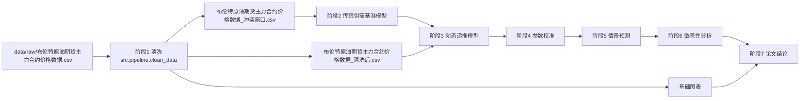
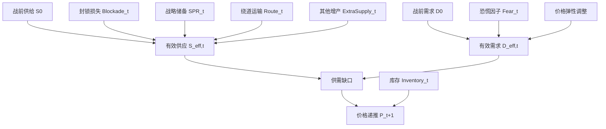

# 06 建模流程设计

## 总流程

```text
原始 CSV
  -> 数据清洗
  -> 冲突窗口提取
  -> 传统供需基准模型
  -> 短期动态递推模型
  -> 参数校准
  -> 60-180 天情景预测
  -> 敏感性分析
  -> 图表和论文结论
```



## Step 1：数据清洗

输入：

- `附件1布伦特原油期货主力合约价格数据.csv`

关键字段：

- `time`
- `preClose`
- `open`
- `high`
- `low`
- `close`

新增字段：

| 字段 | 含义 |
|---|---|
| `log_return` | 对数收益率 |
| `return_pct` | 普通收益率 |
| `volatility_7d` | 7 日滚动波动率 |
| `volatility_14d` | 14 日滚动波动率 |
| `volatility_30d` | 30 日滚动波动率 |
| `is_event_window` | 是否属于冲突窗口 |

## Step 2：传统供需基准模型

目的：

建立一个对照模型，用来说明只考虑供应缺口会高估价格。

基本思路：

```text
供应减少 -> 供需比失衡 -> 低需求弹性放大价格上涨
```

当前主口径：

```text
P = P_0 * (1 + shortage_ratio / abs(elasticity))
```

其中：

- `P_0` 为冲突前基准价格。
- `shortage_ratio` 为供应中断量占战前需求的比例。
- `elasticity` 为短期需求价格弹性，当前取 `-0.05`。
- 该口径是线性化短期弹性近似，适合作为传统模型的可解释对照。

保留参考口径：

```text
P = P_0 * supply_ratio ^ (1 / elasticity)
```

常弹性口径在短期弹性很低时会得到极高机械上界，因此仅保留在结果表中，不作为主图结论。

输出结论：

- 传统模型会给出明显高于现实观测的价格。
- 因此必须引入动态缓冲机制。

当前产物：

- `src/models/baseline_supply_demand.py`
- `output/baseline/传统供需基准模型结果.csv`
- `figures/baseline_vs_actual.png`
- `output/reports/stage2_baseline_model_report.md`

## Step 3：短期动态递推模型

日度有效供应：



```text
S_eff,t = S_0 - Blockade_t + SPR_t + Route_t + ExtraSupply_t
```

日度有效需求：

```text
D_eff,t = D_0 * Fear_t * ElasticityAdjust(P_t)
```

库存变化：

```text
Inventory_t = Inventory_{t-1} + S_eff,t - D_eff,t
```

价格递推：

```text
P_{t+1} = P_t + alpha * (D_eff,t - S_eff,t) + beta * Fear_t - gamma * Buffer_t
```

其中：

- `alpha` 控制供需缺口对价格的影响。
- `beta` 控制恐慌情绪对价格的影响。
- `gamma` 控制缓冲机制对价格的压制。
- `Buffer_t` 可以由 SPR、库存和绕道能力共同构成。

阶段 3 的最小数据结构：

| 字段 | 含义 |
|---|---|
| `day_index` | 从冲突窗口起点开始的日序号 |
| `trade_date` | 若能对齐真实交易日，则记录日期 |
| `simulated_price` | 动态模型模拟价格 |
| `actual_price` | 附件 CSV 实际收盘价 |
| `effective_supply` | 当日有效供给 |
| `effective_demand` | 当日有效需求 |
| `spr_release` | 当日战略储备释放 |
| `route_supply` | 当日绕道运输恢复量 |
| `inventory_buffer` | 当日库存缓冲量 |
| `fear_factor` | 当日恐慌因子 |

当前产物：

- `src/models/dynamic_short_term.py`
- `output/calibration/短期动态递推模型结果.csv`
- `output/calibration/短期动态递推模型误差指标.csv`
- `figures/fitted_vs_actual.png`
- `output/reports/stage3_dynamic_model_report.md`

## Step 4：机制函数

### 封锁冲击

```text
Blockade_t = interruption_volume
```

初版可以设为常数，范围 1400-1800 万桶/日。

### 战略储备释放

```text
SPR_t = 0, t < spr_delay
SPR_t = min(spr_max, planned_release_t), t >= spr_delay
```

参数：

- `spr_delay`
- `spr_max`
- `spr_ramp_days`

### 绕道运输

```text
Route_t = 0, t < route_start_day
Route_t = min(route_max, ramp_rate * (t - route_start_day))
```

参数：

- `route_start_day`
- `route_max`
- `route_ramp_days`

### 恐慌因子

```text
Fear_t = 1 + fear_initial * exp(-fear_decay * t)
```

参数：

- `fear_initial`
- `fear_decay`

### 需求价格弹性

```text
D_eff,t = D_0 * (P_t / P_0) ^ epsilon
```

短期弹性可以取 `-0.05` 附近；中长期可设为更大绝对值，如 `-0.15` 或 `-0.25`。

## Step 5：参数校准

目标函数：

```text
RMSE = sqrt(mean((P_sim,t - P_actual,t)^2))
```

阶段 4 实际采用多目标校准：

```text
综合得分 = RMSE
        + 0.20 * abs(峰值误差)
        + 0.25 * abs(末日误差)
        + 0.15 * 高价平台RMSE
        + 0.12 * 前期RMSE
        + 0.12 * 中期RMSE
        + 0.18 * 后期RMSE
        + 0.18 * 低价回落RMSE
```

待校准参数：

| 参数 | 含义 |
|---|---|
| `alpha` | 供需缺口价格敏感度 |
| `beta` | 恐慌因子价格敏感度 |
| `gamma` | 缓冲机制压制强度 |
| `spr_delay` | SPR 启动延迟 |
| `spr_max` | SPR 每日释放上限 |
| `route_start_day` | 绕道启动日 |
| `fear_decay` | 恐慌衰减速度 |

校准方法：

- 初版用有固定随机种子的多目标随机搜索，随后使用连续局部精修提高短期拟合质量。
- 保证每轮校准可复现。
- 保留最优 10 组参数，避免只依赖单一最优解。

当前产物：

- `src/calibration/calibrate_dynamic_model.py`
- `output/calibration/动态模型校准后路径.csv`
- `output/calibration/动态模型最优参数.csv`
- `output/calibration/动态模型候选参数前10.csv`
- `output/calibration/动态模型分段误差.csv`
- `output/reports/stage4_calibration_report.md`

## Step 6：中长期情景预测

预测长度：

- 60-180 天

情景设置：

| 情景 | 特征 |
|---|---|
| 乐观 | SPR 强、绕道快、需求弹性变大、恐慌快速衰减 |
| 中性 | 采用赛题中值和校准参数 |
| 悲观 | SPR 弱、绕道慢、库存快速消耗、恐慌持续 |

核心输出：

- 180 天价格路径
- 平衡价格区间
- 库存耗尽时间
- 二次跳涨风险

## Step 7：敏感性分析

评价指标：

| 指标 | 含义 |
|---|---|
| `peak_price` | 预测期最高价格 |
| `final_price` | 180 天结束价格 |
| `mean_price` | 预测期平均价格 |
| `inventory_depletion_day` | 库存耗尽日 |
| `rmse` | 与历史价格拟合误差 |

分析方法：

- 单因素敏感性分析
- Tornado 图
- 多情景对比曲线

## Step 8：论文结论映射

模型结果需要直接服务论文结论：

| 模型结果 | 论文结论 |
|---|---|
| 传统模型价格显著高于现实 | 单一供需缺口模型不足 |
| 动态模型贴近 110-120 区间 | 缓冲机制解释异常价格平台 |
| SPR 参数敏感性高 | 战略储备是短期压价核心 |
| 长期需求弹性变大 | 需求毁灭推动中期再平衡 |
| 库存耗尽触发跳变 | 封锁长期化存在二次冲击风险 |
