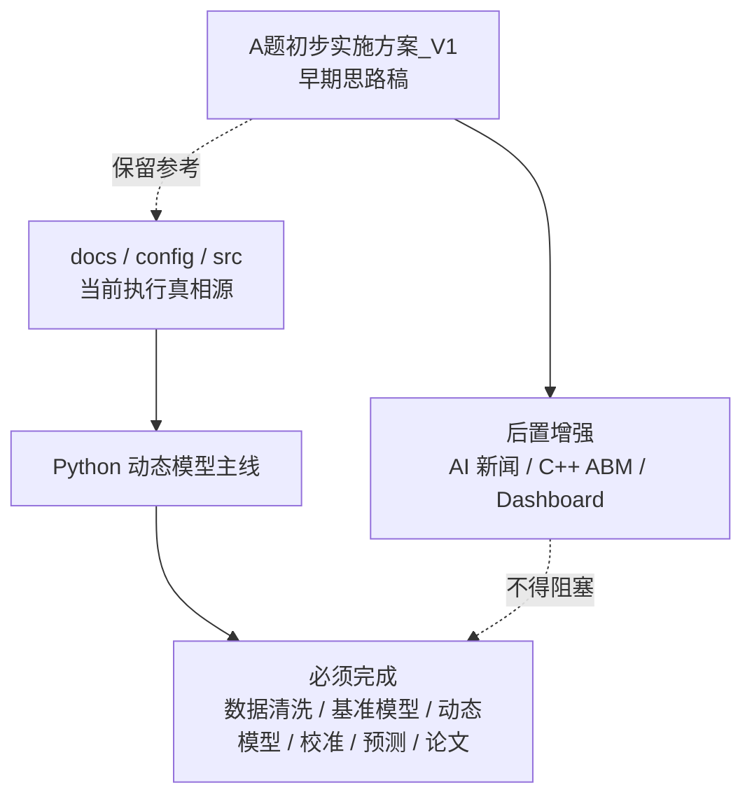

# 08 架构决策记录

本文档记录本项目中会影响后续实现路线的重要决策。后续如果出现新想法，先判断它是主路径、增强项还是暂不采用，避免多个方案并行拉扯。

## ADR-001：当前执行真相源

状态：已采用



决策：

- `docs/`、`config/`、`src/` 中的规划和约定是当前执行真相源。
- `A题初步实施方案_V1.*` 保留为早期思路稿，不作为后续开发和验收的主依据。

原因：

- `V1` 强调 AI 新闻抓取、C++ 多智能体仿真和高级前端展示，方向有启发性，但开发成本较高。
- 当前比赛更需要先形成可复算模型、论文图表和结果证据链。
- 新文档已经把任务拆成阶段、验收和交付物，更适合推进。

影响：

- 后续阶段 1-7 以 Python 主线为准。
- 如果 `V1` 和 `docs/` 出现冲突，以 `docs/` 为准。

## ADR-002：主模型采用 Python 动态递推模型

状态：已采用

决策：

主路径采用：

```text
Python 数据处理 -> 传统供需基准模型 -> 0-60 天动态递推模型 -> 参数校准 -> 60-180 天情景预测 -> 敏感性分析
```

原因：

- Python 更适合 CSV 清洗、参数搜索、批量实验和论文图表生成。
- 当前数据规模不大，不需要 C++ 性能优势。
- 数学建模竞赛更看重模型解释、结果可靠性和论文完整度。

影响：

- `src/` 以 Python 模块为主。
- C++ 多智能体仿真不进入主路径验收。

## ADR-003：C++ ABM 与 Dashboard 降级为后置增强项

状态：已采用

决策：

以下内容作为后置增强项：

- AI Agent 新闻情绪抓取
- C++ 多智能体仿真
- React/ECharts 高级交互式 Dashboard

原因：

- 它们能增强展示效果，但不是完成赛题的必要条件。
- 若过早投入，会挤压数据清洗、模型校准和论文写作时间。

影响：

- 阶段 1-7 不依赖这些增强项。
- 只有在主线模型、图表和论文草稿完成后，才考虑实现。

## ADR-004：参数必须外置并记录来源

状态：已采用

决策：

所有核心参数必须放入 `config/` 或 `data/metadata/`，不允许长期散落在脚本内部。

参数分为四类：

| 类型 | 说明 |
|---|---|
| 题面给定 | 赛题 PDF 直接给出的参数 |
| 外部资料 | 从公开报告或人工整理资料补充的参数 |
| 模型假设 | 为了模型闭合而设定的合理假设 |
| 校准得到 | 通过真实价格数据拟合得到的参数 |

影响：

- `config/base.yml` 管基础路径和题面参数。
- `config/scenarios.yml` 管三情景参数。
- `config/calibration_search.yml` 管参数搜索范围。
- `config/variable_definitions.csv` 管变量含义和来源类型。

## ADR-005：结果必须保留阶段边界

状态：已采用

决策：

`output/` 不再只作为一个总产物目录，而是按阶段分层：

```text
output/
├── baseline/
├── calibration/
├── scenarios/
├── sensitivity/
├── reports/
└── runs/
```

原因：

- 后续会有多轮校准、情景预测和敏感性分析。
- 分层可以减少覆盖旧结果的风险。
- 论文引用时更容易定位结果来源。

影响：

- 阶段报告放入 `output/reports/`。
- 多轮实验快照可放入 `output/runs/`。
- 论文图表仍统一放入 `figures/`。
