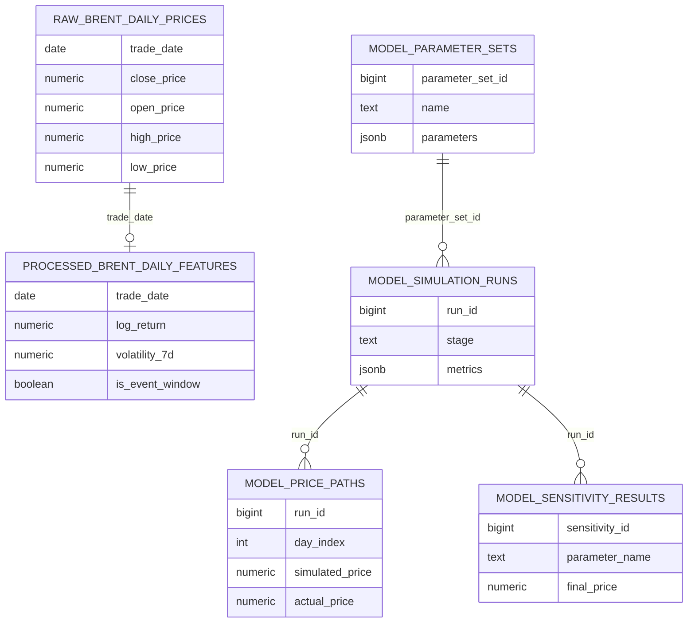

# 09 环境与数据库方案

本文档记录阶段 0.6 的环境与 PostgreSQL 决策。当前环境已经可以支撑阶段 1 和阶段 2 复跑；PostgreSQL 仍然只完成设计和文件准备，不立即建库、不写入数据。

## 一、为什么需要独立环境

本机系统 `python3` 版本较新，科学计算库可能存在兼容风险。为了保证后续 `pandas`、`scipy`、`statsmodels`、`sqlalchemy` 等依赖稳定，项目使用独立 mamba/conda 环境。

推荐环境文件：

```text
environment.yml
```

推荐创建命令：

```bash
mamba env create -f environment.yml
mamba activate mathmodel-oil
```

如果后续只使用 pip，也可以参考：

```bash
pip install -r requirements.txt
```

但首选 mamba 环境，因为它对科学计算包更稳。

## 二、环境定位

环境名：

```text
mathmodel-oil
```

核心用途：

- CSV 清洗
- 时间序列特征处理
- 数值模拟
- 参数校准
- 情景预测
- 敏感性分析
- 图表生成
- 可选 PostgreSQL 读写

## 三、是否需要 PostgreSQL

严格说，本题数据量很小，CSV + Python 足够完成论文。

但考虑到你有数据工程经验，并且希望使用 PostgreSQL，本项目允许把 PostgreSQL 作为结构化实验底座。它的作用不是增加复杂度，而是让参数、运行、结果和论文证据更可追踪。

## 四、PostgreSQL 的使用边界

适合进入数据库：

- 原始价格数据
- 清洗后的价格特征
- 参数集
- 模型运行记录
- 模拟价格路径
- 校准结果
- 敏感性分析结果
- 图表登记表

不适合进入数据库：

- 赛题 PDF
- Markdown 文档
- 论文 DOCX/PDF
- 图片图表本体
- 临时探索笔记

## 五、数据库设计

数据库建议名：

```text
math_model_oil
```

配置文件：

```text
config/database.yml
```

初始化 SQL：

```text
sql/001_init_schema.sql
```

Schema 设计：



| Schema | 用途 |
|---|---|
| `raw` | 官方原始数据和最小字段规范化 |
| `processed` | 清洗后特征数据和建模输入 |
| `model` | 参数、模型运行、价格路径和敏感性分析 |
| `reporting` | 图表登记和论文支撑记录 |

## 六、当前不立即建库的原因

当前已经完成阶段 1 数据清洗和阶段 2 传统供需基准模型。继续暂缓建库的原因是：

1. 当前数据量很小，CSV 足够支撑阶段 3 的模型迭代。
2. 阶段 3 的主要难点是动态机制设计，不是存储层。
3. 过早写库会让简单问题复杂化，拖慢模型主线。
4. 等阶段 4 参数校准出现大量运行记录时，数据库价值会更明显。

因此当前只做：

- 环境文件
- 数据库配置
- SQL schema 设计
- 文档说明

不做：

- 不创建真实数据库
- 不执行 SQL
- 不导入 CSV
- 不写任何模型结果

## 七、何时真正启用数据库

建议在阶段 4 或阶段 5 再评估是否启用。

触发条件：

- `data/processed/布伦特原油期货主力合约价格数据_清洗后.csv` 已生成。
- `data/processed/布伦特原油期货主力合约价格数据_冲突窗口.csv` 已生成。
- 字段名、缺失值处理和日期范围已经稳定。
- 阶段 3 动态模型字段已经稳定。
- 参数校准或情景预测产生大量运行记录，需要结构化追踪。

届时再执行：

```bash
createdb math_model_oil
psql -d math_model_oil -f sql/001_init_schema.sql
```

然后用 Python 脚本将清洗后的数据写入数据库。

## 八、阶段 0.6 验收标准

- `environment.yml` 存在。
- `requirements.txt` 与环境方案一致。
- `config/database.yml` 存在。
- `sql/001_init_schema.sql` 存在。
- 数据库使用边界已写清楚。
- 当前没有执行建库和写入操作。
