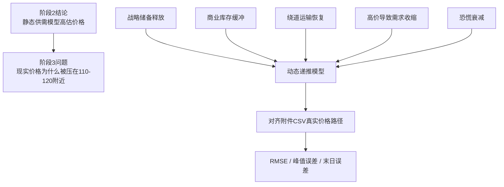

# 10 阶段 2 到阶段 3 交接说明

本文档用于把阶段 2 的结论交接给阶段 3，避免后续建模时忘记“为什么要做动态模型”。

## 当前结论

阶段 2 已经证明：如果只考虑供应中断和低短期需求价格弹性，传统供需模型会明显高估油价。

| 情景 | 供应中断量 | 传统模型价格 | 相对实际最高收盘价 |
|---|---:|---:|---:|
| 低中断 | 1400 万桶/日 | 278.20 USD/barrel | 2.44 倍 |
| 中中断 | 1600 万桶/日 | 307.48 USD/barrel | 2.70 倍 |
| 高中断 | 1800 万桶/日 | 336.77 USD/barrel | 2.95 倍 |

附件 CSV 的冲突窗口最高收盘价是 114.06 USD/barrel，最高盘中价是 119.50 USD/barrel。因此，阶段 3 的目标不是继续调高或调低传统模型，而是解释缓冲机制如何压住价格。

## 阶段 3 要解决的问题



## 阶段 3 输入

| 输入 | 文件 | 用途 |
|---|---|---|
| 冲突窗口真实价格 | `data/processed/布伦特原油期货主力合约价格数据_冲突窗口.csv` | 拟合和对照 |
| 题面参数 | `data/metadata/题面参数表.csv` | SPR、库存、绕道、需求收缩等参数来源 |
| 基础配置 | `config/base.yml` | 路径、单位、基准供需和弹性 |
| 阶段 2 结果 | `output/baseline/传统供需基准模型结果.csv` | 作为传统模型对照 |

## 阶段 3 输出

| 输出 | 建议文件 |
|---|---|
| 0-60 天动态模拟路径 | `output/calibration/短期动态递推模型结果.csv` |
| 动态模型与实际价格对比图 | `figures/fitted_vs_actual.png` |
| 模型变量说明 | `output/reports/stage3_dynamic_model_report.md` |
| 初步误差指标 | `output/calibration/短期动态递推模型误差指标.csv` |

## 最小模型字段

| 字段 | 含义 |
|---|---|
| `day_index` | 日序号 |
| `trade_date` | 交易日 |
| `actual_price` | 附件 CSV 实际收盘价 |
| `simulated_price` | 模型模拟价格 |
| `effective_supply` | 当日有效供给 |
| `effective_demand` | 当日有效需求 |
| `supply_gap` | 当日供需缺口 |
| `spr_release` | 战略储备释放量 |
| `route_supply` | 绕道运输恢复量 |
| `inventory_buffer` | 商业库存缓冲量 |
| `fear_factor` | 恐慌因子 |

## 验收口径

阶段 3 算完成，需要满足：

- 能从脚本稳定生成动态模拟 CSV。
- 能生成动态模型与真实价格的对比图。
- 至少纳入 SPR、库存、绕道运输、需求收缩、恐慌衰减中的 4 类机制。
- 报告中说明每个机制如何影响价格。
- 给出 RMSE、峰值误差和末日误差。

## 给论文的作用

阶段 2 是“传统模型为什么不够”，阶段 3 是“我们的模型为什么更合理”。

论文写作时可以这样承接：

```text
传统供需模型能够解释封锁冲击方向，但会显著高估油价水平。
因此，本文进一步构建包含战略储备、商业库存、绕道运输、需求收缩和市场恐慌衰减的日度动态递推模型，用于解释冲突窗口内实际油价的平台化现象。
```
