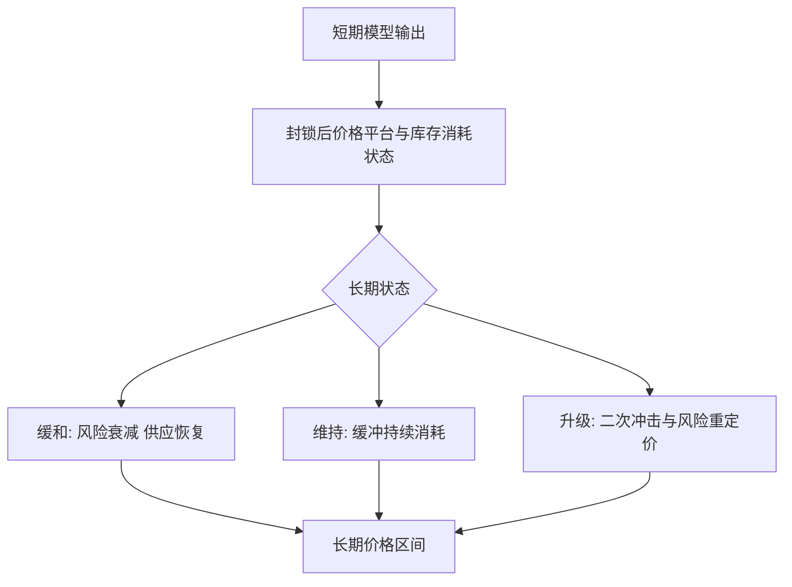

# 模型质量提升与技术实现计划

本文档用于承接根目录《霍尔木兹封锁油价论文的深度文献审查与修订建议.docx》的核心意见，并把后续工作从“继续润色论文”转成“用更硬的模型实验、数据约束和复现流程支撑论文结论”。

## 一、当前判断

项目目前已经完成了比较完整的数模主线：附件数据清洗、短期机制递推、长期情景预测、基准模型对比、敏感性分析、论文 PDF/DOCX 构建与图表体系。现在最值得继续提升的地方，不是再随意增加变量或堆一个更复杂的机器学习模型，而是把现有模型从“拟合效果不错”升级为：

- 能解释：价格变化可以拆成物理缺口、风险溢价、政策缓冲、预期修复等部分。
- 能验证：模型要打败朴素预测、ARIMA 等基准，并通过删块检验、事件窗口检验、参数稳定性检验。
- 能复现：每张图、每个指标、每组参数都能由脚本重新生成。
- 能外推：长期模型不是主观画情景线，而是有状态转移逻辑和外生风险变量约束。
- 能答辩：面对“过拟合、内生性、样本短、长期预测过平”等质疑时，有明确的实验结果支撑。

## 二、核心目标

下一轮工作的核心目标是建立一个统一的“模型实验与质量审计系统”，让短期模型和长期模型都进入同一套评价框架。


这一轮不是为了把论文写得更“炫”，而是为了让论文里的每个核心结论都有代码、数据、检验结果和图表支撑。

## 三、技术实现路线

### 1. 建立模型实验管理层

计划新增或整理一套实验运行结构，用来统一管理模型、参数、指标和输出。

建议目录：

```text
src/
  experiments/
    registry.py          # 注册可比较的模型方案
    runner.py            # 统一运行实验
    metrics.py           # RMSE、MAE、MAPE、方向命中率等指标
    audit.py             # 质量门禁与稳健性检查
    leaderboard.py       # 输出模型对比排行榜

config/
  experiments/
    短期模型对比.yaml
    长期情景对比.yaml

output/
  experiments/
    模型排行榜.csv
    短期模型质量审计.csv
    长期模型质量审计.csv
```

这样做的意义是：以后不再靠人工记忆判断“哪个模型最好”，而是由统一实验表给出结论。

### 2. 短期模型继续增强

短期模型目前是项目最核心、最接近“最终结论”的部分，下一步继续补强它，但重点不是盲目压低误差，而是提升可信度。

重点任务：

- 增加事件窗口检验：观察封锁、升级、缓冲确认等关键日期前后，模型是否能解释价格跳变。
- 增加删块检验：分别删去前期冲击段、平台段、回落段，检查参数和结论是否稳定。
- 增加参数剖面图：观察关键参数变化时误差曲面是否平滑，避免“唯一神奇参数点”。
- 增加贡献分解：把预测价格拆成物理缺口、风险溢价、SPR/库存缓冲、绕道恢复、预期修复。
- 增加基准对比：继续保留朴素预测、ARIMA、Ridge 残差修正等模型，用来证明机制模型确实有价值。

短期模型的质量评价不只看 RMSE，还要看：

| 评价维度 | 具体指标 | 作用 |
|---|---|---|
| 绝对误差 | RMSE、MAE | 看拟合精度 |
| 相对误差 | MAPE | 让评委理解误差比例 |
| 基准胜率 | 相对朴素预测、ARIMA 的改进率 | 证明模型不是复杂但无效 |
| 拐点表现 | 事件窗口局部误差、方向命中率 | 检查是否只是滞后跟随 |
| 参数稳定性 | 删块检验、扰动检验 | 防止过拟合 |
| 机制可信度 | 贡献分解是否符合经济逻辑 | 支撑论文解释 |

### 3. 长期模型改成条件情景预测

长期模型不应被包装成逐日精准预测。更合理的定位是：在封锁持续、缓冲消耗、风险衰减或升级等条件下，给出 60-180 天的价格区间和风险分布。

重点任务：

- 引入更明确的状态转移矩阵：缓和、维持、升级三类状态的基础概率要写清楚。
- 用 OVX、GPR 滞后项、期货期限结构等变量修正状态概率。
- 把绕道运输恢复改成容量受限的 S 型函数，而不是简单线性恢复。
- 把库存耗尽和二次跳涨风险放入尾部风险分析。
- 输出长期情景的区间预测，而不是只强调一条中性线。

长期模型的合理定位：



### 4. 外生数据进入“约束层”，不是随意堆入主方程

已经引入或计划引入的外部数据，应当优先用于约束模型和解释风险状态，而不是直接替换附件真实价格。

变量使用原则：

| 数据类型 | 建议用途 | 注意事项 |
|---|---|---|
| EIA / IEA / OPEC 供需数据 | 约束全球供需缺口数量级 | 多为月频，不适合硬塞进日频拟合 |
| SPR 与商业库存 | 约束缓冲能力和库存消耗 | 不应写成无限释放 |
| GPR | 作为滞后风险状态或事件强度代理 | 避免同步解释当天价格 |
| OVX | 进入波动率、尾部风险、长期状态概率 | 不直接承担主价格方程全部解释 |
| 期货期限结构 | 刻画库存压力、便利收益和预防性需求 | 优先级较高 |
| 运费 / 保险费 | 刻画绕道运输和物流风险 | 数据获取难度较高，先作为增强项 |

### 5. 论文更新原则

论文后续不应继续无限加内容，而是用新的实验结果替换和强化已有结论。

更新顺序：

1. 先跑实验，得到模型排行榜和质量审计结果。
2. 再判断是否替换短期主模型或长期主模型。
3. 最后更新论文正文、表格、图表和附录。

论文中只保留最能支撑主线的图表。未进入论文的候选图，统一放在 `output/candidate_figures/`，不放入 `paper/figures/`。

## 四、可交付成果

这一轮完成后，项目应至少新增或更新以下成果：

- 一份模型实验排行榜：说明短期、长期各模型的误差、稳定性和适用边界。
- 一份短期模型质量审计报告：回答拟合质量、基准对比、拐点、参数稳定性问题。
- 一份长期模型质量审计报告：回答长期情景概率、预测区间、尾部风险来源问题。
- 一组论文级图表：短期贡献分解、事件窗口局部拟合、参数剖面、长期情景区间、状态转移结构。
- 更新后的总论文：只吸收通过实验验证的模型和结论。

## 五、验收标准

下一轮工作完成的标准不是“又写了多少页”，而是看以下问题是否能被明确回答：

- 短期主模型是否显著优于朴素预测和基础 ARIMA？
- 短期模型是否存在明显滞后跟随？
- 参数扰动后，价格平台和核心结论是否仍然稳定？
- 长期模型的状态转移概率是否有数据或规则来源？
- 长期预测是否从单线条变成可信的区间和尾部风险解释？
- 外部数据是否只在合理位置发挥作用，没有造成内生性或口径混乱？
- 论文中的每张图和每张表是否都服务于一个核心结论？

## 六、优先工作清单


优先级安排：

| 优先级 | 工作 | 说明 |
|---|---|---|
| P0 | 建立实验框架与模型排行榜 | 后续所有优化都依赖它 |
| P0 | 短期模型基准对比与稳定性检验 | 决定短期结论能不能作为最终结论 |
| P0 | 长期模型状态转移概率显式化 | 解决长期曲线过平、说服力不足的问题 |
| P1 | 接入期货期限结构、OVX、GPR 滞后变量 | 让风险溢价与状态概率更有依据 |
| P1 | 生成贡献分解和参数剖面图 | 强化论文解释力 |
| P2 | 尝试运费、保险费等物流风险代理 | 数据成本较高，作为增强项 |

## 七、我的执行理解

这轮工作的重点不是“再做一个模型”，而是把项目变成一个更专业的建模系统：  

用工程能力管理实验，用数据处理能力约束参数，用可视化能力发现模型问题，用论文写作把经过验证的结果表达出来。

最终目标是让评委看到：本文不是靠某一次漂亮拟合取胜，而是靠完整的证据链、稳健的实验设计和清晰的机制解释取胜。
